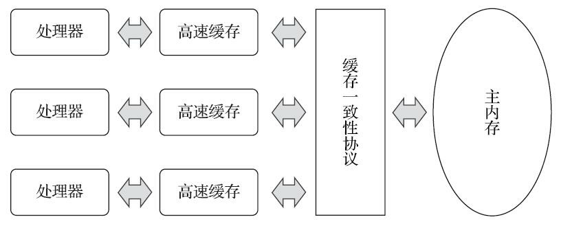
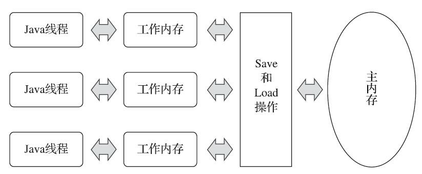
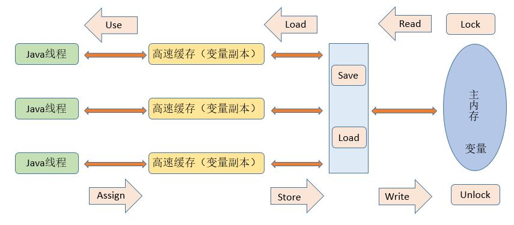

## 从缓存一致性说起
由于计算机的存储速度和处理器的计算速度有着几个数量级的差距，所以现代计算机系统不得不加入一层或者多层读写速度尽可能接近处理器运算速度的**高速缓存（Cache）来作为内存与处理器之间的缓冲**：将运算需要使用的数复制到缓存中，让运算能快速进行，当运算结束后再从缓存同步到内存中，这样处理器就无须等待缓慢的内存读写了。
这样的基于高速缓存的存储设计很好地解决了处理器与内存速度之间的矛盾，但是也让计算机有更高的复杂度了，而且**引入了一个新问题：缓存的一致性问题**。
### 什么叫缓存一致性问题？
举个例子
`i=i+1;`

- 当单线程执行时，会从主存中读取i的值，然后复制一份到高速缓存中，然后CPU执行指令对i进行加1操作，然后将数据写入高速缓存，最后将高速缓存中i的值刷新回主存中。
- 当有多线程执行这个语句时（以两个线程为例），假设初始i为0，我们希望两个线程执行完i=2，其实会存在一种情况是，两个线程分别取值到各自的高速缓存中，然后，线程1和2各自加1，其实就是两个高速缓存中都变为了1，最后分别刷新回内存，其实就是值就是1，而不是2了，这就是缓存一致性问题。
### 如何解决缓存一致性问题
通常来说有两种解决方法

1. 在总线上加LOCK#锁（早期CPU中解决方法，但是在总线锁住期间，其他CPU无法访问内存，导致效率低下）
1. **通过缓存一致性协议**

**为了解决一致性问题，需要各个处理器访问缓存时都遵循一些协议，在读写时都根据协议来进行操作**，这类协议有MSI、MESI（Illinois Protocol)、MOSI、 Synapse、Firefly及Dragon Protocol等。
最出名的就是MESI协议，MESI协议保证了每个缓存中使用的共享变量的副本是一致的。它的核心思想是：当CPU写数据时，如果发现操作的变量是共享变量，即在其他CPU中也存在该变量的副本，会发出信号通知其他CPU将该变量的缓存行置为无效状态，因此当其他CPU需要读取这个变量时，发现自己缓存中缓存改变了的缓存行是无效的，那么它就会从内存中重新读取。

而内存模型，可以理解成为在特定的操作协议之下，对特定的内存或者高速缓存进行读写访问的过程抽象。不同架构的物理机器可以有不一样的内存模型，JVM也有自己的内存模型JMM，且与这里介绍的内存访问操作和硬件的缓存访问操作具有高度的可类比性。
## Java内存模型
《Java虚拟机规范》中曾试图定义一种“**Java内存模型”来屏蔽各种硬件和操作系统的内存访问差异，以实现让Java程序在各个平台下都能达到一致的内存访问效果。**
> 定义Java内存模型并非一件容易的事情，这个模型必须定义得足够严谨，才能让Java的并发内存访 问操作不会产生歧义；但是也必须定义得足够宽松，使得虚拟机的实现能有足够的自由空间去利用硬 件的各种特性（寄存器、高速缓存和指令集中某些特有的指令）来获取更好的执行速度。

### JMM定义了什么
整个Java内存模型实际上是围绕着三个特性建立起来的：原子性、可见性和有序性，这三个特性是整个Java并发的基础。
#### 原子性
原子性：一个操作或者多个操作，要么全部执行并且执行的过程不会被任何因素打断，要么就都不执行。
JMM只保证基本读取和赋值是原子性操作，如果要实现更大范围操作的原子性，可以通过synchronized和Lock来实现。由于synchronized和Lock能够保证任一时刻只有一个线程执行该代码块，那么自然就不存在原子性问题了，从而保证了原子性。
#### 可见性
可见性：当多个线程访问一个变量时，一个线程修改了这个变量的值，其他线程能够立即看得到修改的值。
Java提供Volatile关键字来保证变量可见性，当一个共享变量被Volatile修饰时，它会保证修改的值会立即被更新到主存，当有其他线程需要读取时，它会去主存中读取新值。
另外，通过synchronized和lock也可以保证其可见性，synchronized和lock能保证同一时刻只有一个线程获取锁然后执行同步代码，并且在释放锁之前会将对变量的修改刷新到主存中。所以也是可以保证可见性的。
#### 有序性
有序性：程序执行的顺序按照代码的先后顺序执行。
这一条需要先解释一下什么是指令重排：
一般来说，CPU为了提高程序运行效率，可能会对输入代码进行优化，不保证程序中各个语句的执行先后顺序同代码中的顺序一致，但是它会保证程序最终执行结果和代码顺序执行的结果是一致的。
在JMM中，运行编译器和处理器对指令进行重排序，但是重排序过程不会影响到单线程的执行，却会影响到多线程并发执行的正确性。
在Java中可以通过Volatile来保证一定的有序性，也可以通过synchronized和lock来保证有序性，很显然，synchronized和lock保证每个时刻是有一个线程来执行同步代码，相当于是让线程顺序执行同步代码，自然就保证了有序性。
> 另外，Java内存模型具备一些先天的“有序性”，即不需要通过任何手段就能够得到保证的有序性，这个通常也称为 happens-before 原则。如果两个操作的执行次序无法从happens-before原则推导出来，那么它们就不能保证它们的有序性，虚拟机可以随意地对它们进行重排序。

### 主内存与工作内存
JMM内存模型的主要目的是定义程序中各种遍历的访问规则，即**关注在虚拟机中把变量值存储到内存和从内存中取出变量值这样的底层细节**。此处的变量与Java编程中所说的变量有所区别，它包括了实例字段、静态字段和构成数组对象的元素，但是不包括局部变量与方法参数，因为后者是线程私有的，不会被共享，自然就不会存在竞争问题。
为了获得更好的执行效能，Java内存模型并没有限制执行引擎使用处理器的特定寄存器或者缓存来和主内存进行交互，也没有限制即时编译器是否要进行调整代码执行顺序这类优化措施。
​

**Java内存模型规定了所有的变量都存储在主内存中。每条线程还有自己的工作内存（类比高速缓存），线程的工作内存中保存了被该线程使用的变量的主内存副本，线程对变量的所有操作（读取、赋值等）都必须在工作内存中进行，而不能直接读写主内存中数据。不同的线程之间也无法直接访问对方工作内存中国的变量，线程间变量值的传递均需要通过主内存来完成，线程、主内存、工作内存三者的交互关系如下图所示：**

这里的主内存与工作内存与Java内存区域的堆栈等等不是一个层次的划分，这两者基本上是没有任何关系的，如果硬要对应的话，

- 从变量、主内存、工作内存的定义来看，主内存主要对应于Java堆中的对象实例数据部分，而工作内存则对应于虚拟机栈中的部分区域。
- 从更基础的层次上说，主内存直接对应于物理硬件的内存，而为了获取更好的运行速度，虚拟机（或者是硬件、操作系统本身的优化措施）可能会让工作内存有限存储于寄存器和高速缓存中，因为程序运行时主要访问的是工作内存。

#### 内存间的交互操作
关于主内存与工作内存之间具体的交互协议，也就是一个变量如何从主内存拷贝到工作内存、如何从工作内存同步回主内存这一类的实现细节，Java内存模型中定义了一下8种操作来完成。Java虚拟机实现时必须要保证下面提及的每一种操作都是原子的，不可再分的。（double和long的load、store、read和write操作在某些平台上允许有例外）

| **原子操作** | **作用位置** | **功能** |
| --- | --- | --- |
| lock（锁定） | 作用于主内存的变量 | 把一个变量标识为一条线程独占的状态 |
| read（读取） | 作用于主内存的变量 | 把一个变量的值从主内存传输到线程的工作内存中，以便随后的load动作使用 |
| load（载入） | 作用于工作内存的变量 | 把read操作从主内存中得到的变量值放入工作内存的变量副本中 |
| use（使用） | 作用于工作内存的变量 | 把工作内存中一个变量的值传递给执行引擎，每当虚拟机遇到一个需要使用变量的值的字节码指令时将会执行这个操作 |
| assign（赋值） | 作用于工作内存的变量 | 把一个从执行引擎接收的值赋给工作内存的变量，每当虚拟机遇到一个给变量赋值的字节码指令时执行这个操作 |
| store（存储） | 作用于工作内存的变量 | 把工作内存中一个变量的值传送到主内存中，一遍后续的write操作使用 |
| write（写入） | 走用于主内存的变量 | 把store操作从工作内存中得到的变量的值放入主内存的变量中 |
| unlock（解锁） | 作用于主内存的变量 | 把一个处于锁定状态的变量释放出来，释放出来的变量才可以被其他线程锁定。 |

> 如果需要把一个变量从主内存拷贝到工作内，那就必须按照顺序执行read和load操作，如果需要把变量从工作内存同步到主内存中，就需要按照顺序执行store和write操作。
> 注意JMM只要求上述两个操作必须按顺序执行，而不需要连续执行，也就是这两对操作之间，还是可以插入其他指令的

#### 操作规则
JMM规定了在执行上述表格中8种基本操作时必须要满足如下规则：

1. 不允许read和load、store和write两对操作之一单独出现，也就是read操作后必须load，store操作后必须write。
1. 不允许一个线程丢弃它最近的assign操作，即变量在工作内存中改变了后必须把该变化同步回主内存
1. 不允许一个线程无原因地（没有发生任何assgin操作）把数据从线程的工作内存同步回主内存中
1. 一个新的变量只能在主内存中“诞生”，不允许在工作内存中直接使用一个未被初始化（load或assign）的变量，换句话说就是对一个变量实施use、store操作之前，必须先执行assgin和load操作
1. 一个变量在同一个时刻只允许一条线程对其进行lock操作，但lock操作可以被同一条线程重复执行多次，多次执行lock后，**只有执行相同次数的unlock操作，变量才会被解锁。**
1. 如果对一个变量执行lock操作，那将会情况工作内存中此变量额值，在执行引擎使用这个变量前，需要重新执行load或者assgin操作以初始化变量的值。
1. 如果一个变量实现没有被lock操作锁定，那么就不允许对它执行unlock操作，也不允许去unlock一个被其他线程锁定的变量。
1. 对一个变量执行unlock操作之前，必须先把此变量同步回主内存中（执行store、write操作）

本文的内容其实都是为了介绍Volatile进行铺垫。
​

本文参考：

- 《深入理解Java虚拟机第三版》
- [https://www.cnblogs.com/dolphin0520/p/3920373.html](https://www.cnblogs.com/dolphin0520/p/3920373.html)
