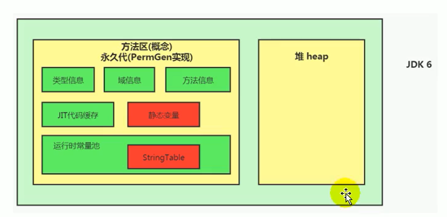
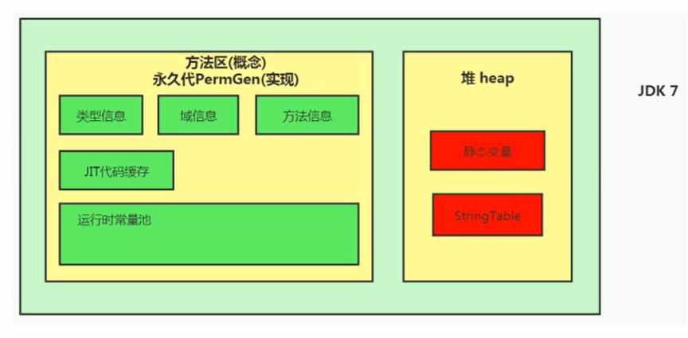
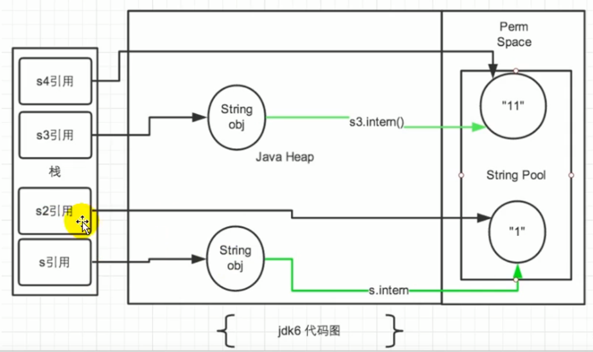
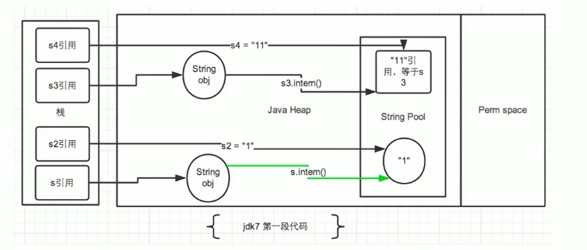
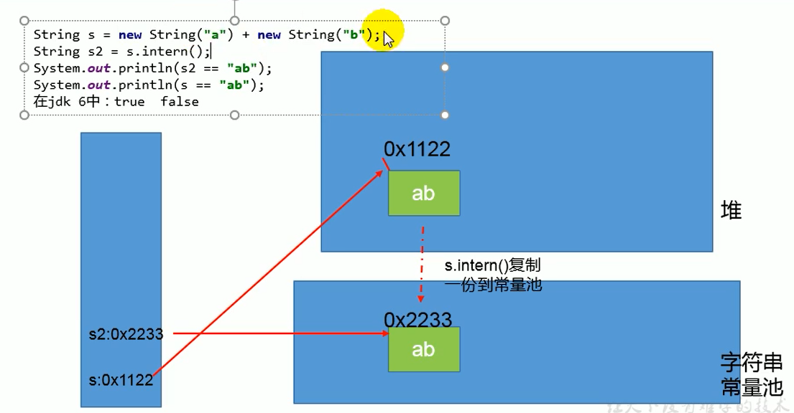
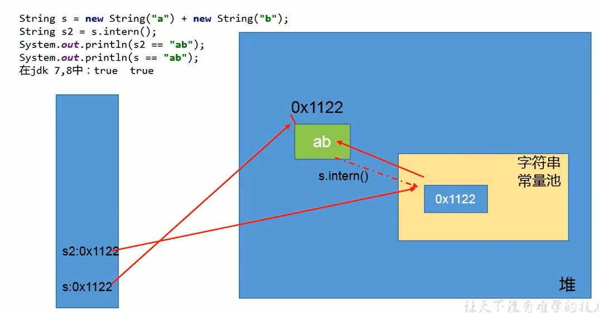
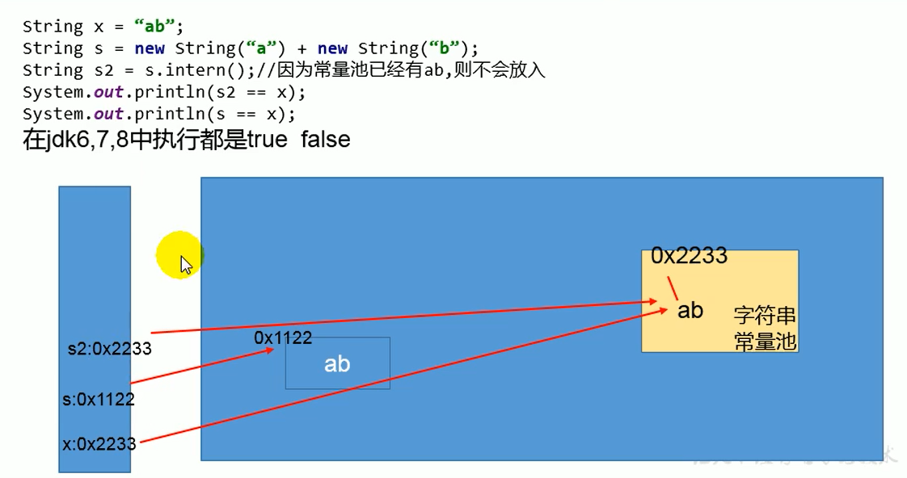

## String的基本特性
- 字符串，使用双引号""引起来，有两种创建方式
   - String s1 = "abc" ; // 字面量的定义方式，看起来就像基本数据类型的赋值方式
   - String s2 = new String("abc");//类实例化方式
- String声明为final的，不可被继承
- String实现了Serializable接口，表示字符串是支持序列化的。
- String实现了Comparable接口，表示String可以比较大小。
- String在JDK8及以前内部定义了final char[] value用于存储字符串数据。JDK9时改为byte[]
> String在JDK9中存储结构的变更
> 为什么要更改？
> 官方翻译：目前String类的实现将字符存储在一个char数组中，每个字符使用两个字节（16位）。从许多不同的应用中收集到的数据表明，字符串是堆使用的主要组成部分，此外，大多数字符串对象只包含Latin-1字符。这些字符只需要一个字节的存储空间，因此这些字符串对象的内部字符数组中有一半的空间没有被使用。
> 我们建议将String类的内部表示方法从UTF-16字符数组改为字节数组加编码标志域。新的String类将根据字符串的内容，以ISO-8859-1/Latin-1（每个字符一个字节）或UTF-16（每个字符两个字节）的方式存储字符编码。编码标志将表明使用的是哪种编码。
> 与字符串相关的类，如AbstractStringBuilder、StringBuilder和StringBuffer将被更新以使用相同的表示方法，HotSpot VM的内在字符串操作也是如此。这纯粹是一个实现上的变化，对现有的公共接口没有变化。目前没有计划增加任何新的公共API或其他接口。迄今为止所做的原型设计工作证实了内存占用的预期减少，GC活动的大幅减少，以及在某些角落情况下的轻微性能倒退。

**结论：String再也不用char[] 来存储了，改成了byte [] 加上编码标记，节约了一些空间**

- String代表不可变的字符序列
   - 当对字符串重新赋值时，需要重写指定的内存区域，不能使用原有的value进行赋值
   - 当对现有的字符串进行连接操作时，也需要重新指定内存区域赋值，不能使用原有的value进行赋值。
   - 当调用replace方法修改指定字符或者字符串时，也需要重新指定内存区域赋值，不能使用原有的value进行赋值
- 通过字面量方式给一个字符串赋值，此时的字符串声明在字符串常量池中
- **字符串常量池中是不会存储相同内容的字符串的**
   - String的String Pool是一个固定大小的Hashtable，默认值大小长度是1009。如果放进String Pool的String非常多，就会造成Hash冲突严重，从而导致链表会很长，而链表长了后直接会造成的影响就是当调用String.intern时性能会大幅下降。
   - 使用`-XX:StringTablesize`可设置StringTable的长度
   - 在jdk6中StringTable是固定的，就是1009的长度，所以如果常量池中的字符串过多就会导致效率下降很快。StringTablesize设置没有要求
   - 在jdk7中，StringTable的长度默认值是60013，StringTablesize设置没有要求 
   - 在JDK8中，设置StringTable长度的话，1009是可以设置的最小值 
## String的内存分配
String常量池比较特殊，主要使用方法有两种：

1. 直接使用双引号声明出来的String对象会直接存储在常量池中
1. 如果不是用双引号声明的，可以使用String提供的intern()方法。


StringTable都放在哪？

- Java 6及以前，字符串常量池存放在永久代
- Java 7中字符串池的逻辑做了很大的改变，将字符串常量池的位置调整到Java堆内
   - 所有的字符串都保存在堆上，与普通对象一样，这样可以让你在进行调优时仅仅需要调整堆大小即可
   - 字符串常量池概念原本使用得比较多，但是这个改动使得我们有足够的理由让我们重新考虑在Java 7中使用`String.intern()`。 
- JDK8中，字符串常量池还是在堆上，其他永久代的东西转移到元空间中。




### StringTable为什么要调整?
> generation of the Java heap, but are instead allocated in the main part of the Java heap (known as the young and old generations), along with the other objects created by the application. This change will result in more data residing in the main Java heap, and less data in the permanent generation, and thus may require heap sizes to be adjusted. Most applications will see only relatively small differences in heap usage due to this change, but larger applications that load many classes or make heavy use of the `String.intern()` method will see more significant differences.
> 在JDK 7中，内部字符串不再分配在Java堆的永久代中，而是分配在Java堆的主要部分（称为年轻代和老年代），与应用程序创建的其他对象一起。这种变化将导致更多的数据驻留在主Java堆中，而更少的数据在永久代中，因此可能需要调整堆的大小。大多数应用程序将看到由于这一变化而导致的堆使用的相对较小的差异，但加载许多类或大量使用String.intern()方法的大型应用程序将看到更明显的差异

简单来说

1. 永久代默认比较小
1. 永久代GC频率低，但是字符串创建比较会比较多（full gc少）
## String的基本操作
略
## 字符串的拼接操作

1. 常量和常量的拼接结果在常量池，原理是编译器优化
```java
public static void test1() {
  // 都是常量，前端编译期会进行代码优化
  // 通过idea直接看对应的反编译的class文件，会显示 String s1 = "abc"; 说明做了代码优化
  String s1 = "a" + "b" + "c";  
  String s2 = "abc"; 

  // true，有上述可知，s1和s2实际上指向字符串常量池中的同一个值
  System.out.println(s1 == s2); 
}
```

2. 常量池中不会存放相同内容的常量
2. 只要其中有一个是变量，结果就在堆中（相当于在堆空间进行new String()，具体内容就是拼接的结果），变量拼接原理是StringBuilder
2. 如果拼接的结果调用intern()方法，则主动将常量池中还没有的字符串对象放入池中，并返回此对象地址。
```java
public static void test5() {
    String s1 = "javaEE";
    String s2 = "hadoop";

    String s3 = "javaEEhadoop";
    String s4 = "javaEE" + "hadoop";    
    String s5 = s1 + "hadoop";
    String s6 = "javaEE" + s2;
    String s7 = s1 + s2;

    System.out.println(s3 == s4); // true 编译期优化
    System.out.println(s3 == s5); // false s1是变量，不能编译期优化
    System.out.println(s3 == s6); // false s2是变量，不能编译期优化
    System.out.println(s3 == s7); // false s1、s2都是变量
    System.out.println(s5 == s6); // false s5、s6 不同的对象实例
    System.out.println(s5 == s7); // false s5、s7 不同的对象实例
    System.out.println(s6 == s7); // false s6、s7 不同的对象实例

    String s8 = s6.intern();
    System.out.println(s3 == s8); // true intern之后，s8和s3一样，指向字符串常量池中的"javaEEhadoop"
}
```

- 不使用final修饰的就是变量
- 使用final修饰的就是常量，会在编译器进行代码优化，在实际开发中，能够使用final的，尽量使用
```java
public void test6(){
    String s0 = "beijing";
    String s1 = "bei";
    String s2 = "jing";
    String s3 = s1 + s2;
    System.out.println(s0 == s3); // false s3指向对象实例，s0指向字符串常量池中的"beijing"
    String s7 = "shanxi";
    final String s4 = "shan";
    final String s5 = "xi";
    String s6 = s4 + s5;
    System.out.println(s6 == s7); // true s4和s5是final修饰的，编译期就能确定s6的值了
}
```
### 使用字节码探究
```java
public void test3(){
    String s1 = "a";
    String s2 = "b";
    String s3 = "ab";
    String s4 = s1 + s2;
    System.out.println(s3==s4);
}
```
我们拿上面的字节码进行查看，可以发现s1+s2实际上是new了一个StringBuilder对象，并使用了append方法将s1和s2添加进来，最后调用了toString方法赋值给s4。
```java
 0 ldc #2 <a>
 2 astore_1
 3 ldc #3 <b>
 5 astore_2
 6 ldc #4 <ab>
 8 astore_3
 9 new #5 <java/lang/StringBuilder>
12 dup
13 invokespecial #6 <java/lang/StringBuilder.<init>>
16 aload_1
17 invokevirtual #7 <java/lang/StringBuilder.append>
20 aload_2
21 invokevirtual #7 <java/lang/StringBuilder.append>
24 invokevirtual #8 <java/lang/StringBuilder.toString>
27 astore 4
29 getstatic #9 <java/lang/System.out>
32 aload_3
33 aload 4
35 if_acmpne 42 (+7)
38 iconst_1
39 goto 43 (+4)
42 iconst_0
43 invokevirtual #10 <java/io/PrintStream.println>
46 return
```
#### 字符串拼接操作性能对比


```java
public class Test
{
    public static void main(String[] args) {
        int times = 50000;

        // String
        long start = System.currentTimeMillis();
        testString(times);
        long end = System.currentTimeMillis();
        System.out.println("String: " + (end-start) + "ms");

        // StringBuilder
        start = System.currentTimeMillis();
        testStringBuilder(times);
        end = System.currentTimeMillis();
        System.out.println("StringBuilder: " + (end-start) + "ms");

        // StringBuffer
        start = System.currentTimeMillis();
        testStringBuffer(times);
        end = System.currentTimeMillis();
        System.out.println("StringBuffer: " + (end-start) + "ms");
    }

    public static void testString(int times) {
        String str = "";
        for (int i = 0; i < times; i++) {
            str += "test";
        }
    }

    public static void testStringBuilder(int times) {
        StringBuilder sb = new StringBuilder();
        for (int i = 0; i < times; i++) {
            sb.append("test");
        }
    }

    public static void testStringBuffer(int times) {
        StringBuffer sb = new StringBuffer();
        for (int i = 0; i < times; i++) {
            sb.append("test");
        }
    }
}

// 结果
String: 7963ms
StringBuilder: 1ms
StringBuffer: 4ms
```
本实验进行5万次循环，String拼接方式的时间是StringBuilder.append方式的约8000倍，StringBuffer.append()方式的时间是StringBuilder.append()方式的约4倍


可以看到，通过StringBuilder的append方式的速度，要比直接对String使用“+”拼接的方式快的不是一点半点
​

那么，在实际开发中，对于需要多次或大量拼接的操作，在不考虑线程安全问题时，我们就应该尽可能使用StringBuilder进行append操作

除此之外，还有那些操作能够帮助我们提高字符串方面的运行效率呢？

StringBuilder空参构造器的初始化大小为16。那么，如果提前知道需要拼接String的个数，就应该直接使用带参构造器指定capacity，以减少扩容的次数（扩容的逻辑可以自行查看源代码）
```java
/**
 * Constructs a string builder with no characters in it and an
 * initial capacity of 16 characters.
 */
public StringBuilder() {
    super(16);
}

/**
 * Constructs a string builder with no characters in it and an
 * initial capacity specified by the {@code capacity} argument.
 *
 * @param      capacity  the initial capacity.
 * @throws     NegativeArraySizeException  if the {@code capacity}
 *               argument is less than {@code 0}.
 */
public StringBuilder(int capacity) {
    super(capacity);
}
```
## intern()使用
字符串常量池最初是空的，由String类私有维护。在调用intern()方法时，如果池中已经包含了由equals(object)方法确定的与该字符串对象相等的字符串，则返回池中的字符串。否则，该字符串对象将被添加到池中，并返回对该字符串对象的引用。 
如果不是用双引号声明的String对象，可以使用String提供的intern()方法：**intern方法会从字符串常量池中查询当前字符串是否存在，若不存在就会将当前字符串放入常量池中。**
`String myInfo = new String("ustc").intern();`
也就是说，如果在任意字符串上调用String.intern()方法，那么其返回结果所指向的那个类实例，必须和直接以常量形式出现的字符串实例完全相同，所以下面的表达式必定是true。
`（"a"+"b"+"c"）.intern（）=="abc"`
简单来说，Intern()就是确保字符串在内存里只有一份拷贝，这样可以节约内存空间，加快字符串操作任务的执行速度。注意，这个值会被存放在字符串内部池中（String Intern Pool）​
### intern()的空间效率测试
通过测试一下，使用了intern和不使用的时候，其实相差还挺多的
```java
public class StringIntern2 {
    static final int MAX_COUNT = 1000 * 10000;
    static final String[] arr = new String[MAX_COUNT];

    public static void main(String[] args) {
        Integer [] data = new Integer[]{1,2,3,4,5,6,7,8,9,10};
        long start = System.currentTimeMillis();
        for (int i = 0; i < MAX_COUNT; i++) {
            arr[i] = new String(String.valueOf(data[i%data.length])).intern();
        }
        long end = System.currentTimeMillis();
        System.out.println("花费的时间为：" + (end - start));

        try {
            Thread.sleep(1000000);
        } catch (Exception e) {
            e.getStackTrace();
        }
    }
}
```
结论：对于程序中大量使用存在的字符串时，尤其存在很多已经重复的字符串时，使用intern()方法能够节省内存空间。
> 大的网站平台，需要内存中存储大量的字符串，如社交网站，有很多人存储相关地址信息，如北京市，这个字符就会使用多次，如果这时候使用都调用intern()方法，就会很明显降低内存的大小。

### 面试题
#### new String("ab")会创建几个对象
```java
public class StringNewTest {
    public static void main(String[] args) {
        String str = new String("ab");
    }
}
```
转换到字节码来看
```java
 0 new #2 <java/lang/String>
 3 dup
 4 ldc #3 <ab>
 6 invokespecial #4 <java/lang/String.<init>>
 9 astore_1
10 return
```
可以看到这里面有两个对象

1. new关键字在堆空间创建（0 new #2 <java/lang/String>）
1. 字符串常量池中的对象（4 ldc #3 <ab>）
#### new String("a") + new String("b") 会创建几个对象
```java
public class StringNewTest {
    public static void main(String[] args) {
        String str = new String("a") + new String("b");
    }
}
```
字节码文件为
```java
 0 new #2 <java/lang/StringBuilder> //对象1
 3 dup
 4 invokespecial #3 <java/lang/StringBuilder.<init>>
 7 new #4 <java/lang/String> //对象2
10 dup
11 ldc #5 <a> //对象3
13 invokespecial #6 <java/lang/String.<init>>
16 invokevirtual #7 <java/lang/StringBuilder.append>
19 new #4 <java/lang/String> //对象4
22 dup
23 ldc #8 <b> //对象5
25 invokespecial #6 <java/lang/String.<init>>
28 invokevirtual #7 <java/lang/StringBuilder.append>
31 invokevirtual #9 <java/lang/StringBuilder.toString>//对象6
34 astore_1
35 return
```
这里面我们创建了6个对象

1. 对象1：new StringBuilder()
1. 对象2：new String("a")
1. 对象3：常量池的a
1. 对象4：new String("b")
1. 对象5：常量池的b
1. 对象6：toString中会创建一个new String("ab")
   1. 调用toString()方法，不会在常量池中生成ab
### JDK6和JDK7中的区别
```java
/**
 * ① String s = new String("1")
 * 创建了两个对象
 * 		堆空间中一个new对象
 * 		字符串常量池中一个字符串常量"1"（注意：此时字符串常量池中已有"1"）
 * ② s.intern()由于字符串常量池中已存在"1"
 * 
 * s  指向的是堆空间中的对象地址
 * s2 指向的是堆空间中常量池中"1"的地址
 * 所以不相等
 */
String s = new String("1");
s.intern();
String s2 = "1";
System.out.println(s==s2); // jdk1.6 false jdk7/8 false

/*
 * ① String s3 = new String("1") + new String("1")
 * 等价于new String（"11"），但是，常量池中并不生成字符串"11"；
 *
 * ② s3.intern()
 * 由于此时常量池中并无"11"，所以把s3中记录的对象的地址存入常量池
 * 所以s3 和 s4 指向的都是一个地址
*/
String s3 = new String("1") + new String("1");
s3.intern();
String s4 = "11";
System.out.println(s3==s4); //jdk1.6 false jdk7/8 true
```


总结一下：
在JDK1.6中，将这个字符串对象尝试放入字符串常量池中

- 如果字符串常量池中有，则并不会放入。返回已有的字符串常量池中的对象地址
- 如果没有，**则会将对象复制一份，放入池中**，并返回池中对象地址

在JDK1.7中，将这个字符串对象尝试放入池中

- 如果池中有，则不会放入，返回已有的池中的对象的地址
- 如果没有，**则会将对象的引用地址复制一份，放入池中**，并返回池中的引用地址。


扩展：在jdk1.7中，如果将中间两句换个顺序，结果如何
```java
String s3 = new String("1") + new String("1");//堆上有11，池中无
String s4 = "11";//在池中生成对象“11”，不是s3的引用，而是实际存在的11
s3.intern();
System.out.println(s3==s4); 
```
结果又变成了false
### 练习题



## StringTable的垃圾回收
```java
public class StringGCTest {
    /**
     * -Xms15m -Xmx15m -XX:+PrintGCDetails
     */
    public static void main(String[] args) {
        
        for (int i = 0; i < 100000; i++) {
            String.valueOf(i).intern();
        }
    }
}
```
运行结果如下
```java
[GC (Allocation Failure) [PSYoungGen: 4096K->504K(4608K)] 4096K->1689K(15872K), 0.0581583 secs] [Times: user=0.00 sys=0.00, real=0.06 secs] 
[GC (Allocation Failure) [PSYoungGen: 4600K->504K(4608K)] 5785K->2310K(15872K), 0.0015621 secs] [Times: user=0.00 sys=0.00, real=0.00 secs] 
[GC (Allocation Failure) [PSYoungGen: 4600K->504K(4608K)] 6406K->2350K(15872K), 0.0034849 secs] [Times: user=0.00 sys=0.00, real=0.00 secs] 
Heap
 PSYoungGen      total 4608K, used 1919K [0x00000000ffb00000, 0x0000000100000000, 0x0000000100000000)
  eden space 4096K, 34% used [0x00000000ffb00000,0x00000000ffc61d30,0x00000000fff00000)
  from space 512K, 98% used [0x00000000fff00000,0x00000000fff7e010,0x00000000fff80000)
  to   space 512K, 0% used [0x00000000fff80000,0x00000000fff80000,0x0000000100000000)
 ParOldGen       total 11264K, used 1846K [0x00000000ff000000, 0x00000000ffb00000, 0x00000000ffb00000)
  object space 11264K, 16% used [0x00000000ff000000,0x00000000ff1cd9b0,0x00000000ffb00000)
 Metaspace       used 3378K, capacity 4496K, committed 4864K, reserved 1056768K
  class space    used 361K, capacity 388K, committed 512K, reserved 1048576K
```
## G1中的String去重操作
官网地址：[JEP 192: String Deduplication in G1 (java.net)](http://openjdk.java.net/jeps/192)

**Motivation**
> Many large-scale Java applications are currently bottlenecked on memory. Measurements have shown that roughly 25% of the Java heap live data set in these types of applications is consumed by String objects. Further, roughly half of those String objects are duplicates, where duplicates means string1.equals(string2) is true. Having duplicate String objects on the heap is, essentially, just a waste of memory. This project will implement automatic and continuous String deduplication in the G1 garbage collector to avoid wasting memory and reduce the memory footprint.
> 
目前，许多大规模的Java应用程序在内存上遇到了瓶颈。测量表明，在这些类型的应用程序中，大约25%的Java堆实时数据集被String'对象所消耗。此外，这些 "String"对象中大约有一半是重复的，其中重复意味着 "string1.equals(string2) "是真的。在堆上有重复的String对象，从本质上讲，只是一种内存的浪费。这个项目将在G1垃圾收集器中实现自动和持续的String重复数据删除，以避免浪费内存，减少内存占用。
注意这里说的重复，指的是在堆中的数据，而不是常量池中的，因为常量池中的本身就不会重复
背景：对许多Java应用（有大的也有小的）做的测试得出以下结果：

- 堆存活数据集合里面string对象占了25%
- 堆存活数据集合里面重复的string对象有13.5%
- string对象的平均长度是45

许多大规模的Java应用的瓶颈在于内存，测试表明，在这些类型的应用里面，Java堆中存活的数据集合差不多25%是String对象。更进一步，这里面差不多一半string对象是重复的，重复的意思是说： stringl.equals(string2)= true。堆上存在重复的String对象必然是一种内存的浪费。这个项目将在G1垃圾收集器中实现自动持续对重复的string对象进行去重，这样就能避免浪费内存。

**实现**

1. 当垃圾收集器工作的时候，会访问堆上存活的对象。对每一个访问的对象都会检查是否是候选的要去重的String对象
1. 如果是，把这个对象的一个引用插入到队列中等待后续的处理。一个去重的线程在后台运行，处理这个队列。处理队列的一个元素意味着从队列删除这个元素，然后尝试去重它引用的string对象。
1. 使用一个hashtable来记录所有的被String对象使用的不重复的char数组。当去重的时候，会查这个hashtable，来看堆上是否已经存在一个一模一样的char数组。
1. 如果存在，String对象会被调整引用那个数组，释放对原来的数组的引用，最终会被垃圾收集器回收掉。
1. 如果查找失败，char数组会被插入到hashtable，这样以后的时候就可以共享这个数组了。

**命令行选项**
```java
# 开启String去重，默认是不开启的，需要手动开启。 
UseStringDeduplication(bool)  
# 打印详细的去重统计信息 
PrintStringDeduplicationStatistics(bool)  
# 达到这个年龄的String对象被认为是去重的候选对象
StringpeDuplicationAgeThreshold(uintx)
```
参考：


- 尚硅谷宋红康老师《JVM全套教程》
- 周志明《深入理解Java虚拟机-第三版》


