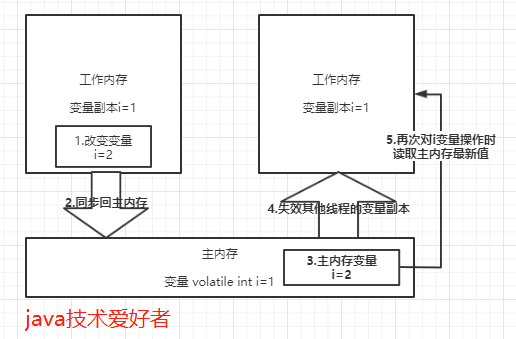
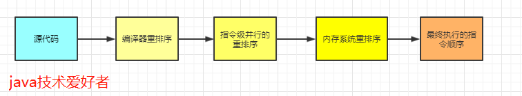
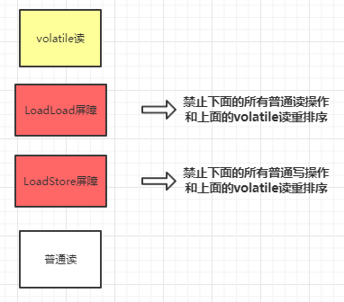
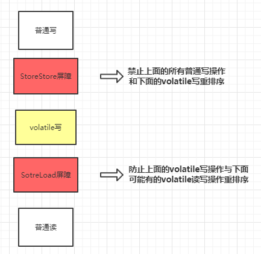

## 讲一下volatile关键字

很多并发编程都使用了volatile关键字，主要的作用包括两点：

1. **保证线程间变量的可见性。**
1. **禁止CPU进行指令重排序。**
### 保证线程间变量的可见性
volatile修饰的变量，当一个线程改变了该变量的值，其他线程是立即可见的。普通变量则需要重新读取才能获得最新值。
volatile保证可见性的流程大概就是这个一个过程：





### volatile一定能保证线程安全吗
先说结论吧，volatile不能一定能保证线程安全。
怎么证明呢，我们看下面一段代码的运行结果就知道了：
```java
public class VolatileTest extends Thread {
    private static volatile int count = 0;
    public static void main(String[] args) throws Exception {
        Vector<Thread> threads = new Vector<>();
        for (int i = 0; i < 100; i++) {
            VolatileTest thread = new VolatileTest();
            threads.add(thread);
            thread.start();
        }
        //等待子线程全部完成
        for (Thread thread : threads) {
            thread.join();
        }
        //输出结果，正确结果应该是1000，实际却是984
        System.out.println(count);//984
    }
    @Override
    public void run() {
        for (int i = 0; i < 10; i++) {
            try {
                //休眠500毫秒
                Thread.sleep(500);
            } catch (Exception e) {
                e.printStackTrace();
            }
            count++;
        }
    }
}
```
为什么volatile不能保证线程安全？
很简单呀，可见性不能保证操作的原子性，前面说过了count++不是原子性操作，会当做三步，先读取count的值，然后+1，最后赋值回去count变量。需要保证线程安全的话，需要使用synchronized关键字或者lock锁，给count++这段代码上锁：
```
private static synchronized void add() {
    count++;
}
```
### 禁止指令重排序
首先要讲一下as-if-serial语义，不管怎么重排序，（单线程）程序的执行结果不能被改变。
为了使指令更加符合CPU的执行特性，最大限度的发挥机器的性能，提高程序的执行效率，只要程序的最终结果与它顺序化情况的结果相等，那么指令的执行顺序可以与代码逻辑顺序不一致，这个过程就叫做**指令的重排序**。
重排序的种类分为三种，分别是：编译器重排序，指令级并行的重排序，内存系统重排序。整个过程如下所示：





指令重排序在单线程是没有问题的，不会影响执行结果，而且还提高了性能。但是在多线程的环境下就不能保证一定不会影响执行结果了。
**所以在多线程环境下，就需要禁止指令重排序**。
volatile关键字禁止指令重排序有两层意思：

- 当程序执行到volatile变量的读操作或者写操作时，在其前面的操作的更改肯定全部已经进行，且结果已经对后面的操作可见，在其后面的操作肯定还没有进行。
- 在进行指令优化时，不能将在对volatile变量访问的语句放在其后面执行，也不能把volatile变量后面的语句放到其前面执行。

下面举个例子：
```
private static int a;//非volatile修饰变量
private static int b;//非volatile修饰变量
private static volatile int k;//volatile修饰变量
private void hello() {
    a = 1;  //语句1
    b = 2;  //语句2
    k = 3;  //语句3
    a = 4;  //语句4
    b = 5;  //语句5
    //以下省略...
}
```
变量a，b是非volatile修饰的变量，k则使用volatile修饰。所以语句3不能放在语句1、2前，也不能放在语句4、5后。但是语句1、2的顺序是不能保证的，同理，语句4、5也不能保证顺序。
并且，执行到语句3的时候，语句1，2是肯定执行完毕的，而且语句1,2的执行结果对于语句3,4,5是可见的。
### volatile禁止指令重排序的原理是什么
首先要讲一下内存屏障，内存屏障可以分为以下几类：

- LoadLoad 屏障：对于这样的语句`Load1，LoadLoad，Load2`。在Load2及后续读取操作要读取的数据被访问前，保证Load1要读取的数据被读取完毕。
- StoreStore屏障：对于这样的语句`Store1， StoreStore， Store2`，在Store2及后续写入操作执行前，保证Store1的写入操作对其它处理器可见。
- LoadStore 屏障：对于这样的语句`Load1， LoadStore，Store2`，在Store2及后续写入操作被刷出前，保证Load1要读取的数据被读取完毕。
- StoreLoad 屏障：对于这样的语句`Store1， StoreLoad，Load2`，在Load2及后续所有读取操作执行前，保证Store1的写入对所有处理器可见。（这个开销是四种屏障中最大的，在大多数处理器的实现中，这个屏障是万能屏障，兼具前三种屏障的功能）

**在每个volatile读操作后插入LoadLoad屏障，在读操作后插入LoadStore屏障。**





**在每个volatile写操作的前面插入一个StoreStore屏障，后面插入一个SotreLoad屏障。**





大概的原理就是这样。
## 总结
要学习并发编程，java内存模型是第一站了。原子性，有序性，可见性这三大特征几乎贯穿了并发编程，可谓是基础知识。对于后面要深入学习起到铺垫作用。
在这篇文章中，如果面试的话，重点是Java内存模型(JMM)的工作方式，三大特征，还有volatile关键字。为什么喜欢问volatile关键字呢，因为**volatile关键字可以扯出很多东西，比如可见性，有序性，还有内存屏障等等**。


来源：[https://developer.aliyun.com/article/772802?utm_content=g_1000185480](https://developer.aliyun.com/article/772802?utm_content=g_1000185480)
代码位置：[https://github.com/yehongzhi/mall](https://github.com/yehongzhi/mall?spm=a2c6h.12873639.0.0.57692cde5UeRJ1)
