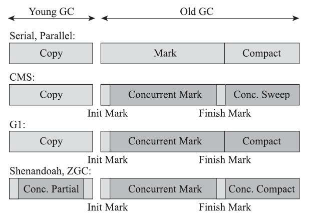
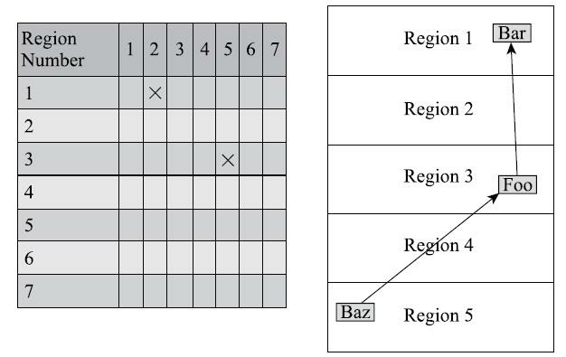
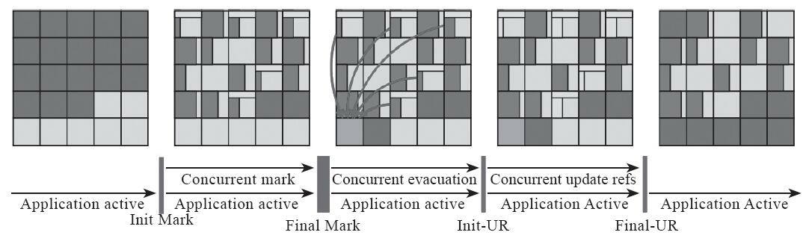
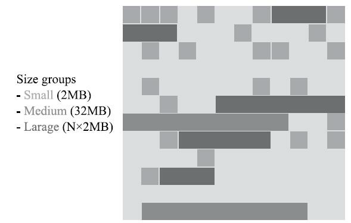
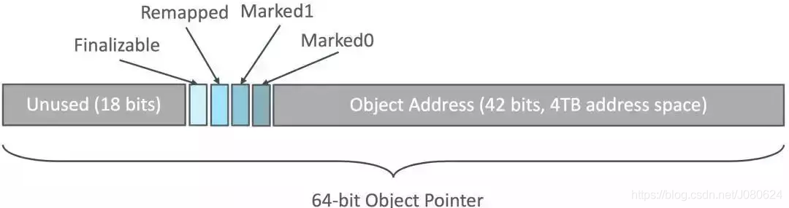
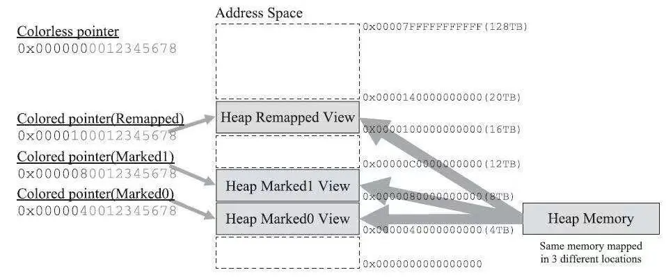

衡量垃圾收集器的三个最重要的指标是：内存占用，吞吐量和延迟，这三者共同构成了一个不可能三角，三者的总体表现会随着技术进步而越来越好，但是这三者不可能同时表示完美，一般可以同时达到其中两项。

Shenandoah和ZGC，几乎整个工作过程全 部都是并发的，只有初始标记、最终标记这些阶段有短暂的停顿，这部分停顿的时间基本上是固定的，与堆的容量、堆中对象的数量没有正比例关系。实际上，它们都可以在任意可管理的（譬如现在 ZGC只能管理4TB以内的堆）堆容量下，实现垃圾收集的停顿都不超过十毫秒这种以前听起来是天方夜谭、匪夷所思的目标。这两款目前仍处于实验状态的收集器，被官方命名为“低延迟垃圾收集器”（Low-Latency Garbage Collector或者Low-Pause-Time Garbage Collector)。

### Shenandoah收集器
> 仅存在于OpenJDK中，而被OracleJDK排除在外

Shenandoah像是G1的继任者，有相似的堆内存布局，在初始标记、并发标记等许多阶段的处理思路上都高度一致，甚至还直接共享了一部分的实现代码，这使得部分对G1的打磨改进和Bug修改会同时反映 在Shenandoah之上，而由于Shenandoah加入所带来的一些新特性，也有部分会出现在G1收集器中，譬如在并发失败后作为“逃生门”的Full GC ，G1就是由于合并了Shenandoah的代码才获得多线程Full GC的支持。
​

相对于G1做的改进：
在管理堆内存方面至少有三点不同：

1. 最重要的是**支持并发的整理算法**（G1回收阶段可以多线程并行，而不能与用户线程并发）
1. **Shenandoah默认不使用分代收集**(也就是说，不会有专门的新生代region和老年代region的存在，没有实现分代，并不是说分代对Shenandoah来说没有价值，这更多是处于性价比的考量，基于工作量上的考量而将其放到优先级较低的位置上去)
1. Shenandoah摒弃了在G1中耗费大量内存和计算资源去维护的记忆集，改用名为“连接矩阵”的全局数据结构来记录跨region的引用关系，降低了处理跨代指针时的记录集维护消耗，也降低了伪共享的发生概率（看不懂）。连接矩阵示意图如下所示。

Shenandoah收集器的工作过程大致可以划分为以下九个阶段：

1. 初始标记（Initial Marking）：与G1一样，首先标记与GC Roots直接关联的对象，这个阶段仍是STW的，但停顿时间与堆大小无关，只与GC Roots的数量相关。
1. 并发标记（Concurrent Marking）：与G1一样，遍历对象图，标记出全部可达的对象，这个阶段是与用户线程一起并发的，时间长短取决于堆中存在对象的数量以及对象图的结构复杂程度。
1. 最终标记（Final Marking）：与G1一样，处理剩余的SATB（Snapshot-At-The-Beginning）扫描，并在这个阶段统计出回收价值最高的region，将这些region构成一组回收集（Collection Set）。最终标记阶段也会有一小段短暂的停顿。
1. 并发清理（Concurrent Cleanup）：这个阶段用于清理那些整个区域内连一个存货对象都没有找到的region（这类Region被称为Immediate Garbage Region）
1. 并发回收（Concurrent Evacuation）：这个阶段是Shenandoah与其他收集器的核心差异。在这个阶段，Shenandoah要把回收集里面的存活对象先复制一份到其他未被使用的Region之中。
> 复制对象这件事情，如果将用户线程冻结起来再做是相当简单，但是如果，想着必须要同时并发进行的话，就变得复杂起来了。其困难的地方在于：在移动对象的同时，用户线程仍然可能不停对被移动的对象进行读写访问，移动对象是一次性的行为，但是移动之后整个内存中国所有指向该对象的引用都还是旧对象的地址，这是很难一瞬间全部改变过来的。对于并发回收解决段遇到的这些困难，Shenandoah将会通过读屏障和被称为“Brooks Pointers”的转发指针来解决。并发回收阶段运行的时间长短取决于回收集的大小。

6. 初始引用更新（Initial Update Reference）：**并发回收阶段复制对象结束后，还需要把堆中所有指向旧对象的引用修正到复制后的新地址，这个操作称为引用更新。**引用更新的初始化阶段实际上并未做什么具体的处理，设立这个阶段还是为了建立一个线程集合点，确保所有并发回收阶段中进行的收集器线程都已经完成分配给它们的对象移动任务而已。**初始引用更新时间很短，会产生一个非常短暂的停顿。**
6. 并发引用更新（Concurrent Update Reference）：**真正开始进行引用更新操作，这个阶段是与用户线程一起并发的，时间长短取决于内存中涉及的引用数量的多少。**并发引用更新与并发标记不同，它不再需要沿着对象图来搜索，只需要按照内存地址地址的顺序，线性地搜索出一样类型，把旧值改为新值即可。
6. 最终引用更新（Final Update Reference）：解决了堆中的引用更新后，还要修正存在于GC Roots中的引用。**这个阶段是Shenandoah的最后一次停顿，停顿时间只与GC Roots的数量相关。**
6. 并发清理（Concurrent Cleanup）：经过并发回收和引用更新之后，整个回收集中所有的region已再无存活对象，这些region都变成Immediate Garbage Regions了，**最后再调用一次并发清理过程来回收这些region的内存空间，供以后新对象分配使用**。

以上九个阶段拆分较为琐碎，可以只关注三个最重要的并发阶段：并发标记、并发回收、并发引用更新。

### ZGC收集器

- 可以说是Oracle抄了 Azul System的作业, ZGC 与 Azul System公司PGC(Pauseless GC) 和 C4(Concurrent Continuously Compacting Collector) 在算法和实现原理上是高度相似的, 只存在术语称谓的区别。
- 主要特征:
   - 基于Region内存布局
   - 不设分代
   - 使用了读屏障, 染色指针和内存多重映射等技术来实现可并发的标记-整理算法
   - 以低延迟为首要目标

首先从ZGC的内存布局说起。与Shenandoah和G1一样，ZGC也采用基于Region的堆内存布局，但与它们不同的是，ZGC的Region（在一些官方资料中将它称为Page或ZPage）具有动态性——动态创建和销毁，以及动态的区域容量大小。在x64硬件平台下，ZGC的 Region可以具有如下图所示的大、中、小三类容量：

- 小型Region（Small Region）：容量固定为2MB，用于放置小于256KB的小对象。
- 中型Region（Medium Region）：容量固定为32MB，用于放置大于等于256KB但小于4MB的对象。
- 大型Region（Large Region）：
   - 容量不固定，可以动态变化，但必须为2MB的整数倍，用于放置4MB或以上的大对象。
   - 每个大型Region中只会存放一个大对象，这也预示着虽然名字叫作“大型 Region”，但它的实际容量完全有可能小于中型Region，最小容量可低至4MB。
   - 大型Region在ZGC的实现中是不会被重分配（重分配是ZGC的一种处理动作，用于复制对象的收集器阶段）的，因为复制一个大对象的代价非常高昂。
#### 染色体技术

   - 在64位系统中, 理论可以访问的内存高达16EB。实际上基于需求, 性能, 和成本考虑, 在AMD64架构中只支持到52位(4PB)的地址总线和48位(256TB)的虚拟地址空间, 目前64位的硬件实际能够支持的最大内存只有256TB。此外操作系统还有自己的约束, 64Linux系统分别支持47位(128TB)的进程虚拟地址和46位(64TB)的物理地址空间, 64位的Windows系统只支持44位(16TB)的物理地址空间。
   - 虽然Linux下64位指针的高18位不能用来寻址, 剩余的46位指针所能支持的64TB内存在今天仍能够充分满足大型服务器需要。而ZGC则利用了剩下的46位指针的高4位提取出来用于存储四个标志信息。
      - 通过这些标志位, 虚拟机可以直接从指针中看到其引用对象的状态, 是否进入重分配集, 是否通过finalize()方法才能被访问到。
      - 由于进一步压缩了原本只有46位的地址空间, ZGC能够管理的内存不可以超过4TB。
   - 三大优势
      - 染色指针可以使得一旦某个Region的存活对象被移走之后, 此Region立即就能够被释放和重用掉, 而不必等待整个堆中所有指向该Region的引用都被修正后才能清理。
      - 染色指针可以大幅减少在垃圾收集过程中内存屏障的使用数量。
      - 染色指针可以作为一种可扩展的存储结构用来记录更多与对象标记、重定位过程相关的数据, 以便日后进一步提高性能。
   - 在Linux/X86-64平台上的ZGC使用了多重映射(Multi-Mapping) 将多个不同的虚拟内存映射到同一个物理内存地址上。
      - 任何的进程在进程自己看来自己的内存空间都是连续的, 但是计算机实际的物理内存并不是与该进程的内存是一一对应的。碎片化的物理内存可以映射成一个完整的虚拟内存, 同时应用可以申请比物理内存大的内存, 使得多个内存互不干扰, 使编译好的二进制文件的地址统一化......
   - ZGC运作过程
      - Concurrent Mark(并发标记)
         - 遍历对象图做可达性分析的阶段, 前后也要经过类似于G1, Shenandoah 的初始标记, 最终标记的短暂停顿。
         - 与G1, Shenandoah不同的是, ZGC的标记是在指针上而不是在对象上进行的, 标记阶段会更新染色指针中的Marked0、Marked1标志位。
      - Concurrent Prepare for Relocate(并发预备重分配)
         - 此阶段需要根据特定的查询条件统计出本次收集过程要清理哪些Region, 将这些Region组成重分配集(Relocation Set)。
      - Concurrent Relocate(并发重分配)
         - 是ZGC执行过程中的核心阶段, 此过程要把重分配集中的存活对象复制到新的Region上, 并为重分配集中的每个Region维护一个转发表(Forward Table), 记录从旧对象到新对象的转向关系。
         - 由于染色指针的存在, ZGC能仅从引用上就明确得知一个对象是否处于重分配集之中。如果用户线程此时并发访问了位于重分配集中的对象, 这次访问将会被预置的内存屏障截获, 然后立即根据Region上的转发表记录将访问转发到新复制的对象上, 并同时修正该引用的值, 使其直接指向新对象, 此即为Self-Healing(自愈)[只有第一次访问旧对象会陷入转发]。
      - Concurrent Remap(并发重映射)
         - 修正整个堆中指向重分配集中旧对象的所有引用。
         - 重映射清理这些旧引用的主要目的是为了不变慢, 并不是很迫切。
         - ZGC将并发重映射阶段要做的工作, 合并到了下一次垃圾收集循环中的并发标记阶段里去完成, 从而节省了一次遍历对象图的开销。

参考：《深入理解Java虚拟机：JVM高级特性与最佳实践（第3版）》--周志明

