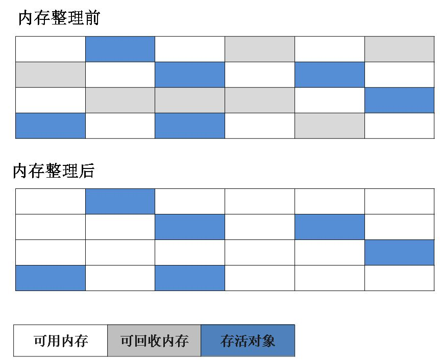
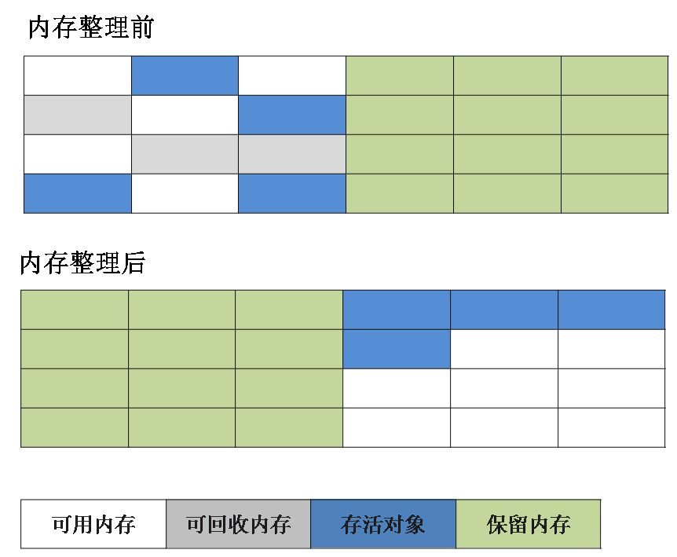
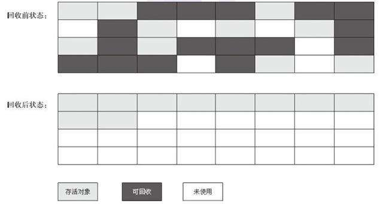
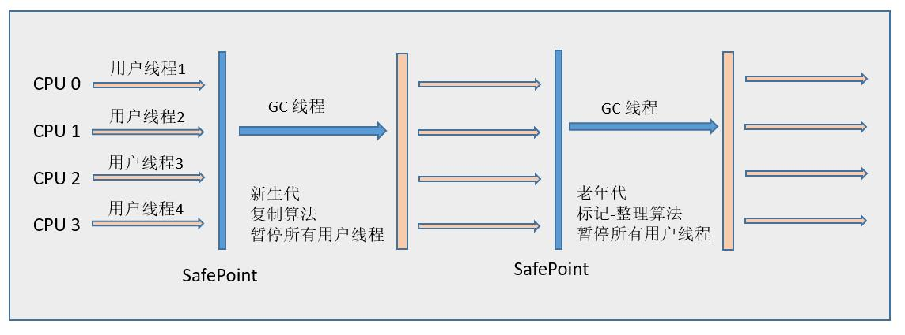
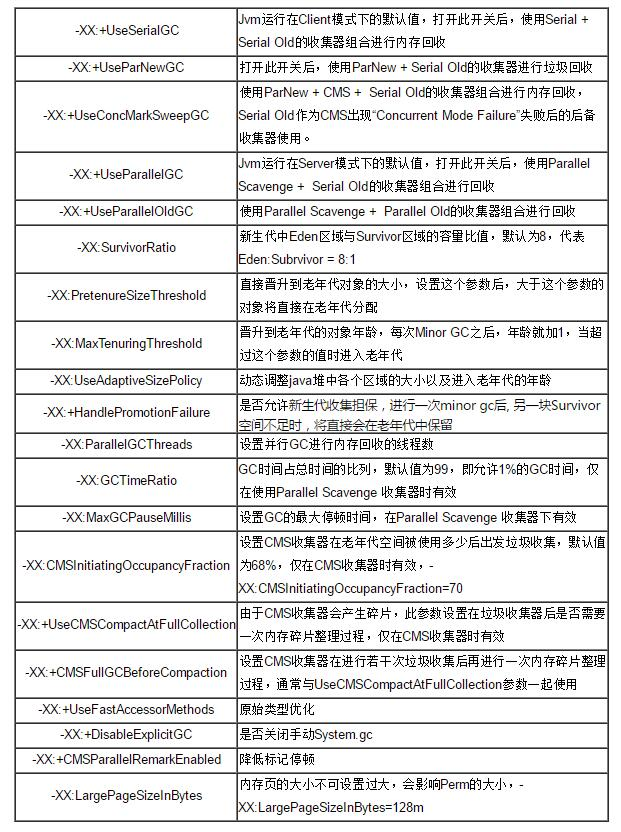
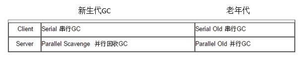
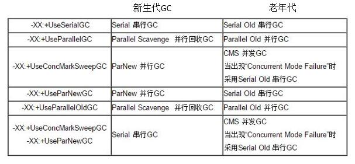

## 前言
Java 的自动内存管理主要是针对对象内存的回收和对象内存的分配。同时，Java 自动内存管理最核心的功能是 **堆** 内存中对象的分配与回收。
Java 堆是垃圾收集器管理的主要区域，因此也被称作**GC 堆（Garbage Collected Heap）**.从垃圾回收的角度，由于现在收集器基本都采用分代垃圾收集算法，所以 Java 堆还可以细分为：新生代和老年代：再细致一点有：Eden 空间、From Survivor、To Survivor 空间等。**进一步划分的目的是更好地回收内存，或者更快地分配内存。**

## 内存分配

上图所示的 Eden 区、From Survivor0("From") 区、To Survivor1("To") 区都属于新生代，Old Memory 区属于老年代。
大部分情况，对象都会首先在 Eden 区域分配，在一次新生代垃圾回收后，如果对象还存活，则会进入 s0 或者 s1，并且对象的年龄还会加 1(Eden 区->Survivor 区后对象的初始年龄变为 1)，当它的年龄增加到一定程度（默认为 15 岁)，就会被晋升到老年代中。对象晋升到老年代的年龄阈值，可以通过参数 `-XX:MaxTenuringThreshold` 来设置。
经过这次 GC 后，Eden 区和"From"区已经被清空。这个时候，"From"和"To"会交换他们的角色，也就是新的"To"就是上次 GC 前的“From”，新的"From"就是上次 GC 前的"To"。不管怎样，都会保证名为 To 的 Survivor 区域是空的。Minor GC 会一直重复这样的过程，直到“To”区被填满，"To"区被填满之后，会将所有对象移动到老年代中。
​

**对象优先在堆的eden区分配，大对象直接进入老年代，长期存活的对象直接进入老年代，当eden中没有足够空间时，虚拟机进行一次minor gc，full gc一般发生在老年代，不过通过配置，可以在full gc之前进行一次minor gc，来加快老年代的回收速度。**

## 垃圾收集
Java的自动管理主要是针对对象内存的回收和对象内存的分配。同时Java自动内存管理最核心的功能是**堆**内存中对象的分配与回收（Java堆是垃圾收集器管理的最主要区域）
### 如何判定对象死亡

1. **引用计数法**
给对象中添加一个引用计数器，每当有一个地方引用它，计数器就加 1；当引用失效，计数器就减 1；任何时候计数器为 0 的对象就是不可能再被使用的。
**这个方法实现简单，效率高，但是目前主流的虚拟机中并没有选择这个算法来管理内存，其最主要的原因是它很难解决对象之间相互循环引用的问题。**
1. **可达性分析法**
这个算法的基本思想就是通过一系列的称为 **“GC Roots”** 的对象作为起点，从这些节点开始向下搜索，节点所走过的路径称为引用链，当一个对象到 GC Roots 没有任何引用链相连的话，则证明此对象是不可用的。
不可达不一定是非死不可的，真正宣告对象死亡至少要经过 两次标记。第一次标记且进行一次筛选（此对象是否有必要执行finalize方法，当对象没有覆盖finalize方法，或finalize方法以及被虚拟机调用过时，虚拟机将这两种情况视为没有必要执行；被判断需要执行的对象将会被房子一个队列中进行第二次标记，除非这个对象与引用链上的任何一个对象建立关联，否则就会被真的回收）
#### 在Java语言中，可以作为GCRoots的对象：

1. 虚拟机栈（栈帧中的本地变量表）中引用的对象
1. 方法区中类静态属性引用的对象
1. 方法区中常量引用的对象
1. 本地方法栈中JNI（即一般说的Native方法）引用的对象
### 如何判断一个类是无用的类
方法区主要回收的是无用的类，那么如何判断一个类是无用的类的呢？
判定一个常量是否是“废弃常量”比较简单，而要判定一个类是否是“无用的类”的条件则相对苛刻许多。类需要同时满足下面 3 个条件才能算是 **“无用的类”** ：

- 该类所有的实例都已经被回收，也就是 Java 堆中不存在该类的任何实例。
- 加载该类的 ClassLoader 已经被回收。
- 该类对应的 java.lang.Class 对象没有在任何地方被引用，无法在任何地方通过反射访问该类的方法。

虚拟机可以对满足上述 3 个条件的无用类进行回收，这里说的仅仅是“可以”，而并不是和对象一样不使用了就会必然被回收。
### 垃圾收集算法

1. 标记-清除算法（Mark-Sweep）：分标记和清除两个阶段：首先标记出所有需要回收的对象，在标记完成后统一回收所有被标记的对象。为什么叫它是最基础的算法：是因为后续的收集算法都是基于这种思路，对其不足进行改进的
  不足主要有两个：`一是效率问题，标记和清除两个过程的效率都不高`；`另一个是空间问题，标记清除后会产生大量不连续的内存碎片，空间碎片太多可能会导致以后在程序运行过程中需要分配较大对象时，无法找到足够的连续内存而不得不提前触发另一次垃圾收集动作`

  
1. 复制算法：将可用的内存按容量划分为大小相等的两块，每次只使用其中的一块。当这一块的内存用完了，就将还存活的着的对象复制到另外一块上面，然后再将已经使用过的内存空间一次清理掉。
`这样使得每次是对整个半区进行内存回收，内存分配时也就不用考虑内存碎片等复杂情况，只要移动堆顶指针，按顺序分配内存即可，实现简单，运行高效。`只是`这种算法的代价是将内存缩小为了之前的一半，代价太高了`，不足点还有，在对象存活率较高时就要进行较多的复制操作，效率将会降低，如果不想浪费一半的空间，就需要额外的空间进行分配担保，以应对被使用的内存中所有对象都100%存活的极端情况，所以老年代一般选用第三种算法。
现在商业虚拟机用这种算法来回收新生代

3. 标记-整理算法（Mark-Compact）：标记过程与标记-整理算法一样，但后续步骤不是直接对可回收对象进行清理，而是让所有存活的对象都向一端移动，然后直接清理掉端边界以外的内存。

  

4. 分代收集算法（Generational Collection）：不算新的算法，只是根据对象存活周期的不同将内存划分为几块。一般就是java堆分为新生代和老年代，这样就可以根据各个年代的特点采用最合适的算法
   比如，新生代中，每次垃圾收集时都发现有大批对象死去，只有少量存活，那就选用复制算法，只需要付出少量存活对象的复制成本就可以完成收集
   老年代中因为对象存活率高，没有额外的空间对他进行分配担保，只能使用标记-清理或者标记-整理算法来进行回收。

### 垃圾收集器

#### Serial收集器

   - 单线程收集器，**工作时必须暂停其他工作线程**（Stop the World）
   - 依然是虚拟机运行在客户端模式下的默认新生代收集器
   - 简单高效（相比其他收集器的单程相比）
#### ParNew收集器

   - Serial的多线程版本，控制参数，收集算法，stop the world，对象分配规则，回收策略与其一样
   - 虚拟机运行在服务器模式下的首选新生代收集器
   - **在单CPU中不比Serial收集器效果好，甚至还有线程交互的开销**
#### Parallel Scavenge收集器

   - 新生代收集器，复制算法，多线程
   - 关注点和ParNew不一样，目的是达到一个可控制的吞吐量，也被称为“吞吐量优先”收集器
   - 两个参数用于精确控制吞吐量：`-XX:MaxGCPauseMillis`参数用于控制最大垃圾收集停顿时间（缩短该时间是以牺牲吞吐量和新生代空间来换取的）；`-XX：GCTimeRatio`直接设置吞吐量大小的。**直观上，只要最大的垃圾收集停顿时间越小，吞吐量越高，但是GC停顿时间的缩短时以牺牲吞吐量和新生代空间作为代价的。**
   - 还有个参数`-XX:+UseAdaptiveSizePolicy`，当该参数打开后，不需要手工指定新生代大小，Eden与存活区的比例，**虚拟机会根据当前系统的运行系统的运行情况收集性能监控信息，动态调整这些参数以提供最合适的停顿时间或者最大的吞吐量，这种调节方式称为GC自适应的调节策略**。这个是这种收集器与ParNew收集器的一个重要区别。
#### Serial Old收集器

   - Serial收集器的老年代版本，也是单线程收集器，使用标记-整理算法，主要意义也是在于给客户端模式下的虚拟机使用。
   - 如果在服务器模式下，其还有两大用途：一个是在JDK1.5以前的版本与Parallel Scavenge收集器搭配使用，二是作为CMS收集器的后备预案，在并发收集发生Concurrent Mode Failure时使用
#### Parallel Old收集器

   - 是Parallel Scavenge收集器的老年版本，多线程，使用标记-整理算法，在JDK1.6版本后提供。其通常与Parallel Scavenge收集器配合使用，“吞吐量优先”收集器是这个组合的特点，在注重**吞吐量和CPU资源敏感**的场合，都可以使用这个组合。
#### CMS收集器（ConCurrent Mark Sweep）

   - 是一种**以获取最短回收停顿时间**为目标的收集器，基于标记-清除算法实现，它的运作过程相对前面几种收集器来说更复杂一些
   - 运作四个过程：
      - 初始标记：仅标记一下GC Roots能直接关联到的对象，速度很快
      - 并发标记：进行GC Roots Tracking的过程
      - 重新标记：为了修正并发标记期间因用户继续运作而导致标记产生变动的那一部分对象的标记记录，会比初始标记时间长点，但远比并发标记时间短
      - 并发清除
   - 前两个步骤仍然需要“Stop the World”
   - 三个明显缺点：
      - **CMS收集器对CPU资源非常敏感**
      - 无法处理浮动垃圾，可能出现Concurrent Mode Failure失败而导致另一次Full GC的产生
      - **标记-清除算法会结束时产生大量空间碎片，碎片过多时，会给大对象分配带来很大麻烦，即使老年区有很大的内存剩余，但是依然没法分配，不得不提前进行一次Full GC**
#### G1收集器( Garbage First )

   - G1的设计原则是"首先收集尽可能多的垃圾(Garbage First)"。因此，**G1并不会等内存耗尽(串行、并行)或者快耗尽(CMS)的时候开始垃圾收集**，而是在内部采用了**启发式算法**，在老年代找出具有高收集收益的分区进行收集。同时G1可以根据用户设置的暂停时间目标**自动调整年轻代和总堆大小，暂停目标越短年轻代空间越小、总空间就越大**；
   - G1采用内存分区(Region)的思路，将内存划分为一个个相等大小的内存分区，回收时则以分区为单位进行回收，存活的对象复制到另一个空闲分区中。由于都是以相等大小的分区为单位进行操作，因此G1天然就是一种压缩方案(局部压缩)；
   - G1虽然也是分代收集器，但整个内存分区不存在物理上的年轻代与老年代的区别，也不需要完全独立的survivor(to space)堆做复制准备。G1只有逻辑上的分代概念，或者说每个分区都可能随G1的运行在不同代之间前后切换；
   - G1的收集都是STW的，但年轻代和老年代的收集界限比较模糊，采用了混合(mixed)收集的方式。即每次收集既可能只收集年轻代分区(年轻代收集)，也可能在收集年轻代的同时，包含部分老年代分区(混合收集)，这样即使堆内存很大时，也可以限制收集范围，从而降低停顿。
   - 传统的收集器如果发生 Full GC 是对整个堆进行全区域的垃圾收集，而分配成各个 Region 的话，方便 G1 跟踪各个 Region 里垃圾堆积的价值大小（回收所获得的空间大小及回收所需经验值），这样根据价值大小维护一个优先列表，根据允许的收集时间，优先收集回收价值最大的 Region,也就避免了整个老年代的回收，也就减少了 STW 造成的停顿时间。同时由于只收集部分 Region,可就做到了 STW 时间的可控。

   - 面向服务端应用的垃圾收集器，目的是替换掉JDK1.5中发布的CMS收集器
   - 有以下特点：
      - 多线程，并行与并发
      - 分代收集
      - 空间整合：整体上是标记-整理，局部是复制
      - 可预测的停顿：这是相对于CMS的另一个大优势

此外，G1收集器将Java堆划分为多个大小相等的Region（独立区域），新生代与老年代都是一部分Region的集合，G1的收集范围则是这一个个Region（化整为零）。G1的工作过程如下：

- 初始标记（Initial Marking）
- 并发标记（Concurrent Marking）
- 最终标记（Final Marking）
- 筛选回收（Live Data Counting and Evacuation）

G1可以设置一个垃圾回收的预期停顿时间，制定一个目标，规定在一个时间内，垃圾回收引起的停顿时间不能超过多久，之后就由G1来全权负责，保证达到该目标。想想之前的几款垃圾回收器，费尽心思的优化参数，最终其实还是为了减少STW的时间，提高吞吐量，而G1直接就做到由开发者来指定STW时间，相比起其他垃圾回收器，无疑显得更智能和友好。

而G1能够做到控制垃圾回收停顿时间的关键在于，它要追踪每个Region的回收价值，它要清楚每个Region里有多少对象是垃圾，如果对这个Region做回收，会消耗多少时间，尽量在有限的时间内回收更多的垃圾对象，把垃圾回收造成的STW时间控制在开发指定的时间范围内。

简而言之，G1会根据开发设定的预期系统停顿时间，来选择最少回收时间和最多垃圾对象的Region进行回收，效率和成果最大化，保证GC时的停顿时间在可控范围内。

### 垃圾收集器常用参数总结

client/serrver端不同的GC方式：

Sun JDK HotSpot虚拟机GC组合方式：

