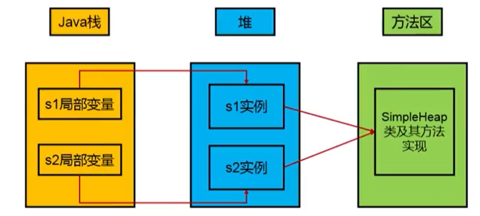
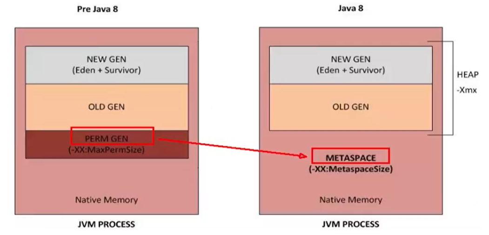
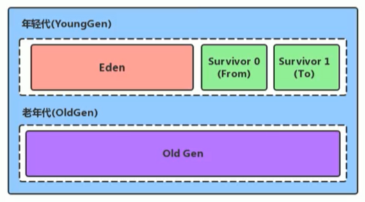
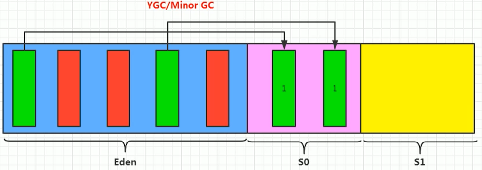
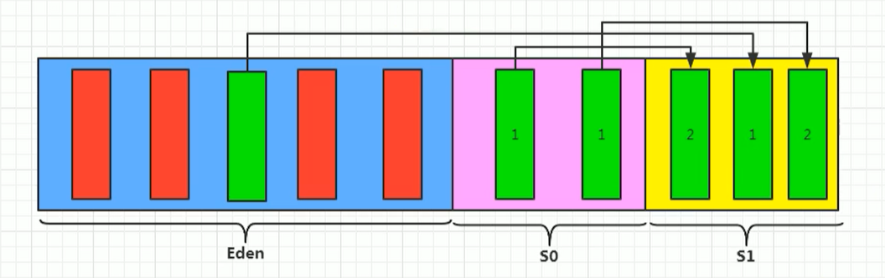
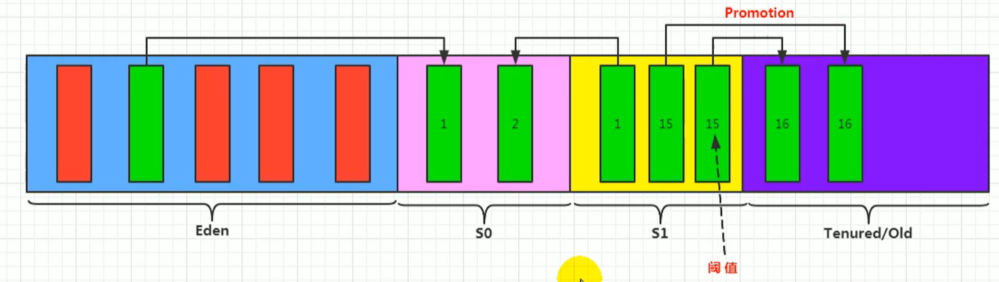
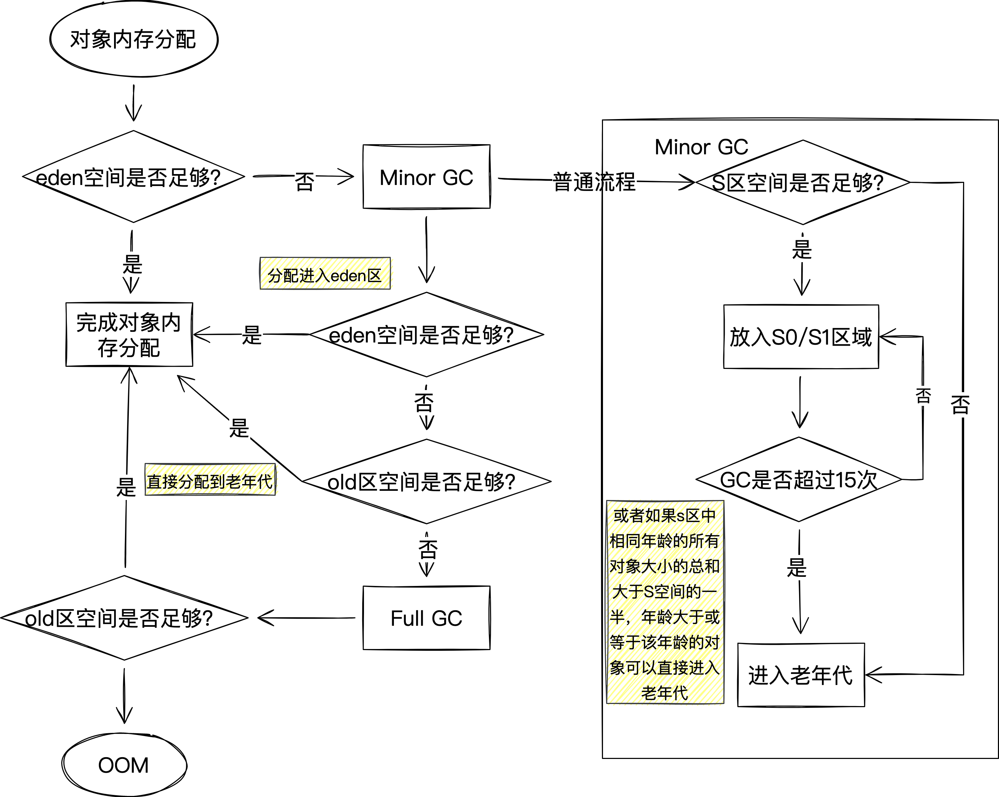
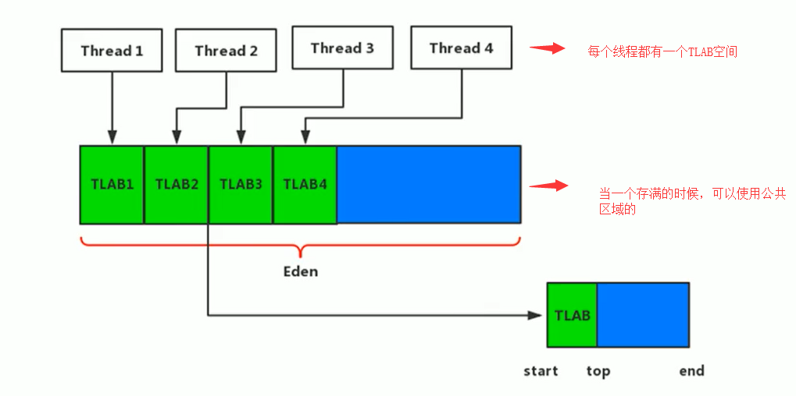
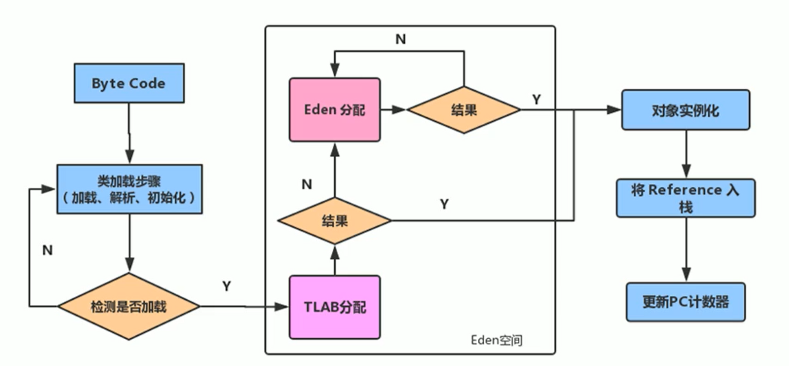

## 堆的核心概述
- 一个JVM实例只存在一个堆内存，堆也是Java内存管理的核心区域
- 堆在JVM启动时就被创建，其大小也就随之确定。是JVM中最大的一块内存空间（堆大小是可以调节的）
- 《Java虚拟机规范》规定，**堆可以处于物理上不连续的内存空间中，但在逻辑上它应该被视为是连续的。**
- **所有的线程共享Java堆，不过在堆中还可以划分线程私有的缓冲区（TLAB，Thread Local Allocation Buffer）**
- **“几乎”所有的对象实例以及数组都应当在运行时分配在堆上**
- 数组和对象可能永远不会存储在栈上，因为栈帧中保存引用，这个引用指向对象或者数组在堆中的位置
- 在方法结束后，堆中的对象不会马上被移除，仅仅在垃圾收集的时候才会被移除（要不然GC过于频繁，影响用户线程执行）
- 堆是GC的重点区域

### 堆的内存细分
Java 7及之前堆内存逻辑上分为三部分：新生区+养老区+永久区

- Young Generation Space 新生区 Young/New 又被划分为Eden区和Survivor区
- Tenure generation space 养老区 Old/Tenure
- Permanent Space永久区 Perm

Java 8及之后堆内存逻辑上分为三部分：新生区养老区+元空间

- Young Generation Space新生区 Young/New 又被划分为Eden区和Survivor区
- Tenure generation space 养老区 Old/Tenure
- Meta Space 元空间 Meta

## 设置堆内存大小和OOM
Java堆区用于存储Java对象实例，那么堆的大小在JVM启动时就已经设定好了，可以通过选项"-Xmx"和"-Xms"来进行设置。

- “-Xms"用于表示堆区的起始内存，等价于-xx:InitialHeapSize
- “-Xmx"则用于表示堆区的最大内存，等价于-XX:MaxHeapSize

一旦堆区中的内存大小超过“-xmx"所指定的最大内存时，将会抛出outofMemoryError异常。
在开发中通常会将-Xms和-Xmx两个参数配置相同的值，其目的是**为了能够在ava垃圾回收机制清理完堆区后不需要重新分隔计算堆区的大小，从而提高性能**。
默认情况下

- 初始内存大小：物理电脑内存大小/64
- 最大内存大小：物理电脑内存大小/4

## 年轻代和老年代
存储在JVM中的Java对象可以被划分为两类：

1. 生命周期较短的瞬时对象，这类对象的创建和消亡都非常迅速
1. 生命周期非常长的对象，在某些极端情况下，可以与JVM的生命周期保持一致

Java堆区进一步细分的话，可以划分为年轻代（YoungGen）和老年代（oldGen）
其中年轻代又可以划分为Eden空间、Survivor0空间和Survivor1空间（有时也叫做from区、to区）

默认是8：1：1，但是必须要手动指定

- 几乎所有对象都是在Eden区被new出来的
- 绝大部分的对象的销毁都在新生代进行了（大约80%）
- 可以使用选项"-Xmn"设置新生代最大内存大小，这个参数一般使用默认值就可以了。
## 图解对象分配过程
JVM设计者不仅需要考虑内存如何分配、在哪里分配等问题，并且由于内存分配算法与内存回收算法密切相关，所以还需要考虑GC执行完内存回收后是否会在内存空间中产生内存碎片。

- new的对象先放Eden区。该区有大小限制。
- 当Eden的空间填满时，程序又需要创建对象，JVM的垃圾回收器将对Eden区进行垃圾回收（MinorGC），将Eden区中的不再被其他对象所引用的对象进行销毁。再加载新的对象放到Eden区
- 然后将Eden中的剩余对象移动到s0区。
- 如果再次触发垃圾回收，此时上次幸存下来的放到s0区的，如果没有回收，就会放到s1区。
- 如果再次经历垃圾回收，此时会重新放回s0区，接着再去s1区。
- 啥时候能去养老区呢？可以设置次数。默认是15次。
- 在养老区，相对悠闲。当养老区内存不足时，再次触发GC：Major GC，进行养老区的内存清理
- 若养老区执行了Major GC之后，发现依然无法进行对象的保存，就会产生OOM异常。
   - 可以设置参数：-Xx:MaxTenuringThreshold= N进行设置

我们创建的对象，一般都是存放在Eden区的，当我们Eden区满了后，就会触发GC操作，一般被称为 YGC / Minor GC操作

当我们进行一次垃圾收集后，红色的将会被回收，而绿色的还会被占用着，存放在S0(Survivor From)区。同时我们给每个对象设置了一个年龄计数器，一次回收后就是1。
同时Eden区继续存放对象，当Eden区再次存满的时候，又会触发一个MinorGC操作，此时GC将会把 Eden和Survivor From中的对象 进行一次收集，把存活的对象放到 Survivor To区，同时让年龄 + 1

我们继续不断的进行对象生成 和 垃圾回收，当Survivor中的对象的年龄达到15的时候，将会触发一次 Promotion晋升的操作，也就是将年轻代中的对象 晋升到 老年代中

Eden满了，触发GC，导致S区也进行GC，而不是因为S区满了会触发GC（S区是被动的GC）
> 总结：
> - 针对S0和S1：复制之后有交换，谁空谁是to
> - 关于垃圾回收：频繁在新生区收集，很少在养老区收集，几乎不在永久区/元空间收集

#### 对象分配的特殊情况

## Minor GC、Major GC和Full GC
这里其实主要是要区分后面两个GC概念。
JVM在进行GC时，并非每次都对上面三个内存区域一起回收的，大部分时候回收的都是指新生代
针对HotSpot VM的实现，它里面你的GC按照回收区域又分为两大类：一种是部分收集（Partial GC），一种是整堆收集（Full GC）

- 部分收集：不是完整收集整个Java堆的垃圾收集，其中又分为：
   - 新生代收集（Minor GC）：只是新生代的垃圾收集
   - 老年代收集（Major GC）：只是老年代的垃圾收集
      - 目前只有CMS会有单独收集老年代的行为
      - 注意很多时候Major GC和Full GC混淆使用，需要具体分辨是老年代回收还是整堆回收
   - 混合收集（Mixed GC）：收集整个新生代以及部分老年代的垃圾收集
      - 目前只有G1会有这种行为
- 整堆收集（Full GC）：收集整个Java堆和方法区的垃圾
#### Minor GC触发机制

- 当年轻代空间不足，就会触发，这里的年轻代满指的是Eden满，S区满并不会触发GC（每次Minor GC会清理年轻代的内存）
- 因为Java对象大多都具备朝生夕灭的特效，所以Minor GC非常频繁，一般回收速度也快
- Minor GC会引起STW
#### Major GC触发机制

- 发生一次Major GC，经常会伴随着至少一次的Minor GC（不绝对，Parallel Scavenge收集器的收集策略中就有直接进行Major GC的策略选择过程）
   - 在老年代空间不足时，会尝试触发Minor GC，如果还空间不足，则触发Major GC
- Major GC速度一般比Minor GC慢10倍以上，STW时间更长
- 如果Major GC后，内存还不足，就会出现OOM
- Major GC的速度一般会比Minor GC慢10倍以上。

#### Full GC触发机制
五种

- 调用System.gc()时，系统建议执行Full GC，但不是必然执行
- 老年代空间不足
- 方法区空间不足
- 通过Minor GC后进入老年代的平均大小小于老年代的可用内存
- 由Eden区、S0向S1区复制时，对象大小大于S1区可用内存，则把该对象转存到老年代，且老年代的可用大小小于该对象大小。

## 堆空间分代思想
其实不分代完全可以，分代的唯一理由就是优化GC性能，如果没有分代，那所有的对象都在一块，就如同把一个学校的人都关在一个教室，GC的时候要找到哪些对象没用，这样就会对堆的所有区域进行扫描。而很多对象都是朝生夕死的，如果分代的话，把新创建的对象放到某一个地方，当GC时先把这块存储临时对象的区域进行回收，这样就会腾出大量的空间出来。
## 内存分配策略
如果对象在Eden出生并经过第一次Minor GC后仍然存活，并且能被Survivor容纳的话，将被移动到survivor空间中，并将对象年龄设为1。对象在survivor区中每熬过一次MinorGC，年龄就增加1岁，当它的年龄增加到一定程度（默认为15岁，其实每个JVM、每个GC都有所不同）时，就会被晋升到老年代
> 对象晋升老年代的年龄阀值，可以通过选项-xx:MaxTenuringThreshold来设置

针对不同年龄段的对象分配原则如下：

- 优先分配到Eden区
- 大对象直接分配到老年代（如比较长的字符串或者数组）
   - 尽量避免程序中出现过多的大对象
- 长期存活的对象分配到老年代
- 动态对象年龄判断
   - 如果survivor区中相同年龄的所有对象大小的总和大于Survivor空间的一半，年龄大于或等于该年龄的对象可以直接进入老年代，无须等到MaxTenuringThreshold 中要求的年龄。
- 空间分配担保： -Xx:HandlePromotionFailure
   - 也就是经过Minor GC后，所有的对象都存活，因为Survivor比较小，所以就需要将Survivor无法容纳的对象，存放到老年代中。（老年代来担保有足够空间来接收该对象）

## 为对象分配内存：TLAB
#### 为什么有TLAB（Thread Local Allocation Buffer）？
也就是为每个线程单独分配了一个缓冲区

- 堆区是线程共享区域，任何线程都可以访问到堆区中的共享数据
- 由于对象实例的创建在JVM中非常频繁，因此在并发环境下从堆区中划分内存空间是线程不安全的
- 为避免多个线程操作同一地址，需要使用加锁等机制，进而影响分配速度。
#### 什么是TLAB？

- 从内存模型而不是垃圾收集的角度，对Eden区继续进行划分，JVM为每个线程分配了一个私有缓存区域，它包含在Eden空间内。
- 多线程同时分配内存时，使用TLAB可以避免一系列的非线程安全问题，同时还能够提升内存分配的吞吐量，因此我们可以将这种内存分配方式称为快速分配策略
- 基本上所有OpenJDK衍生出来的JVM都提供TLAB设计

- 尽管不是所有的对象实例都能够在TLAB中成功分配内存，但JVM确实是将TLAB作为内存分配的首选。（尽管很小，大概只占1%，但很有用）
- 在程序中，开发人员可以通过选项“-Xx:UseTLAB”设置是否开启TLAB空间。
- 默认情况下，TLAB空间的内存非常小，仅占有整个Eden空间的1%，当然我们可以通过选项“-Xx:TLABWasteTargetPercent”设置TLAB空间所占用Eden空间的百分比大小。
- 一旦对象在TLAB空间分配内存失败时，JVM就会尝试着通过使用加锁机制确保数据操作的原子性，从而直接在Eden空间中分配内存。
#### TLAB分配过程

## 堆空间参数小结

- -XX：+PrintFlagsInitial：查看所有的参数的默认初始值
- -XX：+PrintFlagsFinal：查看所有的参数的最终值（可能会存在修改，不再是初始值）
   - jps->jinfo -flag 参数名 进程号
- -Xms：初始堆空间内存（默认为物理内存的1/64）
- -Xmx：最大堆空间内存（默认为物理内存的1/4）
- -Xmn：设置新生代的大小。（初始值及最大值）
- -XX:NewRatio：配置新生代与老年代在堆结构的占比
- -XX:SurvivorRatio：设置新生代中Eden和S0/S1空间的比例
- -XX:MaxTenuringThreshold：设置新生代垃圾的最大年龄
- -XX：+PrintGCDetails：输出详细的GC处理日志
   - 打印gc简要信息：①-Xx：+PrintGC ② - verbose:gc
- -XX:HandlePromotionFalilure：是否设置空间分配担保

在发生Minor GC之前，虚拟机会检查老年代最大可用的连续空间是否大于新生代所有对象的总空间。

- 如果大于，则此次Minor GC是安全的
- 如果小于，则虚拟机会查看-xx:HandlePromotionFailure设置值是否允担保失败。
   - 如果HandlePromotionFailure=true，那么会继续检查老年代最大可用连续空间是否大于历次晋升到老年代的对象的平均大小。
   - 如果大于，则尝试进行一次Minor GC，但这次Minor GC依然是有风险的；
   - 如果小于，则改为进行一次FullGC。
   - 如果HandlePromotionFailure=false，则改为进行一次Ful1 Gc。

在JDK6 Update24之后，HandlePromotionFailure参数不会再影响到虚拟机的空间分配担保策略，观察openJDK中的源码变化，虽然源码中还定义了HandlePromotionFailure参数，但是在代码中已经不会再使用它。JDK6 Update 24之后的规则变为只要老年代的连续空间大于新生代对象总大小或者历次晋升的平均大小就会进行Minor GC，否则将进行FullGC。

参考：

- 尚硅谷宋红康老师《JVM全套教程》
- 周志明《深入理解Java虚拟机-第三版》

