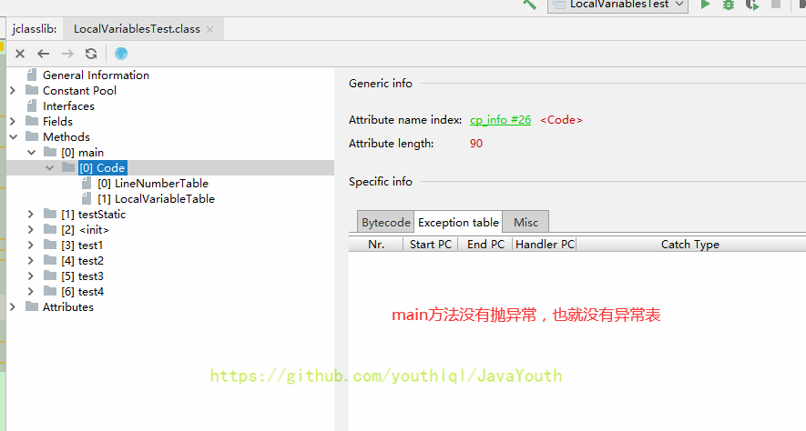

## 概述
- Java虚拟机栈，早期也叫Java栈。每个线程在创建时都会创建一个虚拟机栈，其内部保存一个个的栈帧，对应着一次次的Java方法调用。该区域属于内存私有
```java
public class StackTest {

    public static void main(String[] args) {
        StackTest test = new StackTest();
        test.methodA();
    }

    public void methodA() {
        int i = 10;
        int j = 20;

        methodB();
    }

    public void methodB(){
        int k = 30;
        int m = 40;
    }
}

```


- 虚拟机栈的生命周期和线程一致，也即是线程结束了，该虚拟机栈也就销毁了
- 作用：主管Java程序的运行，它保存方法的局部变量（8种基本数据类型、对象的引用地址）、部分结果，并参与方法的调用和返回
> **局部变量，它是相比于成员变量来说的（或属性）**
> **基本数据类型变量 VS 引用类型变量（类、数组、接口）**

## 特点

- 栈是一种快速有效的分配存储方式，访问速度仅次于程序计数器
- JVM直接对虚拟机栈的操作只有两个：
   - 每个方法执行，进栈
   - 方法执行结束，出栈
- 对栈来说不存在垃圾回收问题（都是在堆上）
- 存在OOM和StackOverflow：Java虚拟机规范是允许Java栈的大小是动态或者是固定不变的。
   - 固定大小：每个线程的虚拟机栈的容量在线程创建时确定，如果线程请求分配的栈容量大于栈最大容量，则会抛出**StackoverflowError异常。**
   - 动态大小：如果在尝试扩展时无法申请到足够内存，或者在创建新的线程时没有足够的内存去创建对应的虚拟机栈，则会抛出**OutofMemoryError**异常。
## 栈运行原理

- JVM直接对虚拟机栈的操作只有两个，栈帧的入栈和出栈
- 在一条活动线程中，一个时间点上，只会有一个活动的栈帧。也即是当前正在执行的方法的栈帧（栈顶帧）是有效的。这个栈帧被称为当前栈帧，与当前栈帧相对应的方法就是当前方法，定义这个方法的类就是当前类。
- 执行引擎运行的所有字节码指令只针对当前栈帧进行操作。
- 如果在该方法中调用了其他方法，对应的新的栈帧会被创建出来，放在站的顶端，成为新的当前帧。


- 不同线程中所包含的栈帧是不允许存在相互引用的，即不可能在一个栈帧中引用另一个线程的栈帧。
- 如果当前方法调用了其他方法，方法返回之际，当前栈帧会传回此方法的执行结果给前一个栈帧，接着，虚拟机会丢弃当前栈帧，使得前一个栈帧重新称为当前栈帧（调用返回）
- Java方法由两种返回函数的方式
   - 正常返回：return返回
   - 异常抛出：出现未捕获的异常，需要抛出异常来处理
   - 两种方式都会导致栈帧被弹出
## 栈帧
每个线程都有自己的栈，栈中数据都是以栈帧格式存在，线程上正在执行的每个方法对应一个栈帧，栈帧是一个内存区域，是一个数据集，维系着方法执行过程中的各种数据信息。
每个栈帧中存储着：

- 局部变量表（Local Variables）
- 操作数栈（Operand Stack）（或表达式栈）
- 动态链接（Dynamic Linking））（或指向运行时常量池的方法引用）
- 方法返回地址（Return Address）（或方法正常退出或者异常退出的定义）
- 一些附加信息
> **栈帧大小主要由局部变量表和操作数栈决定**


### 局部变量表
也叫局部变量数组或者本地变量表

- 定义为一个数字数组，主要用于存储方法参数和定义在方法体内的局部变量，这些数据类型包括各类基本数据类型、对象引用以及 return Address返回值类型
- 由于局部变量表是建立在线程的栈上，属于线程私有，所以**不会存在数据安全问题**
- **局部变量表所需的容量大小是在编译期确定下来的，**并保存在方法的Code属性的**maximum local variables**数据项中。在方法运行期间是不会改变局部变量表的大小的。
- 方法嵌套调用的次数是由栈的大小决定。（一般来说，栈越大，方法嵌套调用次数越多）
   - 对一个函数来说，它的参数和局部变量越多，使得局部变量表膨胀，它的栈帧就会越大，以满足方法调用所需传递的信息增大的需求
   - 进而函数调用就会占用更多的栈空间，导致其嵌套调用次数就会减少
- 局部变量表中的变量只在当前方法调用中有效（也呼应前面说的，一定不存在数据安全问题）
   - 在方法执行时，虚拟机通过使用局部变量表完成参数值到参数变量列表的传递过程。
   - 当方法调用结束后，随着方法栈帧的销毁，局部变量表也会随之销毁。
#### 案例说明
```java
public class LocalVariablesTest {
    private int count = 0;

    public static void main(String[] args) {
        LocalVariablesTest test = new LocalVariablesTest();
        int num = 10;
        test.test1();
    }

    //练习：
    public static void testStatic(){
        LocalVariablesTest test = new LocalVariablesTest();
        Date date = new Date();
        int count = 10;
        System.out.println(count);
        //因为this变量不存在于当前方法的局部变量表中！！
//        System.out.println(this.count);
    }

    //关于Slot的使用的理解
    public LocalVariablesTest(){
        this.count = 1;
    }

    public void test1() {
        Date date = new Date();
        String name1 = "atguigu.com";
        test2(date, name1);
        System.out.println(date + name1);
    }

    public String test2(Date dateP, String name2) {
        dateP = null;
        name2 = "songhongkang";
        double weight = 130.5;//占据两个slot
        char gender = '男';
        return dateP + name2;
    }

    public void test3() {
        this.count++;
    }

    public void test4() {
        int a = 0;
        {
            int b = 0;
            b = a + 1;
        }
        //变量c使用之前已经销毁的变量b占据的slot的位置
        int c = a + 1;
    }
}
```

由上图可得出结论：局部变量表所需的容量大小是在编译器确定下来的
下面的内容使用jclasslib来查看

1. 0-15表示有16行字节码


2. 方法异常信息表为空，因为main方法没有抛出异常



3. Misc


4. 行号表：Java代码的行号和字节码指令行号的对应关系


5. 注意：生效行数和剩余有效行数都是针对于字节码文件的行数


- 图中圈的东西表示该局部变量的作用域。
- Start PC==11表示在字节码的11行开始生效，也就是Java代码对应的第15行。而声明int num在java代码的是第14行，说明是从声明的下一行开始生效。
- Length== 5表示局部变量剩余有效行数，main方法字节码指令总共有16行，从11行开始生效，那么剩下就是16-11 ==5。
- `Ljava/lang/String`前面的L表示引用类型。
#### 关于Slot

- 参数值的存放总是从局部变量数组索引0的位置开始，到数组长度-1的索引结束
- 局部变量表的最基本存储单元是Slot（变量槽），局部变量表中存放编译器可知的各种基本数据类型（8种），引用类型（reference），return Address 类型的变量
- 在局部变量表中，32位以内的类型只占用一个Slot（包括return Address类型），64位的类型占用两个Slot（long和double）
   - byte、short、char在存储前都会被转换成int，boolen也被转换成int（1：true）
   - long、double占据两个Slot
- JVM会为局部变量表中的每一个Slot都分配一个访问索引，通过这个索引即可成功访问到局部变量表中指定的局部变量值。
- 当一个实例方法被调用时，它的方法参数和方法体内部定义的局部变量将会按照顺序被复制到局部变量表中的每一个Slot上。
- 访问64bit的局部变量时，只需要选择靠近前方的一个索引即可
- 如果当前帧是由构造方法或者实例方法创建的，**那么该对象引用this将会存放在index为0的slot处，其余的参数按照参数表顺序继续排列（this也相当于一个变量）**
#### Slot的重复利用
栈帧中的局部变量表中的槽位是可以重用的，如果一个局部变量过了其作用域，那么在其作用域之后声明新的局部变量名，就很有可能复用过期局部变量的槽位，从而达到节省资源的目的。
如下面的代码示例
```java
public void test4() {
    int a = 0;
    {
        int b = 0;
        b = a + 1;
    }
    //变量c使用之前已经销毁的变量b占据的slot的位置
    int c = a + 1;
}
```

很明显局部变量c重用了局部变量b的槽位

#### 静态变量和局部变量
> 变量的分类：
> 1. 按照数据类型划分：基本数据类型和引用数据类型
> 1. 按照在类中声明的位置分：
>    1. 成员变量：在使用前都经历过默认初始化赋值
>       1. 类变量：linking的prepare阶段给类变量默认赋值，initial阶段给类变量显示赋值即静态代码块赋值
>       1. 实例变量：随着对象的创建，会在堆空间中分配实例变量空间，并进行默认赋值
>    2. 局部变量：在使用前，必须要进行显示赋值的，否则无法进行编译。

1. 参数表分配完毕后，再根据方法体内定义的变量的顺序和作用域分配
1. 成员变量有两次初始化的机会，第一次是在“准备阶段”，执行系统初始化，对类变量设置零值，另一次则是在“初始化”阶段，赋予程序员在代码中定义的初始值。
1. 和类变量初始化不同的是，局部变量表不存在系统初始化的过程，这意味着一旦定义了局部变量则必须人为初始化，否则无法使用。
#### 其他说明

1. 在栈帧总，与性能调优关系最为密切的部分就是局部变量表。在方法执行时，虚拟机使用局部变量表完成方法的传递。
1. 局部变量表中的变量也是重要的垃圾回收根节点，只要被局部变量中直接或间接引用的对象都不会被回收
### 操作数栈
操作数栈，主要用于保存计算过程的中间结果，同时作为计算过程中变量临时的存储空间。在方法执行过程中，根据字节码指令，往栈中写入数据或者提取数据（某些字节码指令将值压入操作数栈，其余的字节码指令将操作数取出栈，使用后再将它们的结果压入操作数栈）

示例代码

字节码指令信息


- **操作数栈及时JVM执行引擎的一个工作区，当一个方法刚开始执行的时候，一个新的栈帧也会随之被创建出来，这时方法的操作数栈是空的（但数组是创建了，且创建完数组长度是确定的）**
- **每一个操作数栈都会有一个明确的栈深度用于存储数值，其所需的最大深度在编译器就定义好了**，保存在方法的Code属性中，为maxstack的值。
- 栈中的任何一个元素都可以是任意的Java数据类型
   - 32bit的类型占用一个栈单位深度
   - 64bit的类型占用两个栈单位深度
- 操作数栈并非采用访问索引的方式来进行数据访问的，而是只能通过标准的入栈和出栈操作来完成一次数据访问，只不过**操作数栈是用数组来实现的**
- **如果被调用的方法带有返回值的话，其返回值将会被压入当前栈帧的操作数栈中，并更新PC寄存器中下一条需要执行的字节码指令**
- 操作数栈中元素的数据类型必须与字节码指令的序列严格匹配，这个验证在编译器的编译期间进行，同时在类加载过程中的类检验阶段的数据流分析阶段要再次验证。
- **常说的Java虚拟机的解释引擎是基于栈的执行引擎，其中栈指的就是操作数栈。**
#### 栈顶缓存技术（Top Of Stack Cashing）

1. 基于栈式架构的虚拟机所使用的零地址指令，更加紧凑，但完成一项操作的时候必然需要使用更多的入栈和出栈指令，这同时也就意味着将需要更多的指令分派（instruction dispatch）次数和导致内存读写次数多，效率不高。
1. **由于操作数是存储在内存中的，因此频繁地执行内存读写操作必然会影响执行速度。为了解决这个问题，提出了栈顶缓存技术**：**将栈顶元素全部缓存在物理CPU的寄存器中，一次降低对内存的读写次数，提升执行引擎的执行效率**。
### 动态链接(指向运行时常量池的方法引用) 

1. **每一个栈帧内部都包含一个指向运行时常量池中该栈帧所属方法的引用**。包含这个引用的目的就是为了支持当前方法的代码能够实现动态链接，如invokeddynamic指令
1. **在Java源文件被编译到字节码文件中时，所有的变量和方法引用都作为符号引用 （Symbolic Reference）保存在class文件的常量池里。**如：描述一个方法调用了另外的其他方法时，就是通过常量池中指向方法的符号引用来表示的，那么**动态链接的作用就是为了将这些符号引用转换为调用方法的直接引用。**

**示例**
```java
Classfile /Users/leixue/Documents/CODE/chin_code/chin_code/JVM/target/classes/VMStack/DynamicLinking.class
  Last modified 2021-12-1; size 656 bytes
  MD5 checksum 76a3453e907fd94f42766fab655be6c6
  Compiled from "DynamicLinking.java"
public class VMStack.DynamicLinking
  minor version: 0
  major version: 52
  flags: ACC_PUBLIC, ACC_SUPER
Constant pool://这里是常量池，#1，代表地址
   #1 = Methodref          #9.#23         // java/lang/Object."<init>":()V
   #2 = Fieldref           #8.#24         // VMStack/DynamicLinking.num:I
   #3 = Fieldref           #25.#26        // java/lang/System.out:Ljava/io/PrintStream;
   #4 = String             #27            // A
   #5 = Methodref          #28.#29        // java/io/PrintStream.println:(Ljava/lang/String;)V
   #6 = String             #30            // B
   #7 = Methodref          #8.#31         // VMStack/DynamicLinking.methodA:()V
   #8 = Class              #32            // VMStack/DynamicLinking
   #9 = Class              #33            // java/lang/Object
  #10 = Utf8               num
  #11 = Utf8               I
  #12 = Utf8               <init>
  #13 = Utf8               ()V
  #14 = Utf8               Code
  #15 = Utf8               LineNumberTable
  #16 = Utf8               LocalVariableTable
  #17 = Utf8               this
  #18 = Utf8               LVMStack/DynamicLinking;
  #19 = Utf8               methodA
  #20 = Utf8               methodB
  #21 = Utf8               SourceFile
  #22 = Utf8               DynamicLinking.java
  #23 = NameAndType        #12:#13        // "<init>":()V
  #24 = NameAndType        #10:#11        // num:I
  #25 = Class              #34            // java/lang/System
  #26 = NameAndType        #35:#36        // out:Ljava/io/PrintStream;
  #27 = Utf8               A
  #28 = Class              #37            // java/io/PrintStream
  #29 = NameAndType        #38:#39        // println:(Ljava/lang/String;)V
  #30 = Utf8               B
  #31 = NameAndType        #19:#13        // methodA:()V
  #32 = Utf8               VMStack/DynamicLinking
  #33 = Utf8               java/lang/Object
  #34 = Utf8               java/lang/System
  #35 = Utf8               out
  #36 = Utf8               Ljava/io/PrintStream;
  #37 = Utf8               java/io/PrintStream
  #38 = Utf8               println
  #39 = Utf8               (Ljava/lang/String;)V
{
  int num;
    descriptor: I
    flags:

  public VMStack.DynamicLinking();
    descriptor: ()V
    flags: ACC_PUBLIC
    Code:
      stack=2, locals=1, args_size=1
         0: aload_0
         //这里调用位置“#1”代表的就是动态链接
         1: invokespecial #1                  // Method java/lang/Object."<init>":()V
         4: aload_0
         5: bipush        10
         7: putfield      #2                  // Field num:I
        10: return
      LineNumberTable:
        line 3: 0
        line 4: 4
      LocalVariableTable:
        Start  Length  Slot  Name   Signature
            0      11     0  this   LVMStack/DynamicLinking;

  public void methodA();
    descriptor: ()V
    flags: ACC_PUBLIC
    Code:
      stack=2, locals=1, args_size=1
         0: getstatic     #3                  // Field java/lang/System.out:Ljava/io/PrintStream;
         3: ldc           #4                  // String A
         5: invokevirtual #5                  // Method java/io/PrintStream.println:(Ljava/lang/String;)V
         8: return
      LineNumberTable:
        line 7: 0
        line 8: 8
      LocalVariableTable:
        Start  Length  Slot  Name   Signature
            0       9     0  this   LVMStack/DynamicLinking;

  public void methodB();
    descriptor: ()V
    flags: ACC_PUBLIC
    Code:
      stack=3, locals=1, args_size=1
         0: getstatic     #3                  // Field java/lang/System.out:Ljava/io/PrintStream;
         3: ldc           #6                  // String B
         5: invokevirtual #5                  // Method java/io/PrintStream.println:(Ljava/lang/String;)V
         8: aload_0
         9: invokevirtual #7                  // Method methodA:()V
        12: aload_0
        13: dup
        14: getfield      #2                  // Field num:I
        17: iconst_1
        18: iadd
        19: putfield      #2                  // Field num:I
        22: return
      LineNumberTable:
        line 11: 0
        line 12: 8
        line 13: 12
        line 14: 22
      LocalVariableTable:
        Start  Length  Slot  Name   Signature
            0      23     0  this   LVMStack/DynamicLinking;
}
SourceFile: "DynamicLinking.java"

```
注释在9和60行


> 为什么要用常量池呢？
> 1. 因为不同的方法，都可能调用常量或者方法，所以只需要存储一份即可，然后记录其引用即可，节省了空间
> 1. 常量池的作用：就是为了提供一些符号和常量，便于指令的识别

### 方法调用：解析和分配
在JVM中，将符号引用转换为调用方法的直接引用与方法的绑定机制相关
#### 链接
##### 静态链接
当一个字节码文件被装载进JVM内部时，如果被调用的目标方法在**编译期确定**，且运行期间保持不变时，这种情况下将调用方法的符号引用转换为直接引用的过程称之为静态链接。
##### 动态链接
如果被调用的方法在编译器无法被确定下来，也就是说，只能够在程序**运行期间**将调用的方法的符号转换为直接引用，由于这种引用转换过程具备动态性，也被称为动态链接。
#### 绑定
> 链接针对的是方法，而绑定范围更广一点，早期绑定涵盖了静态链接，晚期绑定涵盖了动态链接。

分为早期绑定和晚期绑定，绑定是一个字段、方法或者类在符号引用被替换为直接引用的过程，只发生一次。
##### 早期绑定
早期绑定是指被调用目标方法如果在编译期可见，且运气期保持不变的话，就可以将这个方法和所属类型进行绑定，这样的话，由于明确了被调用的目标方法究竟是哪一个，因此也就可以使用静态链接方式将符号引用转换为直接引用。
##### 晚期绑定
如果被调用的方法在编译器无法被确定下来，只能在程序运行期根据实际的类型绑定相关的方法，称之为晚期绑定
​

Java中任何一个普通的方法其实都具备虚函数的特征，它们相当于C++语言中的虚函数（C++中则需要使用关键字virtual来显式定义）。如果在Java程序中不希望某个方法拥有虚函数的特征时，则可以使用关键字final来标记这个方法。
#### 虚方法和非虚方法

- 如果方法在编译期就确定了具体的调用版本，这个版本在运行时是不可变的。这样的方法称为非虚方法。（也就是不涉及多态机制的方法，不能重写的~~​~~）
- 静态方法、私有方法、final方法、实例构造器、父类方法都是非虚方法。
- 其他方法称为虚方法。
> **子类对象的多态的使用前提**
> - 类的继承关系
> - 方法的重写

虚拟机中提供了以下几条方法调用指令：
普通调用指令：

- invokestatic：调用静态方法，解析阶段确定唯一方法版本
- invokespecial：调用方法、私有及父类方法，解析阶段确定唯一方法版本
- invokevirtual：调用所有虚方法
- invokeinterface：调用接口方法

动态调用指令：

- invokedynamic：动态解析出需要调用的方法，然后执行

前四条指令固化在虚拟机内部，方法的调用执行不可人为干预，而invokedynamic指令则支持由用户确定方法版本。其中invokestatic指令和invokespecial指令调用的方法称为非虚方法，其余的（final 修饰的除外）称为虚方法。
#### invokednamic指令
JVM字节码指令集一直比较稳定，一直到Java7中才增加了一个invokedynamic指令，这是Java为了实现动态类型语言支持而做的一种改进。但是在Java7中并没有提供直接生成invokedynamic指令的方法，需要借助ASM这种底层字节码工具来产生invokedynamic指令。直到Java8的Lambda表达式的出现，invokedynamic指令的生成，在Java中才有了直接的生成方式。
Java7中增加的动态语言类型支持的本质是对Java虚拟机规范的修改，而不是对Java语言规则的修改，这一块相对来讲比较复杂，增加了虚拟机中的方法调用，最直接的受益者就是运行在Java平台的动态语言的编译器。
#### 动态类型语言和静态类型语言
动态类型语言和静态类型语言两者的区别就**在于对类型的检查是在编译期还是在运行期，满足前者就是静态类型语言，反之是动态类型语言。**
说的再直白一点就是，静态类型语言是判断变量自身的类型信息；动态类型语言是判断变量值的类型信息，变量没有类型信息，变量值才有类型信息，这是动态语言的一个重要特征。
**Java：String info = "mogu blog"; (Java是静态类型语言的，会先编译就进行类型检查)**
**JS：var name = "shkstart"; var name = 10; （运行时才进行检查）**
#### 方法重写的本质
Java 语言中方法重写的本质：

- 找到操作数栈顶的第一个元素所执行的对象的实际类型，记作C。
- 如果在类型C中找到与常量中的描述符合简单名称都相符的方法，则进行访问权限校验，如果通过则返回这个方法的直接引用，查找过程结束；如果不通过，则返回java.lang.illegalAccessError 异常。
- 否则，按照继承关系从下往上依次对C的各个父类进行第2步的搜索和验证过程。
- 如果始终没有找到合适的方法，则抛出java.lang.AbstractMethodsrror异常。
#### illegalAccessError介绍
程序试图访问或修改一个属性或调用一个方法，这个属性或方法，你没有权限访问。一般的，这个会引起编译器异常。这个错误如果发生在运行时，就说明一个类发生了不兼容的改变。
​

#### 方法的调用：虚方法表
在面向对象的编程中，会很频繁的使用到动态分派，如果在每次动态分派的过程中都要重新在类的方法元数据中搜索合适的目标的话就可能影响到执行效率。因此，为了提高性能，JVM采用在类的方法区建立一个虚方法表 （virtual method table）（非虚方法不会出现在表中）来实现。使用索引表来代替查找。
**每个类中都有一个虚方法表，表中存放着各个方法的实际入口。**
> 虚方法表是什么时候被创建的呢？
> 虚方法表会在类加载的链接阶段被创建并开始初始化，类的变量初始值准备完成之后，JVM会把该类的方法表也初始化完毕。


如上图所示：如果类中重写了方法，那么调用的时候，就会直接在虚方法表中查找，否则将会直接连接到Object的方法中。

### 方法返回地址
存放调用该方法的pc寄存器的值（pc中存储的是下一条指令的值）。一个方法的结束，有两种方式：

- 正常执行完成
- 出现未处理的异常，非正常退出

无论通过哪种方式退出，在方法退出后都返回到该方法被调用的位置。方法正常退出时，调用者的pc计数器的值作为返回地址，即调用该方法的指令的下一条指令的地址。而通过异常退出的，返回地址是要通过异常表来确定，栈帧中一般不会保存这部分信息。
当一个方法开始执行后，只有两种方式可以退出这个方法：

- 执行引擎遇到任意一个方法返回的字节码指令（return），会有返回值传递给上层的方法调用者，简称正常完成出口；
   - 一个方法在正常调用完成之后，究竟需要使用哪一个返回指令，还需要根据方法返回值的实际数据类型而定。
   - 在字节码指令中，返回指令包含ireturn（当返回值是boolean，byte，char，short和int类型时使用），lreturn（Long类型），freturn（Float类型），dreturn（Double类型），areturn。另外还有一个return指令声明为void的方法，实例初始化方法，类和接口的初始化方法使用。
- 在方法执行过程中遇到异常（Exception），并且这个异常没有在方法内进行处理，也就是只要在本方法的异常表中没有搜索到匹配的异常处理器，就会导致方法退出，简称异常完成出口。
   - 方法执行过程中，抛出异常时的异常处理，存储在一个异常处理表，方便在发生异常的时候找到处理异常的代码
- **​**


- 本质上，方法的退出就是当前栈帧出栈的过程。此时，需要恢复上层方法的局部变量表、操作数栈、将返回值压入调用者栈帧的操作数栈、设置PC寄存器值等，让调用者方法继续执行下去。
- **两种方式的区别就在于：通过异常完成出口退出的不会给他的上层调用者产生任何的返回值。**
### 一些附加信息
栈帧中还允许携带与Java虚拟机实现相关的一些附加信息。例如：对程序调试提供支持的信息。
## 栈的相关面试题

- 举例栈溢出的情况？（StackOverflowError）
   - 栈是静态固定的大小，栈帧增加，会导致栈溢出
   - 动态的话会导致OOM
   - 通过-Xss设置栈的大小
   
- 调整栈大小，就能保证不出现溢出么？
   - 不能保证不溢出，如果递归无终止条件，一定会发送栈溢出
   
- 分配的栈内存越大越好么？
   - 不是，一定时间内降低了OOM概率，但是会挤占其它的线程空间，因为整个空间是有限的。
   
- 垃圾回收是否涉及到虚拟机栈？
   - 不会，GC主要在堆上，栈上无（方法区也会有full gc）
   
- 方法中定义的局部变量是否线程安全？
   - 具体问题具体分析
   
   - 如果只有一个线程才可以操作此数据，则必是线程安全的。
   
   - 如果有多个线程操作此数据，则此数据是共享数据。如果不考虑同步机制的话，会存在线程安全问题。
   
   - 如果对象是在内部产生，并在内部消亡，没有返回到外部，那么它就是线程安全的，反之则是线程不安全的。
   
     
```java
public class StringBuilderTest {

    int num = 10;

    //s1的声明方式是线程安全的（只在方法内部用了）
    public static void method1(){
        //StringBuilder:线程不安全
        StringBuilder s1 = new StringBuilder();
        s1.append("a");
        s1.append("b");
        //...
    }
    //sBuilder的操作过程：是线程不安全的（作为参数传进来，可能被其它线程操作）
    public static void method2(StringBuilder sBuilder){
        sBuilder.append("a");
        sBuilder.append("b");
        //...
    }
    //s1的操作：是线程不安全的（有返回值，可能被其它线程操作）
    public static StringBuilder method3(){
        StringBuilder s1 = new StringBuilder();
        s1.append("a");
        s1.append("b");
        return s1;
    }
    //s1的操作：是线程安全的（s1自己消亡了，最后返回的只是s1.toString的一个新对象）
    public static String method4(){
        StringBuilder s1 = new StringBuilder();
        s1.append("a");
        s1.append("b");
        return s1.toString();
    }

    public static void main(String[] args) {
        StringBuilder s = new StringBuilder();
        new Thread(() -> {
            s.append("a");
            s.append("b");
        }).start();
        method2(s);
    }
}
```

参考：

- 尚硅谷宋红康老师《JVM全套教程》
- 周志明《深入理解Java虚拟机-第三版》
