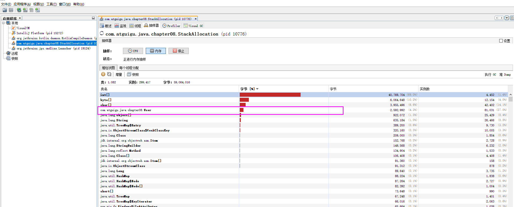
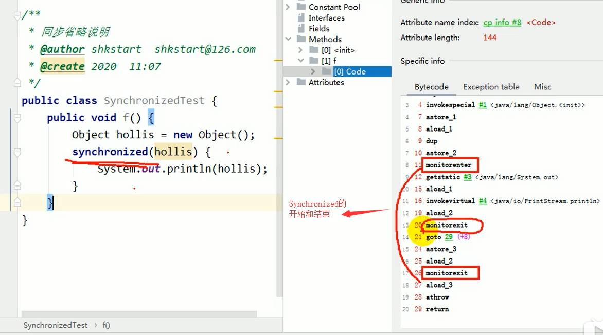

> 从一个问题引出，堆是分配对象存储的唯一选择吗？

首先回答一下，不一定，还有栈上分配，但这么说也算一种共识，不算错
> 在《深入理解Java虚拟机》中关于Java堆内存有这样一段描述：
> 随着JIT编译期的发展与逃逸分析技术逐渐成熟，栈上分配、标量替换优化技术将会导致一些微妙的变化，所有的对象都分配到堆上也渐渐变得不那么“绝对”了。
> 在Java虚拟机中，对象是在Java堆中分配内存的，这是一个普遍的常识。但是，有一种特殊情况，那就是如果经过逃逸分析（Escape Analysis）后发现，一个对象并没有逃逸出方法的话，那么就可能被优化成栈上分配。这样就无需在堆上分配内存，也无须进行垃圾回收了。这也是最常见的堆外存储技术。
> 此外，前面提到的基于openJDk深度定制的TaoBaovm，其中创新的GCIH（GC invisible heap）技术实现off-heap，将生命周期较长的Java对象从heap中移至heap外，并且GC不能管理GCIH内部的Java对象，以此达到降低GC的回收频率和提升GC的回收效率的目的。

### 什么是逃逸分析
如何将堆上的对象分配到栈？
需要使用到逃逸分析手段。这是一种可以有效减少Java程序中同步负载和内存堆分配压力的跨函数全局数据流分析算法。
​

通过逃逸分析，Java HotSpot编译器能够分析出一个新的对象的引用的使用范围从而决定是否要将这个对象分配到堆上。
​

逃逸分析的基本行为就是分析对象动态作用域：

- 当一个对象在方法中被定义后，对象只在方法内部使用，则认为没有发生逃逸
- 当一个对象在方法中被定义后，被外部方法所引用，则认为发生逃逸，比如作为调用参数传递到其他地方。
### 逃逸分析举例
**没有发生逃逸的对象，则可以分配到栈上（函数内部使用）**，**随着方法执行的结束，栈空间就被移除**，每个栈里面包含了很多的栈帧，也即是发生了逃逸分析（这一句啥意思？？？）
```java
public void my_method() {
    V v = new V();
    // use v
    // ....
    v = null;//v就是内部变量，不会逃逸
}

```
针对下面的StringBuilder对象
```java
public static StringBuffer createStringBuffer(String s1, String s2) {
    StringBuffer sb = new StringBuffer();
    sb.append(s1);
    sb.append(s2);
    return sb;
}
```
如果想要StringBuilder对象sb不发生逃逸，可以换成下面的写法
```java
public static String createStringBuffer(String s1, String s2) {
    StringBuffer sb = new StringBuffer();
    sb.append(s1);
    sb.append(s2);
    return sb.toString();
}
```
完整逃逸分析代码举例
```java
/**
 * 逃逸分析
 * 如何快速的判断是否发生了逃逸分析，大家就看new的对象是否在方法外被调用。
 */
public class EscapeAnalysis {

    public EscapeAnalysis obj;

    /**
     * 方法返回EscapeAnalysis对象，发生逃逸
     * @return
     */
    public EscapeAnalysis getInstance() {
        return obj == null ? new EscapeAnalysis():obj;
    }

    /**
     * 为成员属性赋值，发生逃逸
     */
    public void setObj() {
        this.obj = new EscapeAnalysis();
    }

    /**
     * 对象的作用于仅在当前方法中有效，没有发生逃逸
     */
    public void useEscapeAnalysis() {
        EscapeAnalysis e = new EscapeAnalysis();
    }

    /**
     * 引用成员变量的值，发生逃逸
     */
    public void useEscapeAnalysis2() {
        EscapeAnalysis e = getInstance();
        // getInstance().XXX  发生逃逸
    }
}

```
#### 参数设置
在JDK 1.7 版本之后，HotSpot中默认就已经开启了逃逸分析
如果使用的是较早的版本，开发人员则可以通过：

- 选项“-xx：+DoEscapeAnalysis"显式开启逃逸分析
- 通过选项“-xx：+PrintEscapeAnalysis"查看逃逸分析的筛选结果
### 结论
开发中能使用局部变量的，就不要使用在方法外定义（感觉其实就是迪米特法则）
### 代码优化

1. 栈上分配（减少垃圾回收）。将堆分配转换为栈分配。如果一个对象在子程序中被分配，要使指向该对象的指针永远不会发生逃逸，对象可能是栈上分配的候选，而不是堆上分配
   - JIT编译器在编译期根据逃逸分析的结果，发现如果一个对象并没有逃逸出方法的话，就可能被优化成栈上分配。分配完成后，继续在调用栈内执行，最后线程结束，栈空间被回收，局部变量对象也被回收。这样就不需要进行GC了
   - 常见的栈上分配的场景：给成员变量赋值、方法返回值、实例引用传递
2. 同步省略：如果一个对象被发现只能从一个线程被访问到，那么对于这个对象的操作可以不考虑同步。
   - 首先需要知道，线程同步的代价比较高，同步的后果是降低并发性和性能
   - 在动态编译同步块的时候，JIT编译器可以借助逃逸分析来**判断同步块所使用的锁对象是否只能被一个线性访问而没有被发布到其他线程**。**如果没有，那么JIT编译器在编译这个同步块的时候就会取消对这部分代码的同步**。这样就能大大提高并发性和性能。这个取消同步的过程就叫同步省略，也叫锁消除
3. 分离对象或标量替换：有的对象可能不需要作为一个连续的内存结构存在也可以被访问到，那么对象的部分（或全部）可以不存储在内存，而是存储在CPU寄存器中。
   - 标量（Scalar）是指一个无法再分解成更小的数据的数据，Java中原始数据类型就是标量
   - 相对的，那些还可以分解的数据叫做聚合量（Aggregate），Java中的对象就是聚合量，因为他可以分解成其他聚合量和标量
   - 在JIT阶段，如果经过逃逸分析，发现一个对象不会被外界对象访问到的话，那么经过JIT优化，就会把这个对象拆解成若干个其中包含的若干个成员变量来代替。这个过程就是标量替换
#### 栈上分配举例
```java
/**
 * 栈上分配
 * -Xmx1G -Xms1G -XX:-DoEscapeAnalysis -XX:+PrintGCDetails
 */
class User {
    private String name;
    private String age;
    private String gender;
    private String phone;
}
public class StackAllocation {
    public static void main(String[] args) throws InterruptedException {
        long start = System.currentTimeMillis();
        for (int i = 0; i < 100000000; i++) {
            alloc();
        }
        long end = System.currentTimeMillis();
        System.out.println("花费的时间为：" + (end - start) + " ms");

        // 为了方便查看堆内存中对象个数，线程sleep
        Thread.sleep(10000000);
    }

    private static void alloc() {
        // 未发生逃逸
        User user = new User(); 
    }
}

```
设置JVM参数，表示未开启逃逸分析
```java
-Xmx1G -Xms1G -XX:-DoEscapeAnalysis -XX:+PrintGCDetails
```
运行结果，同时还触发了GC操作，
`花费的时间为：664 ms`
然后查看内存情况，发现有大量的User存储在堆中

我们开启逃逸分析

```java
-Xmx1G -Xms1G -XX:+DoEscapeAnalysis -XX:+PrintGCDetails
```
然后查看运行时间，能发现时间快速减少，同时不会发生GC操作
`花费的时间为：5 ms`
再看内存情况，发现只有很少的User对象，说明User未发生逃逸，因为它存储在栈中，随着栈的销毁而销毁


#### 同步省略举例
```java
public void f() {
    Object hellis = new Object();
    synchronized(hellis) {
        System.out.println(hellis);
    }
}
```
上面代码中hellis这个对象加锁了，但是hellis对象的生命周期只在f方法中，并不会被其他线程访问到，所以在JIT编译阶段就会被优化掉，优化成：
```java
public void f() {
    Object hellis = new Object();
    System.out.println(hellis);
}
```
将其转化成字节码如下所示

#### 标量替换举例
```java
public static void main(String args[]) {
    alloc();
}
class Point {
    private int x;
    private int y;
}
private static void alloc() {
    Point point = new Point(1,2);
    System.out.println("point.x" + point.x + ";point.y" + point.y);
}
```
经过标量替换就会变成
```java
private static void alloc() {
    int x = 1;
    int y = 2;
    System.out.println("point.x = " + x + "; point.y=" + y);
}
```
可以看到，Point这个聚合量经过逃逸分析后，**发现他并没有逃逸，就被替换成两个标量了。那么标量替换有什么好处呢？就是可以大大减少堆内存的占用。因为一旦不需要创建对象了，那么就不再需要分配堆内存了。 标量替换为栈上分配提供了很好的基础。**
**​**

上述代码在主函数中进行了1亿次alloc。调用进行对象创建，由于User对象实例需要占据约16字节的空间，因此累计分配空间达到将近1.5GB。如果堆空间小于这个值，就必然会发生GC。使用如下参数运行上述代码：
```java
-server -Xmx100m -Xms100m -XX:+DoEscapeAnalysis -XX:+PrintGC -XX:+EliminateAllocations
```
这里设置参数如下：

- 参数-server：启动Server模式，因为在server模式下，才可以启用逃逸分析。
- 参数-XX:+DoEscapeAnalysis：启用逃逸分析
- 参数-Xmx10m：指定了堆空间最大为10MB
- 参数-XX:+PrintGC：将打印Gc日志
- 参数一xx：+EliminateAllocations：开启了标量替换（默认打开），允许将对象打散分配在栈上，比如对象拥有id和name两个字段，那么这两个字段将会被视为两个独立的局部变量进行分配
### 逃逸分析的不足
关于逃逸分析的论文在1999年就已经发表了，但直到JDK1.6才有实现，而且这项技术到如今也并不是十分成熟。
其根本原因就是无法保证逃逸分析的性能消耗一定能高于他的消耗。虽然经过逃逸分析可以做标量替换、栈上分配、和锁消除。但是逃逸分析自身也是需要进行一系列复杂的分析的，这其实也是一个相对耗时的过程。 一个极端的例子，就是经过逃逸分析之后，发现没有一个对象是不逃逸的。那这个逃逸分析的过程就白白浪费掉了。
虽然这项技术并不十分成熟，但是它也是即时编译器优化技术中一个十分重要的手段。注意到有一些观点，认为通过逃逸分析，JVM会在栈上分配那些不会逃逸的对象，这在理论上是可行的，但是取决于JvM设计者的选择。据我所知，oracle Hotspot JVM中并未这么做，这一点在逃逸分析相关的文档里已经说明，所以可以明确所有的对象实例都是创建在堆上。
目前很多书籍还是基于JDK7以前的版本，JDK已经发生了很大变化，intern字符串的缓存和静态变量曾经都被分配在永久代上，而永久代已经被元数据区取代。但是，intern字符串缓存和静态变量并不是被转移到元数据区，而是直接在堆上分配，所以这一点同样符合前面一点的结论：对象实例都是分配在堆上。
### 参考

- 尚硅谷宋红康老师《JVM全套教程》
- 周志明《深入理解Java虚拟机-第三版》


