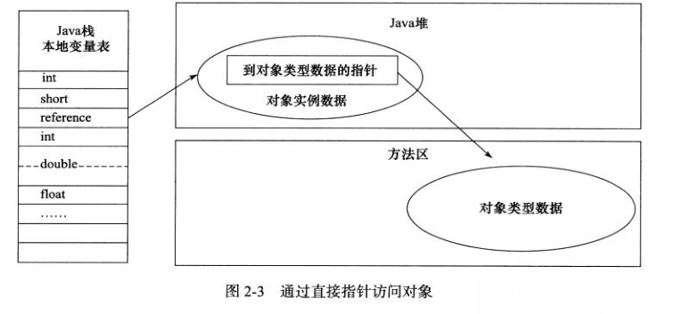

## 对象的创建
下图便是 Java 对象的创建过程

### 类加载检查 
虚拟机遇到一条new指令时，首先将去检查这个指令的参数是否能在元空间的常量池中定位到这个类的符号引用，并且检查这个符号引用代表的类是否已被加载过、解析和初始化过（也就是判断类的元信息是否存在）。如果没有，那必须先执行相应的类加载过程。
> 没有加载的话，在双亲委派模式下，使用当前类加载器以ClassLoader+包名+类名为key进行查找对应的class文件，如果没有找到文件，就抛出ClassNotFoundException异常，如果找到，则进行类加载，并生成对应的Class类对象

### 分配内存
在**类加载检查**通过后，接下来虚拟机将为新生对象**分配内存**。对象所需的内存大小在类加载完成后便可确定，为对象分配空间的任务等同于把一块确定大小的内存从堆中划分出来。
#### 分配方式
**分配方式**有 **“指针碰撞”** 和 **“空闲列表”** 两种，**选择那种分配方式由 Java 堆是否规整决定，**而Java堆是否规整又由所采用的垃圾收集器是否带有压缩整理功能决定。（其实就是看GC算法是“标记-整理”，还是“标记-清除”，前者是压缩的，是规整的，另外复制算法也是规整的）

- 如果内存规整，那么虚拟机将采用指针碰撞法来为对象分配内存。意思是所有用过的内存在一边，空闲的内存在另一边，中间放着一个指针作为分界点的指示器，分配内存就仅仅是把指针指向空闲那边挪动一段与对象大小相等的距离罢了。如果垃圾收集器选择的是Serial、ParNew这种基于压缩算法的（标记整理），虚拟机采用这种分配方式，一般使用带有compact（整理）过程的收集器时，使用指针碰撞。
- 如果内存不规整，已使用的内存和未使用的内存相互交错，那么虚拟机将采用空闲列表法来进行对象的内存分配。意思是虚拟机维护一个列表，记录那些内存块是可用的，再分配的时候从列表中找到一块足够大的空间划分给对象实例，并更新列表上的内容，这种分配方式称为空闲列表法（FreeList）

#### 内存分配并发问题
在创建对象的时候有一个很重要的问题，就是线程安全，因为在实际开发过程中，创建对象是很频繁的事情，作为虚拟机来说，必须要保证线程是安全的，通常来讲，虚拟机采用两种方式来保证线程安全：

- **CAS+失败重试：** CAS 是乐观锁的一种实现方式。所谓乐观锁就是，每次不加锁而是假设没有冲突而去完成某项操作，如果因为冲突失败就重试，直到成功为止。**虚拟机采用 CAS 配上失败重试的方式保证更新操作的原子性。**
- **TLAB：** 为每一个线程预先在Eden区分配一块儿内存，JVM在给线程中的对象分配内存时，首先在TLAB分配，当对象大于TLAB中的剩余内存或TLAB的内存已用尽时，再采用上述的CAS进行内存分配
### 初始化零值
内存分配完成后，虚拟机需要将分配到的内存空间都初始化为零值（也就是默认初始化，但**不包括对象头**），这一步操作**保证了对象的实例字段在 Java 代码中可以不赋初始值就直接使用**，程序能访问到这些字段的数据类型所对应的零值。
### 设置对象头
初始化零值完成之后，**虚拟机要对对象进行必要的设置**，例如这个对象是那个类的实例、如何才能找到类的元数据信息、对象的哈希码、对象的 GC 分代年龄等信息。 **这些信息存放在对象头中。** 另外，根据虚拟机当前运行状态的不同，如是否启用偏向锁等，对象头会有不同的设置方式。
### 执行init方法
其实也就是显示初始化阶段。
在上面工作都完成之后，从虚拟机的视角来看，一个新的对象已经产生了，但从Java程序的视角来看，对象创建才刚开始，`<init>`方法还没有执行，所有的字段都还为零。所以一般来说，执行new指令之后会接着执行`<init>`方法，把对象按照程序员的意愿进行初始化，这样一个真正可用的对象才算完全产生出来。

## 对象的内存布局
在 Hotspot 虚拟机中，对象在内存中的布局可以分为3块区域：**对象头**、**实例数据**和**对齐填充**。
### 对象头
**对象头包括两部分信息（以Hotspot虚拟机为例）**，**第一部分用于存储对象自身的自身运行时数据**，即哈希码值、GC分代年龄、锁状态标志、线程持有的锁、偏向线程ID以及偏向时间戳等等（也叫**Mark Word**），**另一部分是类型指针**，即对象指向它的类元数据的指针，虚拟机通过这个指针来确定这个对象是那个类的实例。**另外如果创建的是数组，还需要记录数组的长度。**
### 实例数据
**实例数据部分是对象真正存储的有效信息**，也是在程序中所定义的各种类型的字段内容。（包括从父类继承下来的以及本身拥有的字段）
有以下几个规则：

1. 相同宽度的字段总是被分配到一起
1. 先放父类中的变量，再放子类中的变量
1. 如果+XX：CompactFields参数值为true（默认就为true），那子类之中较窄的变量也允许插入父类变量的空隙之中，以节省出一点点空间。（HotSpot虚拟机）
### 对齐填充部分
**对齐填充部分不是必然存在的，也没有什么特别的含义，仅仅起占位作用。** 因为Hotspot虚拟机的自动内存管理系统要求对象起始地址必须是8字节的整数倍，换句话说就是对象的大小必须是8字节的整数倍。而对象头部分正好是8字节的倍数（1倍或2倍），因此，当对象实例数据部分没有对齐时，就需要通过对齐填充来补全。

## 对象的访问定位
JVM是如何通过栈帧中的对象引用访问到其内部的对象实例的呢？
建立对象就是为了使用对象，我们的Java程序通过栈上的 reference 数据来操作堆上的具体对象。对象的访问方式有虚拟机实现而定，目前主流的访问方式有**句柄访问**和**直接指针**两种：
### 句柄访问
在Java堆空间划分一块空间作为句柄池，用以存放句柄，一个对象对应有一个句柄，reference 中存储的就是对象的句柄地址，而句柄中包含了对象实例数据与类型数据各自的具体地址信息； 

### 直接指针（HotSpot使用）
 如果使用直接指针访问，那么 Java 堆对象的布局中就必须考虑如何放置访问类型数据的相关信息，而reference 中存储的直接就是对象的地址。

### 两种方式对比
这两种对象访问方式各有优势。

- 使用句柄来访问的最大好处是 reference 中**存储的是稳定的句柄地址**，**在对象被移动时只会改变句柄中的实例数据指针，而 reference 本身不需要修改**。访问对象实例时需要两次访问，效率不高。且需要专门开辟句柄池，空间上比较浪费
- **使用直接指针访问方式最大的好处就是速度快，它节省了一次指针定位的时间开销。（快，省空间）**

**​**

参考：

- 尚硅谷宋红康老师《JVM全套教程》
- 周志明《深入理解Java虚拟机-第三版》

**​**

