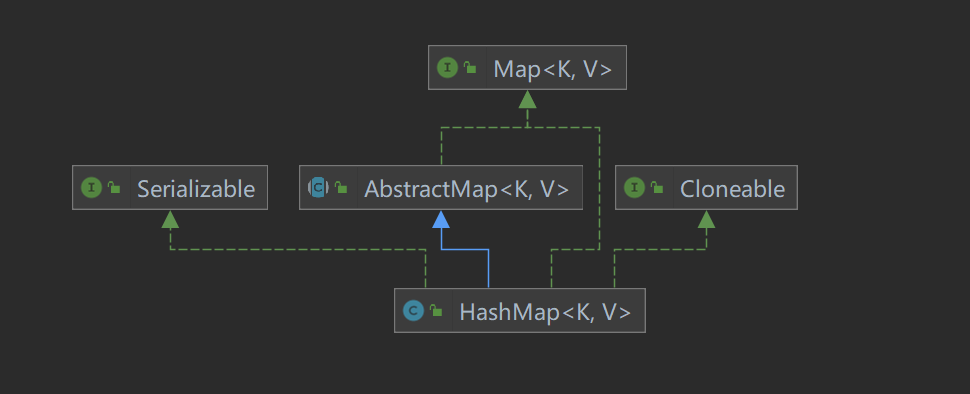
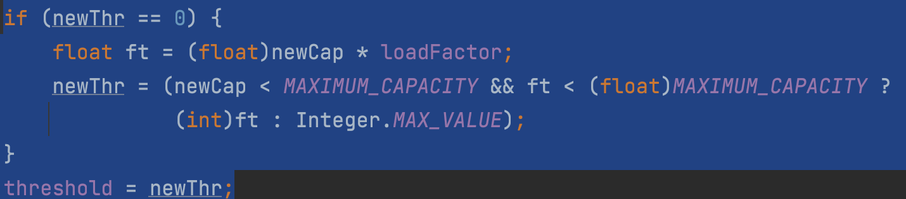
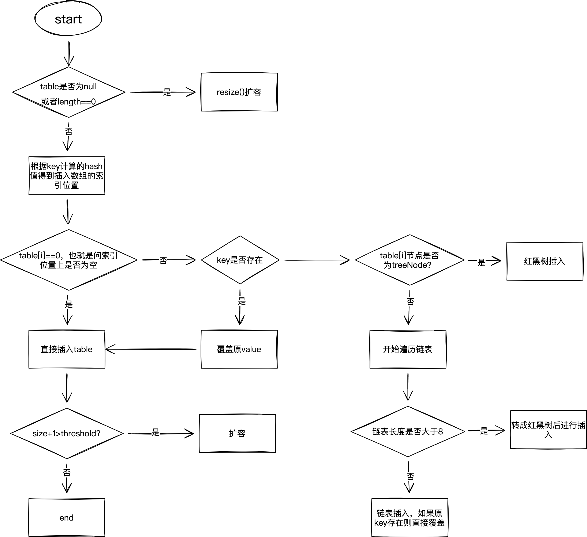

### (注意put函数的流程图没有放进来，需要找时间画一下)
### Hash作用
Hash表通过把关键码值映射到表中的一个位置来访问记录，以加快查找的速度。
那么这个映射的函数就称为散列函数，存放记录的数组称为**散列表**
​

### Hash冲突
如果多个key通过散列函数到同一个位置，这时候该如何处理？
常用的是两种方案：

1. 开放地址法：当遇到冲突了，这时候通过另一个新的函数再计算一遍，得到相应的映射关系。（可能还会造成冲突）
1. 链地址法：将冲突用链表进行记录，只要遇到数据冲突，就将冲突的数据添加到对应位置的链表后面（不会再次冲突，但是可能造成链表过长，查找时间长）


### 什么是HashMap
HashMap是一个利用Hash表原理来存储元素的集合。遇到冲突时，HashMap采用的是链地址法来解决，在JDK1.7中，HashMap是由数组+链表构成的。但是在JDK1.8中，HashMap是由数组+链表+红黑树构成。
​

### HashMap定义
下面是源码中的注释。
```java
/**
Hash table based implementation of the Map interface. This implementation provides all of the optional map operations, and permits null values and the null key. (The HashMap class is roughly equivalent to Hashtable, except that it is unsynchronized and permits nulls.) This class makes no guarantees as to the order of the map; in particular, it does not guarantee that the order will remain constant over time.
基于哈希表的Map接口实现，除了允许key和value为空，和不同步之外，和HashTable没啥区别

This implementation provides constant-time performance for the basic operations (get and put), assuming the hash function disperses the elements properly among the buckets. Iteration over collection views requires time proportional to the "capacity" of the HashMap instance (the number of buckets) plus its size (the number of key-value mappings). Thus, it's very important not to set the initial capacity too high (or the load factor too low) if iteration performance is important.
这种实现方式，可以在常量时间中，进行基础的get和put方法
初始容量太高以及装填因子太低，对迭代器（遍历）性能都有不好的影响

An instance of HashMap has two parameters that affect its performance: initial capacity and load factor. The capacity is the number of buckets in the hash table, and the initial capacity is simply the capacity at the time the hash table is created. The load factor is a measure of how full the hash table is allowed to get before its capacity is automatically increased. When the number of entries in the hash table exceeds the product of the load factor and the current capacity, the hash table is rehashed (that is, internal data structures are rebuilt) so that the hash table has approximately twice the number of buckets.
hashmap有两个影响性能的参数：初始容量和装填因子
初始容量：创建哈希表中时的桶的数量
装填因子：哈希表中元素填满的程度
当初始容量*装填因子小于哈希表的容量时，哈希表会再次散列，桶的数量也翻倍

As a general rule, the default load factor (.75) offers a good tradeoff between time and space costs. Higher values decrease the space overhead but increase the lookup cost (reflected in most of the operations of the HashMap class, including get and put). The expected number of entries in the map and its load factor should be taken into account when setting its initial capacity, so as to minimize the number of rehash operations. If the initial capacity is greater than the maximum number of entries divided by the load factor, no rehash operations will ever occur.
默认的额75%的装填因子对于时间和空间的消耗是最平衡的
如果设置高了，虽然会降低空间，但是get和put的遍历时间会增加
在设置初始容量时，就最好把装填因子和map集合大小考虑好，来最小化再哈希的可能性

If many mappings are to be stored in a HashMap instance, creating it with a sufficiently large capacity will allow the mappings to be stored more efficiently than letting it perform automatic rehashing as needed to grow the table. Note that using many keys with the same hashCode() is a sure way to slow down performance of any hash table. To ameliorate impact, when keys are Comparable, this class may use comparison order among keys to help break ties.
如果知道可能有比较多的数据存入Hashmap，就最好直接初始化容量，比自动扩容效率高

Note that this implementation is not synchronized. If multiple threads access a hash map concurrently, and at least one of the threads modifies the map structurally, it must be synchronized externally. (A structural modification is any operation that adds or deletes one or more mappings; merely changing the value associated with a key that an instance already contains is not a structural modification.) This is typically accomplished by synchronizing on some object that naturally encapsulates the map. If no such object exists, the map should be "wrapped" using the Collections.synchronizedMap method. This is best done at creation time, to prevent accidental unsynchronized access to the map:
     Map m = Collections.synchronizedMap(new HashMap(...));
The iterators returned by all of this class's "collection view methods" are fail-fast: if the map is structurally modified at any time after the iterator is created, in any way except through the iterator's own remove method, the iterator will throw a ConcurrentModificationException. Thus, in the face of concurrent modification, the iterator fails quickly and cleanly, rather than risking arbitrary, non-deterministic behavior at an undetermined time in the future.
Hashmap是不安全的，如果多线程访问，有风险

Note that the fail-fast behavior of an iterator cannot be guaranteed as it is, generally speaking, impossible to make any hard guarantees in the presence of unsynchronized concurrent modification. Fail-fast iterators throw ConcurrentModificationException on a best-effort basis. Therefore, it would be wrong to write a program that depended on this exception for its correctness: the fail-fast behavior of iterators should be used only to detect bugs.
迭代器的相关行为

This class is a member of the Java Collections Framework.
Since:
1.2
See Also:
Object.hashCode(), Collection, Map, TreeMap, Hashtable
Author:
Doug Lea, Josh Bloch, Arthur van Hoff, Neal Gafter
Type parameters:
<K> – the type of keys maintained by this map
<V> – the type f mapped values

**/
```
实现了Map接口（没具体作用），也继承了AbstractMap抽象类，实现了Serializable和Cloneable类，HashMap的类图如下所示。


#### 字段属性
```java
/**
The default initial capacity - MUST be a power of two.
默认初始容量为16
*/
static final int DEFAULT_INITIAL_CAPACITY = 1 << 4; // aka 16
/**
* The maximum capacity, used if a higher value is implicitly specified
* by either of the constructors with arguments.
* MUST be a power of two <= 1<<30.
最大容量是2^31
*/
static final int MAXIMUM_CAPACITY = 1 << 30;

/**
* The load factor used when none specified in constructor.
默认装填因子为0.75
*/
static final float DEFAULT_LOAD_FACTOR = 0.75f;

/**
 * The bin count threshold for using a tree rather than list for a
 * bin.  Bins are converted to trees when adding an element to a
 * bin with at least this many nodes. The value must be greater
 * than 2 and should be at least 8 to mesh with assumptions in
 * tree removal about conversion back to plain bins upon
 * shrinkage.
 当元素被加到TREEIFY_THRESHOLD个元素的桶中，桶中的链表就会转化为树形结构。（JDK1.8新增）
 */
static final int TREEIFY_THRESHOLD = 8;

/**
 * The bin count threshold for untreeifying a (split) bin during a
 * resize operation. Should be less than TREEIFY_THRESHOLD, and at
 * most 6 to mesh with shrinkage detection under removal.
 如果桶中元素小于UNTREEIFY_THRESHOLD，桶中的树就变成链表。（JDK1.8新增）
 */
static final int UNTREEIFY_THRESHOLD = 6;

/**
 * The smallest table capacity for which bins may be treeified.
 * (Otherwise the table is resized if too many nodes in a bin.)
 * Should be at least 4 * TREEIFY_THRESHOLD to avoid conflicts
 * between resizing and treeification thresholds.
 允许链表变成树结构的最小表容量。（JDK1.8新增）
 */
static final int MIN_TREEIFY_CAPACITY = 64;
```
后三个字段是JDK1.8新增的，主要用来进行红黑树和链表的相互转换。
```java
/* ---------------- Fields -------------- */

    /**
     * The table, initialized on first use, and resized as
     * necessary. When allocated, length is always a power of two.
     * (We also tolerate length zero in some operations to allow
     * bootstrapping mechanics that are currently not needed.)
     * 初始化使用，长度总是2的幂，默认长度是16，如果有声明，会扩充到2^n
     */
    transient Node<K,V>[] table;

    /**
     * Holds cached entrySet(). Note that AbstractMap fields are used
     * for keySet() and values().
     * 保存缓存的entrySet。
     */
    transient Set<Map.Entry<K,V>> entrySet;

    /**
     * The number of key-value mappings contained in this map.
     * 此映射中包含的键值映射的数量。（集合存储键值对的数量）
     */
    transient int size;

    /**
     * The number of times this HashMap has been structurally modified
     * Structural modifications are those that change the number of mappings in
     * the HashMap or otherwise modify its internal structure (e.g.,
     * rehash).  This field is used to make iterators on Collection-views of
     * the HashMap fail-fast.  (See ConcurrentModificationException).
     * 记录集合中被修改的次数，用以迭代器中的快速失败
     */
    transient int modCount;

    /**
     * The next size value at which to resize (capacity * load factor).
     *
     * @serial
     */
    // (The javadoc description is true upon serialization.
    // Additionally, if the table array has not been allocated, this
    // field holds the initial array capacity, or zero signifying
    // DEFAULT_INITIAL_CAPACITY.)
	//用来调整下一个值的大小（容量*加载因子），也就是目前能装的的最大值，需要扩容的临界值
    int threshold;

    /**
     * The load factor for the hash table.
     *
     * @serial
     * 散列表的加载因子，用来衡量HashMap满的程度，实时装载因子的计算方法是size/capacity，而不是用占用桶的数量去除以capacity。
     * 默认为0.75
     * 1. 如果内存空间足够，但对时间要求高，可以降低该值
     * 2. 如果内存紧张而对时间要求不高，可以增加该值，这个值可以大于1.
     */
    final float loadFactor;
```
#### 底层结构
```java
/**
 * Basic hash bin node, used for most entries.  (See below for
 * TreeNode subclass, and in LinkedHashMap for its Entry subclass.)
 */
static class Node<K,V> implements Map.Entry<K,V> {
    final int hash;
    final K key;
    V value;
    Node<K,V> next;

    Node(int hash, K key, V value, Node<K,V> next) {
        this.hash = hash;
        this.key = key;
        this.value = value;
        this.next = next;
    }

    public final K getKey()        { return key; }
    public final V getValue()      { return value; }
    public final String toString() { return key + "=" + value; }

    public final int hashCode() {
        return Objects.hashCode(key) ^ Objects.hashCode(value);
    }

    public final V setValue(V newValue) {
        V oldValue = value;
        value = newValue;
        return oldValue;
    }

    public final boolean equals(Object o) {
        if (o == this)
            return true;
        if (o instanceof Map.Entry) {
            Map.Entry<?,?> e = (Map.Entry<?,?>)o;
            if (Objects.equals(key, e.getKey()) &&
                Objects.equals(value, e.getValue()))
                return true;
        }
        return false;
    }
}

```
#### 构造函数
```java
/**
 * Constructs an empty <tt>HashMap</tt> with the default initial capacity
 * (16) and the default load factor (0.75).
 * 默认构造函数
 */
public HashMap() {
    this.loadFactor = DEFAULT_LOAD_FACTOR; // all other fields defaulted
}

/**
 * Constructs an empty <tt>HashMap</tt> with the specified initial
 * capacity and the default load factor (0.75).
 *
 * @param  initialCapacity the initial capacity.
 * @throws IllegalArgumentException if the initial capacity is negative.
 */
public HashMap(int initialCapacity) {
    this(initialCapacity, DEFAULT_LOAD_FACTOR);
}

/**
 * Constructs an empty <tt>HashMap</tt> with the specified initial
 * capacity and load factor.
 *
 * @param  initialCapacity the initial capacity
 * @param  loadFactor      the load factor
 * @throws IllegalArgumentException if the initial capacity is negative
 *         or the load factor is nonpositive
 */
public HashMap(int initialCapacity, float loadFactor) {
    //初始容量不能小于0，否则会出问题
    if (initialCapacity < 0)
        throw new IllegalArgumentException("Illegal initial capacity: " +
                                           initialCapacity);
    //如果初始化容量大于2的30的次方，则初始化容量都为2的30次方。
    if (initialCapacity > MAXIMUM_CAPACITY)
        initialCapacity = MAXIMUM_CAPACITY;
    //如果加载因子小于0，或者加载因子是一个非数值则抛出异常
    if (loadFactor <= 0 || Float.isNaN(loadFactor))
        throw new IllegalArgumentException("Illegal load factor: " +
                                           loadFactor);
    this.loadFactor = loadFactor;
    this.threshold = tableSizeFor(initialCapacity);
}

/**
 * Constructs a new <tt>HashMap</tt> with the same mappings as the
 * specified <tt>Map</tt>.  The <tt>HashMap</tt> is created with
 * default load factor (0.75) and an initial capacity sufficient to
 * hold the mappings in the specified <tt>Map</tt>.
 *
 * @param   m the map whose mappings are to be placed in this map
 * @throws  NullPointerException if the specified map is null
 */
public HashMap(Map<? extends K, ? extends V> m) {
    this.loadFactor = DEFAULT_LOAD_FACTOR;
    putMapEntries(m, false);
}


/**
 * Returns a power of two size for the given target capacity.
 * 返回大于等于initialCapacity的最小的二次幂数值
 */
static final int tableSizeFor(int cap) {
    int n = cap - 1;
    n |= n >>> 1;
    n |= n >>> 2;
    n |= n >>> 4;
    n |= n >>> 8;
    n |= n >>> 16;
    return (n < 0) ? 1 : (n >= MAXIMUM_CAPACITY) ? MAXIMUM_CAPACITY : n + 1;
}
```
这是位运算算法，具体流程可参考：

- [https://www.cnblogs.com/loading4/p/6239441.html](https://www.cnblogs.com/loading4/p/6239441.html)
- [https://blog.csdn.net/fan2012huan/article/details/51097331](https://blog.csdn.net/fan2012huan/article/details/51097331)

看完上面可能会感到奇怪的是：**为啥是将2的整数幂的数赋给threshold？在下一小节中会介绍。**

- threshold这个成员变量是阈值，决定了是否要将散列表再散列。它的值应该是：`capacity * load factor`才对的。

其实这里仅仅是一个初始化，当创建哈希表的时候，它会重新赋值的：


#### 确定Hash桶数组索引位置
HashMap是数组+链表+红黑树组合，是希望在有限个数组位置时，尽量使每个位置的元素只有一个，当用散列表函数求得索引位置时，就能马上知道对应位置的元素是不是想要的，而不用进行链表的遍历或者红黑树的遍历，这样会大大提高查询效率。
下面是HashMap中的hash算法
```java
/**
 * Computes key.hashCode() and spreads (XORs) higher bits of hash
 * to lower.  Because the table uses power-of-two masking, sets of
 * hashes that vary only in bits above the current mask will
 * always collide. (Among known examples are sets of Float keys
 * holding consecutive whole numbers in small tables.)  So we
 * apply a transform that spreads the impact of higher bits
 * downward. There is a tradeoff between speed, utility, and
 * quality of bit-spreading. Because many common sets of hashes
 * are already reasonably distributed (so don't benefit from
 * spreading), and because we use trees to handle large sets of
 * collisions in bins, we just XOR some shifted bits in the
 * cheapest possible way to reduce systematic lossage, as well as
 * to incorporate impact of the highest bits that would otherwise
 * never be used in index calculations because of table bounds.
 */
static final int hash(Object key) {
    int h;
    return (key == null) ? 0 : (h = key.hashCode()) ^ (h >>> 16);
}

//这个是在putVal()方法总进行位置的确定
i = (n - 1) & hash
```
主要分为以下三步：

1. 取hashCode值：key.hashCode();
1. 高位参与运算：h>>>16
1. 取模运算：(n - 1) & hash

这里获取hashCode()方法的值是变量，但是对于任意给定的对象，只要它的hashCode()返回值相同，那么程序调用hash(Object key)所计算得到的hash码值总是相同的。
**为了让数组元素分布均匀，首先相到的是把获得的hash码对数组长度取模运算（hash%length），但是计算机都是以二进制进行操作，取模运算相对开销还是很大的，如何进行优化呢？**
**​**

这里就说到了上一节说到的问题了，HashMap使用的方法是：
**通过hash & (length -1)来得到该对象的保存位置，HashMap底层数组长度总是2的幂，这是因为HashMap在速度上的优化，当length为2的幂时，这个计算就等价于对length取模，也就是hash%length，但是&比%具有更高的效率。所以这就解释了为什么需要保证数组的长度总是2的幂。**
**​**

**这样还有一个好处是：**
**在hashCode计算中，key的哈希值（32位）的高位也做了运算(与高16位做异或运算，使得在做&运算时，此时的低位实际上是高位与低位的结合)，这就增加了随机性**，减少了碰撞冲突的可能性！
​

附：JDK 1.8 的 hash 方法 相比于 JDK 1.7 hash 方法更加简化，但是原理不变。1.7源码如下：
```java
static int hash(int h) {     
    // This function ensures that hashCodes that differ only by     
    // constant multiples at each bit position have a bounded     
    // number of collisions (approximately 8 at default load factor).     
    h ^= (h >>> 20) ^ (h >>> 12);     
    return h ^ (h >>> 7) ^ (h >>> 4); 
}
```
相比于 JDK1.8 的 hash 方法 ，JDK 1.7 的 hash 方法的性能会稍差一点点，因为毕竟扰动了 4 次。
#### put方法



```java
/**
 * Associates the specified value with the specified key in this map.
 * If the map previously contained a mapping for the key, the old
 * value is replaced.
 *
 * @param key key with which the specified value is to be associated
 * @param value value to be associated with the specified key
 * @return the previous value associated with {@code key}, or
 *         {@code null} if there was no mapping for {@code key}.
 *         (A {@code null} return can also indicate that the map
 *         previously associated {@code null} with {@code key}.)
 * 调用putVal方法
 */
public V put(K key, V value) {
    return putVal(hash(key), key, value, false, true);
}
/**
 * Implements Map.put and related methods.
 *
 * @param hash hash for key
 * @param key the key
 * @param value the value to put
 * @param onlyIfAbsent if true, don't change existing value
 * @param evict if false, the table is in creation mode.
 * @return previous value, or null if none
 */
final V putVal(int hash, K key, V value, boolean onlyIfAbsent,
               boolean evict) {
    Node<K,V>[] tab; Node<K,V> p; int n, i;
    //如果table是否是空，如果空的话就进行初始化
    if ((tab = table) == null || (n = tab.length) == 0)
        //resize本来是用来进行扩容的，由于初始化没有实际分配空间，这里使用该方法进行分配空间
        n = (tab = resize()).length;
    //计算索引i的位置，并判断索引位置是否为空，
    if ((p = tab[i = (n - 1) & hash]) == null)
        //空的话直接插入
        tab[i] = newNode(hash, key, value, null);
    //否则表示该位置有值了，需要进行冲突处理
    else {
        Node<K,V> e; K k;
       	//如果是数组，节点的key已经有值了，直接用新值进行覆盖。
        if (p.hash == hash &&
            ((k = p.key) == key || (key != null && key.equals(k))))
            e = p;
        //判断p是否为红黑树节点，如果是，进入红黑树的执行流程，进行插入操作
        else if (p instanceof TreeNode)
            e = ((TreeNode<K,V>)p).putTreeVal(this, tab, hash, key, value);
        //不是红黑树，就是链表了
        else {
            for (int binCount = 0; ; ++binCount) {
                if ((e = p.next) == null) {
                    p.next = newNode(hash, key, value, null);
                    //如果这个数据超过了8，转化为红黑树
                    if (binCount >= TREEIFY_THRESHOLD - 1) // -1 for 1st
                        treeifyBin(tab, hash);
                    break;
                }
                //key已经存在直接覆盖value
                if (e.hash == hash &&
                    ((k = e.key) == key || (key != null && key.equals(k))))
                    break;
                p = e;
            }
        }
        if (e != null) { // existing mapping for key
            V oldValue = e.value;
            if (!onlyIfAbsent || oldValue == null)
                e.value = value;
            afterNodeAccess(e);
            //老值
            return oldValue;
        }
    }
    ++modCount;
    //需要扩容
    if (++size > threshold)
        resize();
    afterNodeInsertion(evict);
    return null;
}
```
#### resize()方法
当向HashMap中插入元素时，如果集合元素数已经大于最大承载容量threshold（capacity*loadFactor），这里threshold不是数组的最大长度。那么必须扩大数组的长度，由于Java中数组是无法自动扩容的，所以采用的方法是用一个更大的数组代替这个小的数组。不过jdk1.8中添加了红黑树，所以扩容没那么简单了
```java
/**
 * Initializes or doubles table size.  If null, allocates in
 * accord with initial capacity target held in field threshold.
 * Otherwise, because we are using power-of-two expansion, the
 * elements from each bin must either stay at same index, or move
 * with a power of two offset in the new table.
 *
 * @return the table
 */
final Node<K,V>[] resize() {
    Node<K,V>[] oldTab = table;
    //原数组为null，则长度赋值为0
    int oldCap = (oldTab == null) ? 0 : oldTab.length;
    int oldThr = threshold;
    int newCap, newThr = 0;
    //当原数组长度大于0
    if (oldCap > 0) {
        //且数组长度大于等于最大值2^30
        if (oldCap >= MAXIMUM_CAPACITY) {
            //修改阈值为2^31-1
            threshold = Integer.MAX_VALUE;
            return oldTab;
        }
        //原数组长度大于等于初始化长度16，且原数组长度扩大1倍也小于2^30次方
        else if ((newCap = oldCap << 1) < MAXIMUM_CAPACITY &&
                 oldCap >= DEFAULT_INITIAL_CAPACITY)
            //阈值扩大一倍
            newThr = oldThr << 1; // double threshold
    }
    //如果是旧阈值大于0.则将新容量直接等于旧阈值
    else if (oldThr > 0) // initial capacity was placed in threshold
        newCap = oldThr;
    //阈值等于0，原数组也等于0（未进行初始化）
    else {               // zero initial threshold signifies using defaults
        //新的长度为16
        newCap = DEFAULT_INITIAL_CAPACITY;
        //新阈值等于16*0.75 = 12
        newThr = (int)(DEFAULT_LOAD_FACTOR * DEFAULT_INITIAL_CAPACITY);
    }
    //计算新的阈值上限
    if (newThr == 0) {
        float ft = (float)newCap * loadFactor;
        newThr = (newCap < MAXIMUM_CAPACITY && ft < (float)MAXIMUM_CAPACITY ?
                  (int)ft : Integer.MAX_VALUE);
    }
    threshold = newThr;
    @SuppressWarnings({"rawtypes","unchecked"})
    Node<K,V>[] newTab = (Node<K,V>[])new Node[newCap];
    table = newTab;
    if (oldTab != null) {
        //移动每个桶中的元素到新的桶中
        for (int j = 0; j < oldCap; ++j) {
            Node<K,V> e;
            if ((e = oldTab[j]) != null) {
                oldTab[j] = null;//设置为null，便于gc
                if (e.next == null)//数组没有下一个时，就搞完了
                    newTab[e.hash & (newCap - 1)] = e;
                else if (e instanceof TreeNode)//如果是红黑树
                    ((TreeNode<K,V>)e).split(this, newTab, j, oldCap);
                else { // preserve order
                    //如果是链表
                    Node<K,V> loHead = null, loTail = null;
                    Node<K,V> hiHead = null, hiTail = null;
                    Node<K,V> next;
                    do {
                        next = e.next;
                        //原索引
                        if ((e.hash & oldCap) == 0) {
                            if (loTail == null)
                                loHead = e;
                            else
                                loTail.next = e;
                            loTail = e;
                        }
                        //原索引+oldCap
                        else {
                            if (hiTail == null)
                                hiHead = e;
                            else
                                hiTail.next = e;
                            hiTail = e;
                        }
                    } while ((e = next) != null);
                    //原索引放到桶内
                    if (loTail != null) {
                        loTail.next = null;
                        newTab[j] = loHead;
                    }
                    //原索引+oldCap放到桶内
                    if (hiTail != null) {
                        hiTail.next = null;
                        newTab[j + oldCap] = hiHead;
                    }
                }
            }
        }
    }
    return newTab;
}
```
#### get()方法
```java
/**
 * Returns the value to which the specified key is mapped,
 * or {@code null} if this map contains no mapping for the key.
 *
 * <p>More formally, if this map contains a mapping from a key
 * {@code k} to a value {@code v} such that {@code (key==null ? k==null :
 * key.equals(k))}, then this method returns {@code v}; otherwise
 * it returns {@code null}.  (There can be at most one such mapping.)
 *
 * <p>A return value of {@code null} does not <i>necessarily</i>
 * indicate that the map contains no mapping for the key; it's also
 * possible that the map explicitly maps the key to {@code null}.
 * The {@link #containsKey containsKey} operation may be used to
 * distinguish these two cases.
 *
 * @see #put(Object, Object)
 */
public V get(Object key) {
    Node<K,V> e;
    return (e = getNode(hash(key), key)) == null ? null : e.value;
}
/**
 * Implements Map.get and related methods.
 *
 * @param hash hash for key
 * @param key the key
 * @return the node, or null if none
 */
final Node<K,V> getNode(int hash, Object key) {
    Node<K,V>[] tab; Node<K,V> first, e; int n; K k;
    if ((tab = table) != null && (n = tab.length) > 0 &&
        (first = tab[(n - 1) & hash]) != null) {
        if (first.hash == hash && // always check first node
            ((k = first.key) == key || (key != null && key.equals(k))))
            return first;
        if ((e = first.next) != null) {
            if (first instanceof TreeNode)
                return ((TreeNode<K,V>)first).getTreeNode(hash, key);
            do {
                if (e.hash == hash &&
                    ((k = e.key) == key || (key != null && key.equals(k))))
                    return e;
            } while ((e = e.next) != null);
        }
    }
    return null;
}
```
#### remove()方法
```java
/**
* Removes the mapping for the specified key from this map if present.
*
* @param  key key whose mapping is to be removed from the map
* @return the previous value associated with <tt>key</tt>, or
*         <tt>null</tt> if there was no mapping for <tt>key</tt>.
*         (A <tt>null</tt> return can also indicate that the map
*         previously associated <tt>null</tt> with <tt>key</tt>.)
*/
public V remove(Object key) {
Node<K,V> e;
return (e = removeNode(hash(key), key, null, false, true)) == null ?
    null : e.value;
}
/**
 * Implements Map.remove and related methods.
 *
 * @param hash hash for key
 * @param key the key
 * @param value the value to match if matchValue, else ignored
 * @param matchValue if true only remove if value is equal
 * @param movable if false do not move other nodes while removing
 * @return the node, or null if none
 */
final Node<K,V> removeNode(int hash, Object key, Object value,
                           boolean matchValue, boolean movable) {
    Node<K,V>[] tab; Node<K,V> p; int n, index;
   	//找到桶位置
    if ((tab = table) != null && (n = tab.length) > 0 &&
        (p = tab[index = (n - 1) & hash]) != null) {
        Node<K,V> node = null, e; K k; V v;
        if (p.hash == hash &&
            ((k = p.key) == key || (key != null && key.equals(k))))
            node = p;
        else if ((e = p.next) != null) {
            if (p instanceof TreeNode)
                node = ((TreeNode<K,V>)p).getTreeNode(hash, key);
            else {
                do {
                    if (e.hash == hash &&
                        ((k = e.key) == key ||
                         (key != null && key.equals(k)))) {
                        node = e;
                        break;
                    }
                    p = e;
                } while ((e = e.next) != null);
            }
        }
        //删除节点并进行红黑树平衡调整
        if (node != null && (!matchValue || (v = node.value) == value ||
                             (value != null && value.equals(v)))) {
            if (node instanceof TreeNode)
                ((TreeNode<K,V>)node).removeTreeNode(this, tab, movable);
            else if (node == p)
                tab[index] = node.next;
            else
                p.next = node.next;
            ++modCount;
            --size;
            afterNodeRemoval(node);
            return node;
        }
    }
    return null;
}
```


#### 总结
在JDK8中HashMap的底层是：**数组+链表(散列表)+红黑树**
在散列表中有装载因子这么一个属性，当装载因子*初始容量小于散列表元素时，该散列表会再散列，扩容2倍！
装载因子的**默认值是0.75**，无论是初始大了还是初始小了对我们HashMap的性能都不好

- 装载因子初始值大了，可以减少散列表再散列(扩容的次数)，但同时会导致散列冲突的可能性变大(**散列冲突也是耗性能的一个操作，要得操作链表(红黑树)**！
- 装载因子初始值小了，可以减小散列冲突的可能性，但同时扩容的次数可能就会变多！

初始容量的**默认值是16**，它也一样，无论初始大了还是小了，对我们的HashMap都是有影响的：

- 初始容量过大，那么遍历时我们的速度就会受影响~
- 初始容量过小，散列表再散列(扩容的次数)可能就变得多，扩容也是一件非常耗费性能的一件事~

从源码上我们可以发现：HashMap并不是直接拿key的哈希值来用的，它会将key的哈希值的高16位进行异或操作，使得我们将元素放入哈希表的时候**增加了一定的随机性**。
还要值得注意的是：**并不是桶子上有8位元素的时候它就能变成红黑树，它得同时满足我们的散列表容量大于64才行的**~
​

### HashMap 和 Hashtable 的区别

1. **线程是否安全：** HashMap 是非线程安全的，HashTable 是线程安全的,因为 HashTable 内部的方法基本都经过synchronized 修饰。（如果你要保证线程安全的话就使用 ConcurrentHashMap 吧！）；
1. **效率：** 因为线程安全的问题，HashMap 要比 HashTable 效率高一点。另外，HashTable 基本被淘汰，不要在代码中使用它；
1. **对 Null key 和 Null value 的支持：** HashMap 可以存储 null 的 key 和 value，但 null 作为键只能有一个，null 作为值可以有多个；HashTable 不允许有 null 键和 null 值，否则会抛出 NullPointerException。
1. **初始容量大小和每次扩充容量大小的不同 ：** ① 创建时如果不指定容量初始值，Hashtable 默认的初始大小为 11，之后每次扩充，容量变为原来的 2n+1。HashMap 默认的初始化大小为 16。之后每次扩充，容量变为原来的 2 倍。② 创建时如果给定了容量初始值，那么 Hashtable 会直接使用你给定的大小，而 HashMap 会将其扩充为 2 的幂次方大小（HashMap 中的tableSizeFor()方法保证，下面给出了源代码）。也就是说 HashMap 总是使用 2 的幂作为哈希表的大小,后面会介绍到为什么是 2 的幂次方。
1. **底层数据结构：** JDK1.8 以后的 HashMap 在解决哈希冲突时有了较大的变化，当链表长度大于阈值（默认为 8）（将链表转换成红黑树前会判断，如果当前数组的长度小于 64，那么会选择先进行数组扩容，而不是转换为红黑树）时，将链表转化为红黑树，以减少搜索时间。Hashtable 没有这样的机制。


