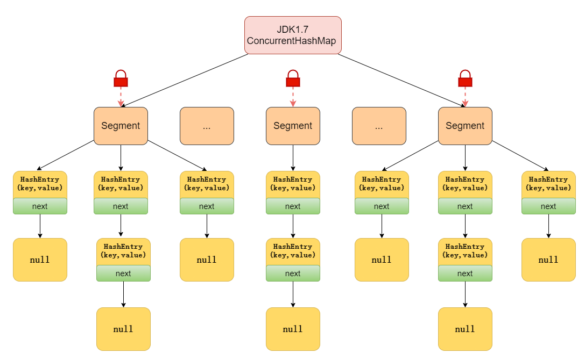
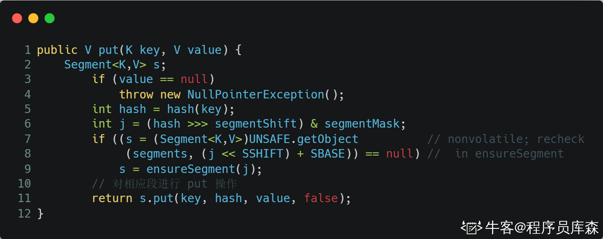

。线程安全的hashmap是concurrenthashmap
## 实现原理
注意：concurrenthashmap在jdk1.7和1.8中的实现方式是不一样的

### JDK1.7
在JDK1.7中的concurrenthashmap是由Segment数组结构和HashEntry结构组成，也就是其把哈希桶数分成小数组（segment），每个小数组有n个HashEntry组成
如下图所示，首先将数据分成一段一段的存储，然后给每段数据配一把锁，当一个线程占用锁访问其中一段数据时，其他段的数据的读写不受影响，实现了真正的并发访问。

Segment是ConcurrentHashMap的一个内部类，主要组成如下

其继承了ReentrantLock，所以Segment是一种可重入锁，扮演锁的角色，默认16，也就是说并发度为16.

存放元素的HashEntry，也是一个静态内部类，主要组成如下

其中，用volatile修饰了HashEntry的数据value和下一个节点next，保证了多线程环境下数据获取时的可见性。

### JDK1.8
在JDK1.8中，ConcurrentHashMap选择了与HashMap相同的Node数组+链表+红黑树的结构，在锁的实现上，抛弃了原有的Segment分段锁，采用了CAS+Synchronized实现更加细粒度的锁

将锁的级别控制在了更细粒度的哈希桶数组级别，也就是说只需要锁住链表的头（或者红黑树的根节点），就不会影响其他的哈希桶数组元素的读写，大大提高了并发度。

#### 1.8中为什么使用synchronized替换掉segment锁

1. 在jdk1.6中，对synchronized锁的实现引入了大量的优化，并且synchronized有多种锁状态，会从无锁->偏向锁->轻量级锁->重量级锁一步步转换
1. 减少了内存开销：如果使用ReentrantLock来获得同步至此，那么每个节点都需要通过继承AQS来获得同步支持，但并不是每个节点都需要获得同步支持的，只有链表的头结点（红黑树的根节点）需要同步，这无疑带来了巨大的内存浪费。

## PUT方法
### JDK1.7

先定位到相应的Segment，然后再进行put操作

首先会尝试获取锁，如果获取失败肯定就有其他线程存在竞争，则利用scanAndLockForPut()自旋获取锁

1. 尝试自旋获取锁
1. 如果自旋重试次数达到MAX_SCAN_PETRIES则改为阻塞锁获取，保证能获取成功

### JDK1.8

大致可以分为一下几个步骤：

1. 根据key计算出hash值
1. 判断是否需要进行初始化
1. 定位到node，拿到首节点f，判断f：
   1. 如果是null，则通过CAS的方式尝试添加
   1. 如果为 f.hash = MOVED = -1 ，说明其他线程在扩容，参与一起扩容
   1. 如果都不满足，synchronized锁住f节点，判断其实链表还是红黑树，遍历插入
4. 当在链表长度达到8的时候，数组扩容或者将链表转换为红黑树。

## get 方法
### get方法是否需要加锁
get方法是不需要加锁的，因为Node的元素value指针next是用volatile修饰的，在多线程环境下线程A修改节点的value或者新增节点的时候是对线程B可见的。

这也是它比其他并发集合如HashTable，用 Collections.synchronizedMap()包装的 HashMap 效率高的原因之一。

### get方法不需要加锁与volatile修饰的哈希桶数组有关系吗？
没有关系。哈希桶数组table用voaltile修饰主要是保证在数组扩容的时候保证其可见性

## 其他
### ConcurrentHashMap 不支持 key 或者 value 为 null 的原因？
首先说明一下为什么value不能为null？
因为ConcurrentHashMap是用于多线程的，如果get(key)时得到了null，就无法判断，是存储的value是null，还是没有找到对应的key而返回null，造成了二义性

而用于单线程状态的 HashMap 却可以用containsKey(key) 去判断到底是否包含了这个 null 。
我们用反证法来推理：

- 假设 ConcurrentHashMap 允许存放值为 null 的 value，这时有A、B两个线程，线程A调用ConcurrentHashMap.get(key)方法，返回为 null ，我们不知道这个 null 是没有映射的 null ，还是存的值就是 null 。
- 假设此时，返回为 null 的真实情况是没有找到对应的 key。那么，我们可以用 ConcurrentHashMap.containsKey(key)来验证我们的假设是否成立，我们期望的结果是返回 false 。
- 但是在我们调用 ConcurrentHashMap.get(key)方法之后，containsKey方法之前，线程B执行了ConcurrentHashMap.put(key, null)的操作。那么我们调用containsKey方法返回的就是 true 了，这就与我们的假设的真实情况不符合了，这就有了二义性。

至于key为什么不能为null的问题，在源码中就是这样写的，可能是作者不喜欢吧，在设计之处就不允许null的key存在

### ConcurrentHashMap的并发度是什么？
可以理解为程序运行时能够同时更新ConcurrentHashMap且不产生锁竞争的最大线程数，在JDK1.7中，实际上就是Segment的个数，默认是16，这个值可以在构造函数中设置
如果自己设置了并发度，ConcurrentHashMap会使用大于等于该值的最小的2的幂指数作为实际并发度，也就是比如你设置的17，实际上并发数是32

如果并发度设置过小，会带来严重的锁竞争问题，如果设置过大，原本位于同一个Segment里的访问会扩散到不同的Segment，CPU cache命中会降低，也会导致性能下降

在JDK1.8里，已经摒弃了Segment的概念，选择了Node数组+链表+红黑树结构，并发度大小依赖于数组的大小。
### ConcurrentHashMap 迭代器是强一致性还是弱一致性？
与 HashMap 迭代器是强一致性不同，**ConcurrentHashMap 迭代器是弱一致性。**
ConcurrentHashMap 的迭代器创建后，就会按照哈希表结构遍历每个元素，但在遍历过程中，内部元素可能会发生变化，如果变化发生在已遍历过的部分，迭代器就不会反映出来，而如果变化发生在未遍历过的部分，迭代器就会发现并反映出来，这就是弱一致性。
这样迭代器线程可以使用原来老的数据，而写线程也可以并发的完成改变，更重要的，这保证了多个线程并发执行的连续性和扩展性，是性能提升的关键。想要深入了解的小伙伴，可以看这篇文章：[http://ifeve.com/ConcurrentHashMap-weakly-consistent/](http://ifeve.com/ConcurrentHashMap-weakly-consistent/)
### JDK1.7 与 JDK1.8 中ConcurrentHashMap 的区别？

- 数据结构：取消了 Segment 分段锁的数据结构，取而代之的是数组+链表+红黑树的结构。
- 保证线程安全机制：JDK1.7 采用 Segment 的分段锁机制实现线程安全，其中 Segment 继承自ReentrantLock 。JDK1.8 采用CAS+synchronized保证线程安全。
- 锁的粒度：JDK1.7 是对需要进行数据操作的 Segment 加锁，JDK1.8 调整为对每个数组元素加锁（Node）。
- 链表转化为红黑树：定位节点的 hash 算法简化会带来弊端，hash 冲突加剧，因此在链表节点数量大于 8（且数据总量大于等于 64）时，会将链表转化为红黑树进行存储。
- 查询时间复杂度：从 JDK1.7的遍历链表O(n)， JDK1.8 变成遍历红黑树O(logN)。
### ConcurrentHashMap 和 Hashtable 的效率哪个更高？为什么？
ConcurrentHashMap 的效率要高于 Hashtable，因为 Hashtable 给整个哈希表加了一把大锁从而实现线程安全。而ConcurrentHashMap 的锁粒度更低，在 JDK1.7 中采用分段锁实现线程安全，在 JDK1.8 中采用CAS+synchronized实现线程安全。
### 具体说一下Hashtable的锁机制
Hashtable 是使用 synchronized来实现线程安全的，给整个哈希表加了一把大锁，多线程访问时候，只要有一个线程访问或操作该对象，那其他线程只能阻塞等待需要的锁被释放，在竞争激烈的多线程场景中性能就会非常差！

### 多线程下安全的操作 map还有其他方法吗？
还可以使用Collections.synchronizedMap方法，对方法进行加同步锁。

如果传入的是 HashMap 对象，其实也是对 HashMap 做的方法做了一层包装，里面使用对象锁来保证多线程场景下，线程安全，本质也是对 HashMap 进行全表锁。在竞争激烈的多线程环境下性能依然也非常差，不推荐使用！

原文：[面试 ConcurrentHashMap，看这一篇就够了！](https://www.nowcoder.com/discuss/591527)
