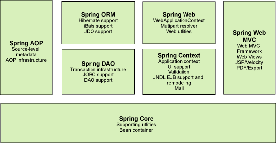

> Spring理念 : 使现有技术更加实用 . 本身就是一个大杂烩 , 整合现有的框架技术

- 官网 : [http://spring.io/](http://spring.io/)
- 官方下载地址 : [https://repo.spring.io/libs-release-local/org/springframework/spring/](https://repo.spring.io/libs-release-local/org/springframework/spring/)
- GitHub : [https://github.com/spring-projects](https://github.com/spring-projects)

优点
1. Spring是一个开源免费的框架 , 容器  .
2. Spring是一个轻量级的框架 , 非侵入式的 .
3. 控制反转 IoC  , 面向切面 AOP.
4. 对事务的支持 , 对框架的支持
**一句话概括：Spring是一个轻量级的控制反转(IoC)和面向切面(AOP)的容器（框架）。**

### Spring组件介绍

Spring框架是一个分层架构，由7个定义良好的模块组成，Spring模块构建在核心容器之上，核心容器定义了创建、配置和管理bean的方式。Spring 框架的每个模块（或组件)都可以单独存在，或者与其他一个或多个模块联合实现。每个模块的功能如下：

- **Spring Core**：**提供Spring框架的基本功能**。核心容器的主要组件是BeanFactory，它是工厂模式的实现。BeanFactory使用控制反转（IOC）模式将应用程序的配置和依赖性规范与实际的应用程序代码分开。
- **Spring Context**：是一个配置文件，向Spring框架提供上下文信息。Spring上下文包括企业服务，例如 JNDI、EJB、电子邮件、国际化、校验和调度功能等。
- **Spring AOP**：通过配置管理特性，Spring AOP模块直接将面向切面的编程功能 , 集成到了Spring框架中。所以，可以很容易地使Spring框架管理任何支持AOP的对象。Spring AOP模块为基于Spring的应用程序中的对象提供了事务管理服务。通过使用Spring AOP，不用依赖组件，就可以将声明性事务管理集成到应用程序中。
- **Spring DAO**：JDBC DAO抽象层提供了有意义的异常层次结构，可用该结构来管理异常处理和不同数据库供应商抛出的错误消息。异常层次结构简化了错误处理，并且极大地降低了需要编写的异常代码数量（例如打开和关闭连接）。Spring DAO的面向JDBC的异常遵从通用的DAO异常层次结构。
- **Spring ORM**：Spring框架插入了若干个ORM框架，从而提供了ORM的对象关系工具，其中包括JDO、Hibernate和iBatis SQL Map。所有这些都遵从Spring的通用事务和DAO异常层次结构。
- **Spring Web**：Web上下文模块建立在应用程序上下文模块之上，为基于Web的应用程序提供了上下文。所以，Spring框架支持与Jakarta Struts的集成。Web模块还简化了处理多部分请求以及将请求参数绑定到域对象的工作。
- **Spring MVC**：MVC框架是一个全功能的构建Web应用程序的MVC实现。通过策略接口，MVC框架变成为高度可配置的，MVC容纳了大量视图技术，其中包括JSP、Velocity、Tiles、iText和POI。
### 拓展
**Spring Boot与Spring Cloud**

- Spring Boot是Spring的一套快速配置脚手架，可以基于Spring Boot快速开发单个微服务;
- Spring Cloud是基于Spring Boot实现的；
- Spring Boot专注于快速、方便集成的单个微服务个体，Spring Cloud关注全局的服务治理框架；
- Spring Boot使用了约束优于配置的理念，很多集成方案已经帮你选择好了，能不配置就不配置 , Spring Cloud很大的一部分是基于Spring Boot来实现，Spring Boot可以离开Spring Cloud独立使用开发项目，但是Spring Cloud离不开Spring Boot，属于依赖的关系。
- Spring Boot在Spring Cloud中起到了承上启下的作用，如果你要学习Spring Cloud必须要学习Spring Boot。

参考：[【狂神：Spring简介】](https://www.bilibili.com/video/BV1WE411d7Dv?p=1)

