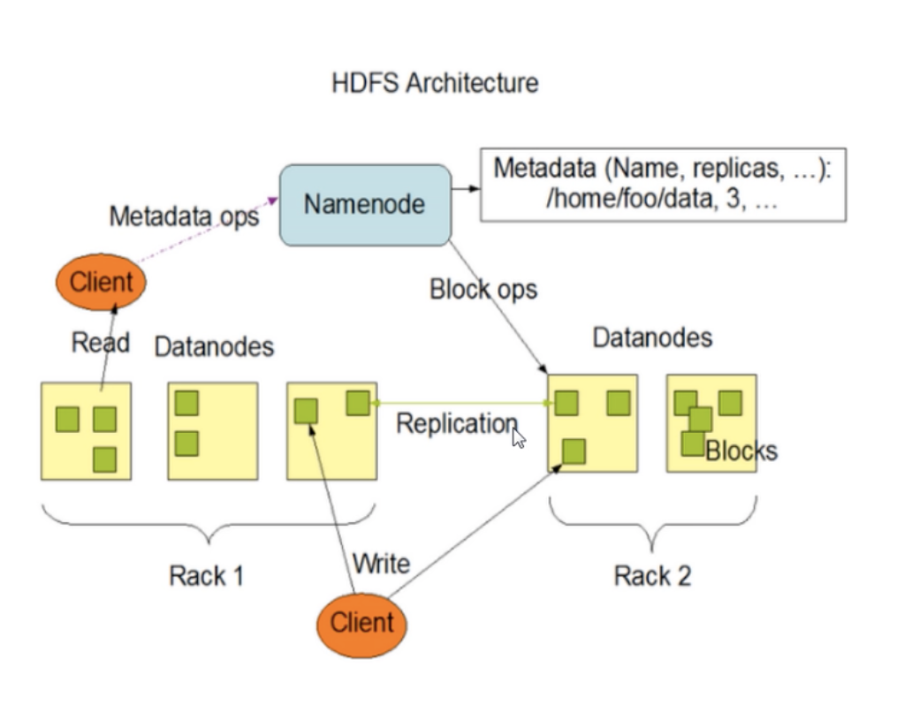
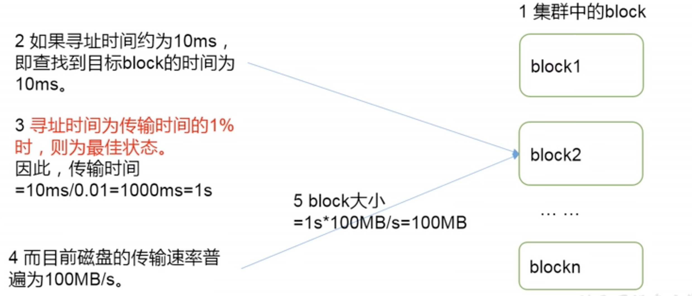

### 使用场景
适合一次写入，多次读取的操作，且不支持文件的修改，适合用来做数据分析，不适合用来做网盘
> ？？为啥，网盘小文件多，不适合

#### 优点

1. 高容错：数据自动保存多个副本（默认3个），某一个副本丢失后可以自动恢复
1. 适合处理大数据：能够处理PB级的数据规模，能够处理百万级别的文件数量
1. 可以搭建在廉价的机器上，节省开支
#### 缺点

1. 不适合低延时的数据访问，比如无法做到毫秒级的
1. **无法高效的对大量小文件进行存储**
   - 如果存储大量小文件的话，会占用大量NameNode内存来存储文件目录和块信息
   - 小文件存储的话，寻址时间会超过读取时间，违背了HDFS的设计目标
3. **不支持并发写入、文件随机修改**
   - 一个文件只能有一个写，不允许多个线程写入
   - 仅支持文件append追加，不支持随机修改
### HDFS的组成架构

#### NameNode
就是master
> 存储文件的**元数据**，如文件名、文件目录结构、文件属性（生成时间、副本数、文件权限等），以及每个文件的块列表和块所在的DataNode等

- 管理HDFS名称空间
- 配置副本策略
- 管理block映射信息
- 处理客户端的请求
#### DataNode
slave，master下发命令，slave执行实际操作

- 存储实际的数据块，以及块数据的校验和
- 执行数据块的读写操作

#### Client

- 文件切分，在文件上传的HDFS时，将文件切分成一个个block（默认128M），然后进行上传
- 与NameNode交互，获取文件的位置信息
- 与DataNode交互，读写信息
- 可以用一些命令来管理HDFS，如NameNode格式化，HDFS增删改查

#### Secondary NameNode
并非NameNode的热备，当NameNode挂掉后，它并不能马上替换NameNode并提供服务

- 用来辅助NameNode，分担其工作量，如定期合并Fsimage和Edits，并推送给NameNode
- 在紧急情况下，可辅助恢复NameNode

### 文件块大小（面试）
HDFS文件在物理块上是分块存储，块大小可以通过设置dfs.blocksize来设置，在Hadoop2.x版本中默认块大小是128M，老版本中是64M

> 为什么块不能太小，也不能太大？
> - 如果HDFS块设置太小，会增加寻址时间，程序一直在找块的开始位置
> - 如果太大，从磁盘传输数据的时间会明显大于寻址时间，导致程序在处理这个文件的时候，会非常慢
> 
总结：HDFS块大小设置主要取决于磁盘传输速率
