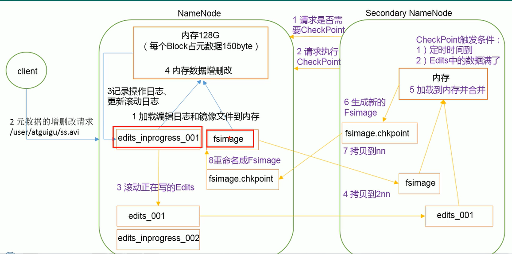

### NN与2NN的工作机制
#### 首先了解几个问题：

1. NN中元数据存储在哪？
   - 首先我们做个假设，如果存储在NN节点的磁盘中，因为需要经常进行随机访问，还需响应客户请求，必然效率过低。所以，**元数据需要存储在内存中。但是如果只存在内存中，一旦断电，元数据丢失，这样整个集群就无法进行正常工作了，所以产生了在磁盘中备份元数据的FsImage**
2. 这时候会导致新的问题：当在内存中的元数据更新时，
   - 如果同时更新FsImage，就会导致效率过低
   - 但如果不更新，就会发生一致性问题。
   - 一旦NN节点断电，就会产生数据丢失。因此引入Edits文件（只进行追加操作，效率很高）。每当元数据有更新或者添加元数据时，修改内存中的元数据并追加到Edits中。这样，一旦NN节点断电，可以通过FsImage和Edits合并，合成元数据。
> 为什么写编辑日志比镜像快？
> 因为写日志写的是记录动作，但是写数据时要寻址操作的

3. 但是如果尝试加添加数据到Edits中，会导致该文件比较大，效率降低，而且一旦断电，恢复元数据需要的时间过长。因此，**需要定期进行FsImage和Edits的合并，但是这个合并工作如果由NN来完成，又会效率比较低**
   - 因此引入一个新的节点2NN

#### 工作机制

1. NN一启动就加载编辑日志和镜像文件到内存（edits_inprocess_001,fsimage合并）
1. 客户端对元数据的增删改请求
1. NN更新编辑日志，然后更新内存中元数据（为什么这个顺序不可以反过来）万一断电就没更新上
1. 2NN节点
   1. 请求是否需要CheckPoint（就是检查是否需要合并edits和fsimage）
   1. 请求执行CheckPoint
   1. 滚动正在写的Edits，先滚动改名成edits_001,再创建一个空的edits_inprogress_002(后续操作，会写入这个文件中)
   1. 拷贝fsimage和edits_001到2NN上
   1. 将两个文件加载到内存中进行合并
   1. 生成新的fsimage，名为fsimage.chkpoint
   1. 然后拷贝回NN
5. 将拷贝回NN的fsimage.chkpoint重命名为fsimage
> ckp触发条件：

      - 定时时间到
      - Edits中数据满了

### 总结

1. NameNode启动时，先滚动Edits并生成一个空的edits.inprogress，
1. 然后加载Edits和Fsimage到内存中，此时NameNode内存就持有最新的元数据信息。Client开始对NameNode发送元数据的增删改的请求，这些请求的操作首先会被记录到edits.inprogress中（查询元数据的操作不会被记录在Edits中，因为查询操作不会更改元数据信息），如果此时NameNode挂掉，重启后会从Edits中读取元数据的信息。
1. 然后，NameNode会在内存中执行元数据的增删改的操作。
1. 由于Edits中记录的操作会越来越多，Edits文件会越来越大，导致NameNode在启动加载Edits时会很慢，所以需要对Edits和Fsimage进行合并（所谓合并，就是将Edits和Fsimage加载到内存中，照着Edits中的操作一步步执行，最终形成新的Fsimage）。SecondaryNameNode的作用就是帮助NameNode进行Edits和Fsimage的合并工作。
1. SecondaryNameNode首先会询问NameNode是否需要CheckPoint（触发CheckPoint需要满足两个条件中的任意一个，定时时间到和Edits中数据写满了）。直接带回NameNode是否检查结果
1. SecondaryNameNode执行CheckPoint操作，首先会让NameNode滚动Edits并生成一个空的edits.inprogress，滚动Edits的目的是给Edits打个标记，以后所有新的操作都写入edits.inprogress，其他未合并的Edits和Fsimage会拷贝到SecondaryNameNode的本地，然后将拷贝的Edits和Fsimage加载到内存中进行合并，生成fsimage.chkpoint，然后将fsimage.chkpoint拷贝给NameNode，重命名为Fsimage后替换掉原来的Fsimage。NameNode在启动时就只需要加载之前未合并的Edits和Fsimage即可，因为合并过的Edits中的元数据信息已经被记录在Fsimage中。

