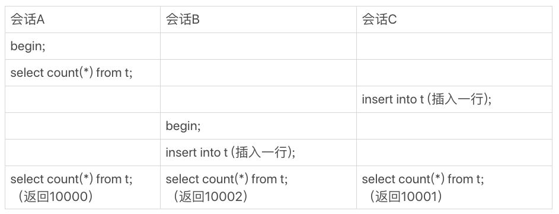
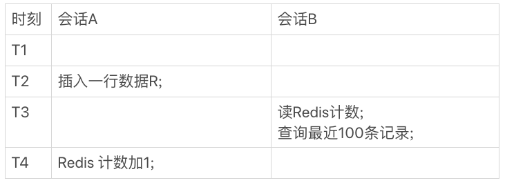
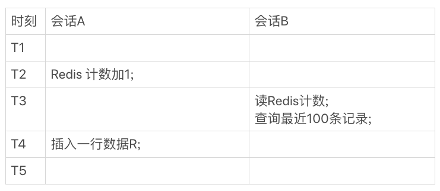
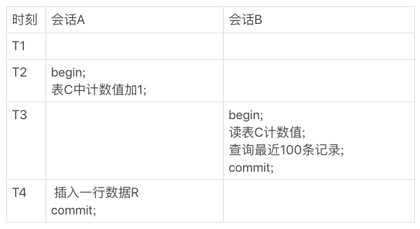

假如统计一个交易系统的所有变更记录总数。一般情况下使用一个select count(*) from t 语句就可以了。
​

但是随着系统中记录数变得越来越多，这条语句就会变得越来越慢，这是为什么呢？？

首先聊一下count(*)实现方式以及MySQL为什么会这么实现。然后再讨论在业务上有频繁变更并需要统计表行数的需求，业务设计该如何做？
### count(*)的实现方式
在MyISAM和InnoDB中，count(*)都会有不同的实现方式。

- MyISAM：将一个表的总行数存在磁盘上，因此执行count(*)的时候会直接返回这个数，效率很高；
- InnoDB：执行count(*)时，需要将数据一行一行从引擎中读取出来，然后累积计数。
> 注意：需要明确，这里的count(*)是没有加任何过滤条件的，如果添加了where条件，MyISAM表也是不能返回得这么快

这里有个问题，为什么InnoDB不使用和MyISAM一样，将行数存储起来呢？？
**因为在InnoDB中的多版本并发控制MVCC的原因，在同一时刻的不同查询，可能返回行的数量也是不一样的，这里举个例子说明一下。**
​

假设表t中现在有10000条记录，我们设计了三个用户并行的会话。

- 会话A先启动事务并查询一次表的总行数
- 会话B启动事务，插入一行后记录后，查询表的总行数
- 会话C先启动一个单独的语句，插入一行记录后，查询表的总行数

我们假设从上到下是按照时间顺序执行的，同一行语句是在同一时刻执行的。

你会看到，在最后一个时刻，三个会话A、B、C会同时查询表t的总行数，但拿到的结果却不同。

这和InnoDB的事务设计有关系，可重复读是它默认的隔离级别，在代码上就是通过多版本并发控制，也就是MVCC来实现的。每一行记录都要判断自己是否对这个会话可见，因此对于count(*)请求来说，InnoDB只好把数据一行一行地读出依次判断，可见的行才能够用于计算“基于这个查询”的表的总行数。
​

其实，这个很慢的查询在执行时也是经过优化的。
InnoDB是索引组织表，主键索引树的叶子节点是**数据**，而普通索引树的叶子节点是**主键值**。所以，普通索引树比主键索引树小很多。对于count(*)这样的操作，遍历哪个索引树得到的结果逻辑上都是一样的。因此，MySQL优化器会找到最小的那棵树来遍历。**在保证逻辑正确的前提下，尽量减少扫描的数据量，是数据库系统设计的通用法则之一。**
> 如果你用过show table status 命令的话，就会发现这个命令的输出结果里面也有一个TABLE_ROWS用于显示这个表当前有多少行，这个命令执行挺快的，那这个TABLE_ROWS能代替count(*)吗？
> 索引统计的值是通过采样来估算的。实际上，TABLE_ROWS就是从这个采样估算得来的，因此它也很不准。有多不准呢，官方文档说误差可能达到40%到50%。**所以，show table status命令显示的行数也不能直接使用。**

到这里我们小结一下：

- MyISAM表虽然count(*)很快，但是不支持事务；
- show table status命令虽然返回很快，但是不准确；
- InnoDB表直接count(*)会遍历全表，虽然结果准确，但会导致性能问题。

现在，我们回到开头问题，如何有一个页面经常要显示交易系统的操作记录总数，到底应该怎么办呢？答案是我们只能自己计数。基本思路是自己找一个地方把操作记录表的行数存起来。
​

#### 1. 用缓存系统保存计数
对于更新很频繁的库来说，你可能会第一时间想到，用缓存系统来支持。
你可以用一个Redis服务来保存这个表的总行数。这个表每被插入一行Redis计数就加1，每被删除一行Redis计数就减1。这种方式下，读和更新操作都很快，但你再想一下这种方式存在什么问题吗？
没错，缓存系统可能会丢失更新。
Redis的数据不能永久地留在内存里，所以你会找一个地方把这个值定期地持久化存储起来。但即使这样，仍然可能丢失更新。试想如果刚刚在数据表中插入了一行，Redis中保存的值也加了1，然后Redis异常重启了，重启后你要从存储redis数据的地方把这个值读回来，而刚刚加1的这个计数操作却丢失了。
当然了，这还是有解的。比如，Redis异常重启以后，到数据库里面单独执行一次count(*)获取真实的行数，再把这个值写回到Redis里就可以了。异常重启毕竟不是经常出现的情况，这一次全表扫描的成本，还是可以接受的。
但实际上，**将计数保存在缓存系统中的方式，还不只是丢失更新的问题。即使Redis正常工作，这个值还是逻辑上不精确的。**
你可以设想一下有这么一个页面，要显示操作记录的总数，同时还要显示最近操作的100条记录。那么，这个页面的逻辑就需要先到Redis里面取出计数，再到数据表里面取数据记录。
我们是这么定义不精确的：

1. 一种是，查到的100行结果里面有最新插入记录，而Redis的计数里还没加1；
1. 另一种是，查到的100行结果里没有最新插入的记录，而Redis的计数里已经加了1。

这两种情况，都是逻辑不一致的。
我们一起来看看这个时序图。

会话A是一个插入交易记录的逻辑，往数据表里插入一行R，然后Redis计数加1；会话B就是查询页面显示时需要的数据。
在图2的这个时序里，在T3时刻会话B来查询的时候，会显示出新插入的R这个记录，但是Redis的计数还没加1。这时候，就会出现我们说的数据不一致。
你一定会说，这是因为我们执行新增记录逻辑时候，是先写数据表，再改Redis计数。而读的时候是先读Redis，再读数据表，这个顺序是相反的。那么，如果保持顺序一样的话，是不是就没问题了？我们现在把会话A的更新顺序换一下，再看看执行结果。

你会发现，这时候反过来了，会话B在T3时刻查询的时候，Redis计数加了1了，但还查不到新插入的R这一行，也是数据不一致的情况。
在并发系统里面，我们是无法精确控制不同线程的执行时刻的，因为存在图中的这种操作序列，所以，我们说即使Redis正常工作，这个计数值还是逻辑上不精确的。

#### 2. 在数据库保存计数
根据上面的分析，用缓存系统保存计数有丢失数据和计数不精确的问题。那么，**如果我们把这个计数直接放到数据库里单独的一张计数表C中，又会怎么样呢？**
首先，这解决了崩溃丢失的问题，InnoDB是支持崩溃恢复不丢数据的。
然后，我们再看看能不能解决计数不精确的问题。
你会说，这不一样吗？无非就是把图3中对Redis的操作，改成了对计数表C的操作。只要出现图3的这种执行序列，这个问题还是无解的吧？
这个问题还真不是无解的。
我们这篇文章要解决的问题，都是由于InnoDB要支持事务，从而导致InnoDB表不能把count(*)直接存起来，然后查询的时候直接返回形成的。
所谓以子之矛攻子之盾，现在我们就利用“事务”这个特性，把问题解决掉。

我们来看下现在的执行结果。虽然会话B的读操作仍然是在T3执行的，但是因为这时候更新事务还没有提交，所以计数值加1这个操作对会话B还不可见。
因此，会话B看到的结果里， 查计数值和“最近100条记录”看到的结果，逻辑上就是一致的。

### 不同的count用法
在select count(?) from t这样的查询语句里面，count(*)、count(主键id)、count(字段)和count(1)等不同用法的性能，有哪些差别？？？
下面的讨论是基于InnoDB引擎。
​

首先需要了解count(?)的语义，count()是一个聚合函数，对于返回的结果集，一行行判断，如果count函数的参数不是NULL，累计值就+1，否则就不加，最后返回累计值
​

**所以，count(*)、count(主键id)和count(1) 都表示返回满足条件的结果集的总行数；而count(字段），则表示返回满足条件的数据行里面，参数“字段”不为NULL的总个数。**
**在分析性能差别的时候，需要记住这么几个原则：

1. server层要什么就给什么；
1. InnoDB只给必要的值；
1. 现在的优化器只优化了count(*)的语义为“取行数”，其他“显而易见”的优化并没有做。

所以

1. 对于count(主键id)来说，InnoDB引擎会遍历整个表，把每一行的id值都取出来，返回给server层。server层拿到id后，判断是不可能为空的，就按行累加
1. 对于count(1)来说，InnoDB引擎遍历整张表，但不取值。server层对于返回的每一行，放一个数字“1”进去，判断是不可能为空的，按行累加。（少了一个取值操作）
> 单看这两个用法的差别的话，你能对比出来，count(1)执行得要比count(主键id)快。因为从引擎返回id会涉及到解析数据行，以及拷贝字段值的操作。

3. 对于count(字段）来说：
   1. 如果这个“字段”是定义为not null的话，一行行地从记录里面读出这个字段，判断不能为null，按行累加；
   1. 如果这个“字段”定义允许为null，那么执行的时候，判断到有可能是null，还要把值取出来再判断一下，不是null才累加。
> 也就是前面的第一条原则，server层要什么字段，InnoDB就返回什么字段。

4. count(*)是个例外，并不会将所有字段全部取出来，而是专门做了优化，不取值，count(*)肯定不是null，按行累加

看到这里，你一定会说，优化器就不能自己判断一下吗，主键id肯定非空啊，为什么不能按照count(*)来处理，多么简单的优化啊。
当然，MySQL专门针对这个语句进行优化，也不是不可以。但是这种需要专门优化的情况太多了，而且MySQL已经优化过count(*)了，你直接使用这种用法就可以了。
所以结论是：按照效率排序的话，count(字段)<count(主键id)<count(1)≈count(*)，所以我建议你，尽量使用count(*)。
