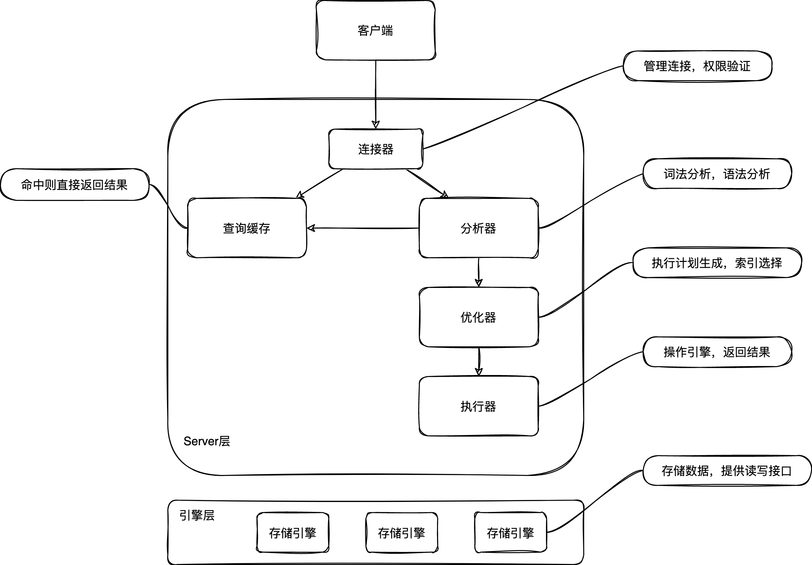

了解查询语句如何执行，我们以最简单的表来进行举例，表Tab中只有一个字段ID，

我们需要查询ID为10的行数据，则需要执行下面语句：

` mysql> select * from Tab where ID=10；`

那我们需要首先了解一下MySQL的架构

### MySQL基本架构


大体来说，MySQL可以分为Server层和存储引擎层两部分

- **Server层：**包含连接器、查询缓存、分析器、优化器、执行器等；涵盖MySQL的大部分核心服务功能，以及所有的内置函数（如日期、时间、数学和加密函数等），所有跨存储引擎的功能都在这一层实现，如存储过程、触发器、视图等等
- **存储引擎层：**负责数据的存储和提取。其架构模式是插件式的，支持InnoDB、MyISAM等多个存储引擎，**从5.5.5版本后，默认引擎为InnoDB**
- **不同的存储引擎共用一个Server层**，也就是连接器到执行器的部分。
#### 连接器

执行SQL语句的第一步，需要先连接到数据库，这个这个步骤是连接器来做的。**连接器主要负责跟客户端建立连接、获取权限、维持和管理连接**

​		`mysql -h$ip -P$port -u$username -p$password db_name`

连接命令中的mysql是客户端工具，用来跟服务端建立连接。在完成经典的TCP握手后，连接器就要开始认证你的身份，这时候用的就是你输入的用户名和密码

- 如果用户名或密码不对，就会收到一个`Access denied for user`错误，然后客户端程序结束执行
- 如果用户名密码正确，认证通过，连接器会到权限表里查询用户所对应的权限，之后，这个连接里面的权限判断逻辑，都将依赖此时读到的权限
> 这里也就是说，一旦一个用户成功建立连接后，即使后面这个账户的权限被修改了，也不会影响当前的已经连接的权限，修改完成后，需要重新连接，这时新的权限才会生效。

连接完成后，如果没有后续动作，这个连接就处在空闲状态，你可以在show processlist命令中看到它。如
> 如果客户端长时间没进行操作，连接器将自动会断开，这个是由`wait_timeoout`参数规定的，默认为8小时
> 在连接被断开后，客户端如果再请求的话，就会收到一个错误提醒： `Lost connection to MySQL server during query`。这时候如果你要继续，就需要重连，然后再执行请求了。因为建立连接过程是比较复杂的，建议减少建立连接的动作，也就是尽量使用长连接
> **当全部使用长连接时，可能有时候MySQL占用内存会涨的比较快，这时因为MySQL在执行过程中临时使用的内存是管理在连接对象中的。**这些资源在连接断开时才会释放，所以由于长连接累积的话，可能会OOM，导致被系统强行杀掉，从现象来看就是MySQL异常重启了。解决方法可以考虑以下两种：
>
> 1. 定期断开长连接
> 2. 如果是使用5.7+版本，可以在每次执行一个比较大的操作后，通过执行`mysql_rest_connection`来重新初始化连接资源，这个过程不需要重连和重新做权限验证，但是可以将连接恢复到刚刚创建完的状态


#### 查询缓存

MySQL收到一个查询请求后，首先到查询缓存查看之前是否执行过这一条语句。

- 如果之前执行过，那么执行语句和结果可能会以kv键值对的形式被直接缓存在内存中，key是查询的语句，value是查询的结果
- 如果之前没执行过，也就是语句key在查询缓存中不存在，就会继续执行后面的阶段，执行完成后，执行结果会被存入查询缓存中。

> 虽然看起来，如果缓存命中的话，可以直接返回结果，效率很高，但是查询缓存往往弊大于利。**因为查询缓存失效比较频繁**，当前有一个表更新，这个表上所有查询缓存都会被清空，因此很可能你费劲地将结果存起来，还没有使用，就被一个更新全清空了。所以**查询缓存对于静态查询表比较友好**

你可以将参数`query_cache_type`设置成`DEMAND`，这样对于默认的SQL语句都不使用查询缓存。而对于你确定要使用查询缓存的语句，可以用SQL_CACHE显式指定，像下面这个语句一样：

`mysql> select SQL_CACHE * from T where ID=10；`

**在8.0版本之后，查询缓存已经被整体删除了。**

#### 分析器
如果没有命中查询缓存，这时候就需要真正执行语句了
首先，MySQL需要知道你要在做什么，所以需要对语句进行解析

1. 分析器会先做“词法分析”，将sql语句中的字符串分别识别出来，代表什么。如果语句中包含select，MySQL将会识别出来这个是一个查询语句。然后识别表名等
1. 然后再做“语法分析”，根据词法分析的结果，语法分析会根据语法规则，判断这个语句是否满足MySQL语法。如果语句不对，就会有“You have an error in your SQL syntax”的错误提醒。一般语法错误会提示第一个错误的位置
#### 优化器
经过分析器后，MySQL就知道你需要做什么了，在正式执行前，需要进行优化器的处理

优化器在表中有多个索引的时候，决定使用哪个索引；或者正在一个语句有多表关联（join）的时候，决定各个表的连接顺序。比如

`mysql> select * from t1 join t2 using(ID)  where t1.c=10 and t2.d=20;`

执行两个表的join

- 既可以先从t1中取出c=10的记录的ID值，再根据ID值关联到t2，再判断t2里面d的值是否等于20
- 也可以先从t2中取出d=20的记录的ID值，再根据ID值关联到t1，再判断t1里面c的值是否等于10

两种执行方法的逻辑结果是一样的，但是执行的效率会有所不同，而优化器的作用就是决定选择使用哪一个方案。


#### 执行器
经过分析器后，MySQL就知道了SQL语句需要做什么，经过优化器，就知道了怎么做会比较优，于是就进入执行器进行语句执行

开始执行的时候，需要先判断你对这个表是否有执行查询的权限。如果没有，就会返回没有权限的错误，如下所示(在工程实现上，如果命中查询缓存，会在查询缓存放回结果的时候，做权限验证。查询也会在优化器之前调用precheck验证权限)。

```
mysql> select * from T where ID=10;
ERROR 1142 (42000): SELECT command denied to user 'b'@'localhost' for table 'T'
```
如果有权限，就打开表继续执行。打开表的时候，执行器就会根据表的引擎定义，去使用这个引擎提供的接口。


整体执行器的执行流程如下

1. 调用InnoDB引擎接口取这个表的第一行，判断ID值是不是10，如果不是则跳过，如果是则将这行存在结果集中；
1. 调用引擎接口取“下一行”，重复判断步骤1，直到最后一行；
1. 执行器将上述遍历过程所有满足条件的行组成记录集返回给客户端；

对于有索引的表，执行逻辑差不多。暂略

