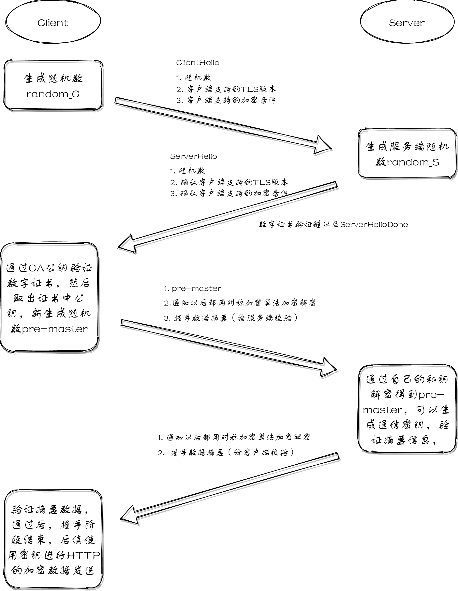
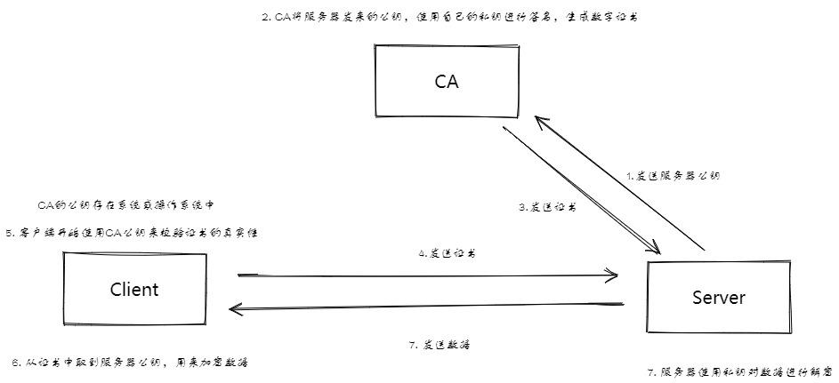
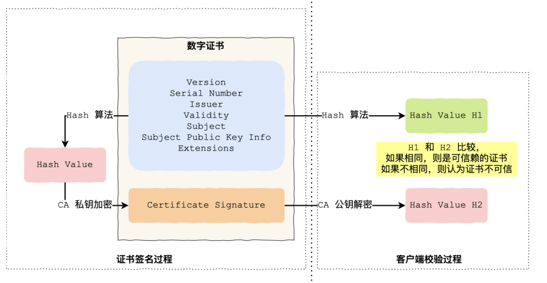
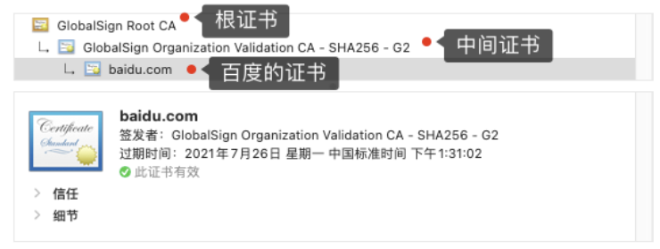
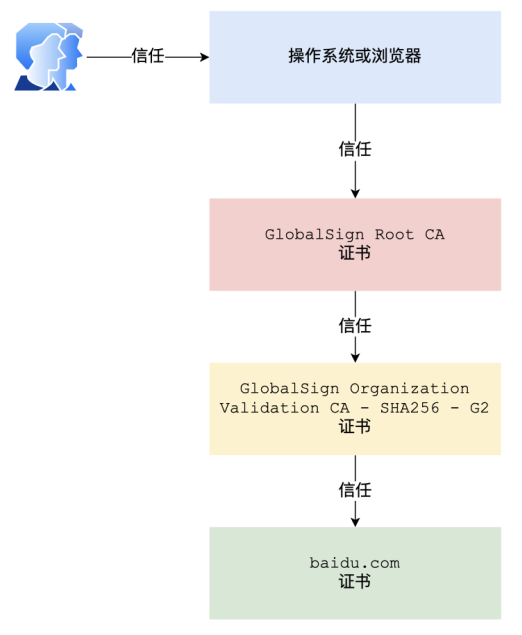
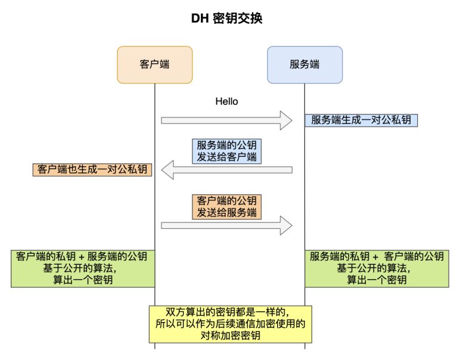

### TLS协议如何解决HTTP风险
> HTTP风险是什么？
> 1. 明文传输易被窃取
> 1. 不校验信息，信息易被篡改
> 1. 不校验通信身份，易被冒充

所以HTTPS在HTTP和TCP层之间加入了**TLS**协议，来解决上述风险

1. 信息加密：对传输的数据进行加密，使用非对称加密加密传输的密钥，在数据传输时进行对称加密，解决机密性问题；
1. 校验机制：校验信息在传输过程中是否被修改过，以保证数据传输的完整性
1. 数字证书：使用数字证书验证网站是否为正版网站。

在TCP完成三次握手后，进行HTTP通信前，先进行TLS握手（四次握手，需要两个RTT时延）。
#### SSL/TLS协议基本流程

1. 客户端向服务端索要并验证服务器的公钥
1. 双方协商生产会话密钥
> 为了保证后面进行加密的对称加密密钥的安全性，所以使用非对称加密的方式来保护对称加密密钥的协商，这个工作就是密钥交换算法负责的。

3. 双方采用会话密钥进行加密通信

传统的TLS握手基本都是使用RSA算法来实现密钥交换的，在将TLS证书部署到服务端时，证书文件中含有一对公私钥，其中公钥会在TLS握手阶段传递给客户端，私钥一直留在服务端，一定要确保私钥不能被窃取，详细流程如下：

1. 首先，由客户端向服务器发起加密通信请求，也就是 client_hello请求。请求内容主要包括：
   - version：客户端目前支持的TLS协议版本；
   - random_C：客户端生产的随机数，用于后面生产会话密钥；
   - cipher suites：客户端支持的密码套件列表，如RSA。
2. 服务器收到客户端请求后，向客户端发出响应。响应的内容有如下内容：
   - server_hello
      - **确认**TLS协议版本，如果不支持，则关闭加密通信
      - **确认**支持的密码套件列表（基本格式：密钥交换算法+签名算法+对称加密算法+摘要算法）
      - 服务端生产的随机数，也是用于后面生产会话密钥
   -  server_certificates：服务端的数字证书对应的证书链（客户端可以根据数字证书来确认网站是否正版）
   - server_hello_done确认本次打招呼完成。
3. 客户端收到服务器的回应之后，首先通过浏览器或者操作系统中的 CA 公钥，确认服务器的数字证书的真实性（**合法性验证流程见后面**）。如果证书没有问题，客户端会从数字证书中取出服务器的公钥，然后使用它加密报文，向服务器发送如下信息：
   - client_key_exchange：生成一个新的随机数（pre-master key），这个随机数使用服务器公钥加密。通过client_key_exchange消息传给服务端；（此时客户端三个随机数，服务端两个随机数）；
   - change_cipher_spec：客户端通知服务端后续通信都采用协商出来的会话密钥和加密算法进行加密通信；
   - encrypted_handshake_message：表示客户端的握手阶段已经结束。这一项同时把之前所有内容的发生的数据（握手数据）做个摘要，用来供服务端校验。
4. 服务器收到客户端数据后，用RSA私钥解密，得到客户端发来的第三个随机数（ pre-master key ）之后，至此客户端和服务端都有了三个随机数，Client Random、Server Random以及pre-master ，根据这三个随机数通过协商的加密算法，计算出本次通信的【会话秘钥】（客户端也是根据这个相同算法计算出秘钥），这个秘钥是后面数据传输的对称加密秘钥。最后向客户端发送最后信息：
   - 服务端用私钥解密pre-master数据，基于之前交换的两个明文随机数random_C和random_S，计算得到密钥enc_key=Fuc(random_C, random_S, Pre-Master);
   - 计算之前所有接收信息的hash值，然后解密客户端发送的encrypted_handshake_message信息，验证数据和密钥的正确性
   - change_cipher_spec：验证通过后，服务器也发这个来通知客户端后续的通信都采用协商的密钥和算法进行加密通信。
   - encrypted_handshake_message：服务器也结合所有当前通信参数进行摘要，提供给客户端进行校验。
5. 最后客户端接收所有信息，使用协商的密钥解密服务端发来的encrypted_handshake_message摘要信息，如果校验通过，则握手结束

至此，整个 SSL/TLS 的握手阶段全部结束。接下来，客户端与服务器进入加密通信，就完全是使用普通的 HTTP协议，只不过用「会话秘钥」加密内容。很明显一般来说经过四个消息就可以完成TLS握手，也即是需要两个RTT时延，然后就可以在安全的通信环境里面发送HTTP报文，实现HTTPS协议
HTTPS需要先经过TCP三次握手建立连接，然后执行TLS握手过程，才能建立通信安全的连接，所以很明显HTTPS是应用层协议
### 客户端如何验证证书可信

> 数字证书通常包含了
> - 公钥
> - 持有者信息
> - 证书认证机构CA的信息
> - CA对这个文件的数字签名以及使用的算法
> - 证书有效期
> - 额外信息

数字证书的作用是用来认证公钥持有者的身份，防止第三方进行冒充，说简单点就是证书用来告诉客户端，服务端是否是合法的，因为只有证书是合法的，才代表服务端身份可信
​

#### 证书是如何来的？？如何认证证书？？？？
为了让服务端的公钥被大家信任，服务端的证书都是由CA来签名办法的，CA证书认证机构，具有很高的可信度，所以他签发的证书也是可信的。
之所以要签名，是因为签名可以防止中间人在获取证书时对证书内容进行篡改，数字证书签发和认证过程如下图所示

签发过程：

1. 首先CA会把持有者的公钥、用途、颁发者、有效时间等信息打成一个包，然后对这些信息进行Hash计算，得到一个Hash值
1. 然后CA会使用自己的私钥将该Hash值加密，生成Certificate Signature，也就是CA对证书做了签名
1. 最后将Certificate Signature添加到文件证书上，形成数字证书

验证过程

1. 首先客户端会使用相同的Hash算法获取该证书的Hash值H1
1. 通常浏览器或操作系统中会集成CA的公钥信息，浏览器在收到证书后使用CA的公钥解密Certificate Signature内容，得到一个Hash值H2
1. 最后比较H1和H2，如果值相同，则为可信赖的证书，否则则认为证书不可信

#### 证书链
其实证书的验证过程还存在一个证书信任链的过程，因为我们申请的证书一般不是根证书颁发的，而是由中间证书签发的，比如百度的证书

对于这种三级层级关系的证书的验证过程如下：

- **客户端收到 baidu.com 的证书后，发现这个证书的签发者不是根证书，就无法根据本地已有的根证书中的公钥去验证 baidu.com 证书是否可信**。于是，客户端根据 baidu.com 证书中的签发者，找到该证书的颁发机构是 “GlobalSign Organization Validation CA - SHA256 - G2”，**然后向 CA 请求该中间证书**。
- 请求到证书后发现 “GlobalSign Organization Validation CA - SHA256 - G2” 证书是由 “GlobalSign Root CA”签发的，由于 “GlobalSign Root CA” 没有再上级签发机构，说明它是根证书，也就是自签证书。**应用软件会检查此证书有否已预载于根证书清单上，如果有，则可以利用根证书中的公钥去验证 “GlobalSign Organization Validation CA - SHA256 - G2” 证书（就是上面证书的验证过程）**，如果发现验证通过，就认为该中间证书是可信的。
- “GlobalSign Organization Validation CA - SHA256 - G2” 证书被信任后，可以使用“GlobalSign Organization Validation CA - SHA256 - G2” 证书中的公钥去验证 baidu.com 证书的可信性，如果验证通过，就可以信任baidu.com 证书。

在这四个步骤中，最开始客户端只信任根证书 GlobalSign Root CA 证书的，然后 “GlobalSign Root CA” 证书信任“GlobalSign Organization Validation CA - SHA256 - G2” 证书，而 “GlobalSign Organization Validation CA -
SHA256 - G2” 证书又信任 baidu.com 证书，于是客户端也信任 baidu.com 证书。
总括来说，由于用户信任 GlobalSign，所以由 GlobalSign 所担保的 baidu.com 可以被信任，另外由于⽤户信任操作系统或浏览器的软件商，所以由软件商预载了根证书的 GlobalSign 都可被信任。

### RSA的缺陷
RSA最大缺陷是不支持**前向保密**
因为客户端传递随机数（用于生成对称加密秘钥的条件之一）给服务端的时候使用公钥加密的，服务端收到后，会使用私钥解密得到随机数，所以一旦服务端的私钥泄露了，之前被第三方截获的TLS加密密文都会被破解
为了解决这一个问题，就有了DH秘钥协商算法（非对称）

客户端和服务端都会各自生成随机数，并以此作为私钥，然后根据公开的DH计算公式算出自己的公钥，通过TLS握手双方交换各自的公钥，这样双方都有自己的私钥和对方的公钥，然后双方根据各自持有的材料算出一个随机数，这个随机数的值双方都是一样的的，这样就可以作为后续对称加密时使用的密钥
DH 密钥交换过程中， 即使第三方截获了 TLS 握手阶段传递的公钥，在不知道的私钥的情况下，也是无法计算出密钥的，⽽且每⼀次对称加密密钥都是实时⽣成的，实现前向保密。
但因为 DH 算法的计算效率问题，后⾯出现了 ECDHE 密钥协商算法，我们现在大多数网站使用的正是 ECDHE 密钥协商算法。
​

参考：小林coding
​

