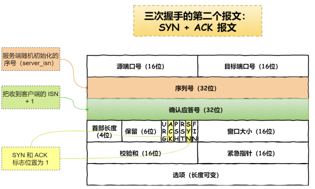

### TCP是什么？
**TCP是面向连接的、可靠的、基于字节流的传输层通信协议，属于传输层**

- **面向连接**：一定是“一对一”才能连接，不能一个主机同时向多个主机发送消息，也就是“一对多”是无法实现的。
- **可靠的**：无论网络链路如何变化，TCP都可以保障报文一定能到达接收端
- **字节流**：消息是没边界的，无论我们消息多大都可以进行传输，并且消息是有序的，当前一个消息没有收到的时候，即使它先收到了后面的字节，那么也不能扔给应用层去处理，同时对重复的报文会自动丢弃
> 为什么需要TCP，它工作在哪一层？
> IP层是不可靠的，不保证网络包的交付，不保证网络的有序交付，也不保证网络包中数据的完整性
> 如果需要保障网络数据包的可靠性，那么就需要上层的TCP来负责，因为TCP是一个工作在传输层的可靠数据传输协议，它能确保接收端的网络包是无损坏、无间隔、非冗余和按序的

当我们想了解TCP的三次握手和四次挥手时，需要首先了解一下TCP的头部结构
### TCP头部结构


- 源端口号和目标端口号：告知主机该报文段来自哪里，以及传给那个上层协议或者应用程序的
- 序列号：在建⽴连接时由计算机⽣成的随机数作为其初始值，通过 SYN 包传给接收端主机，每发送⼀次数据，就累加⼀次该数据字节数的⼤⼩。 ⽤来解决⽹络包乱序问题
- 确认应答号：指下⼀次期望收到的数据的序列号，发送端收到这个确认应答以后可以认为在这个序号以前的数据都已经被正常接收。 ⽤来解决丢包的问题。
- 控制位：
   - ACK：该位为 1 时，确认应答的字段变为有效， TCP 规定除了最初建⽴连接时的 SYN 包之外，该位必须设置为 1 。
   - RST：该位为 1 时，表示 TCP 连接中出现异常必须强制断开连接。
   - SYN：该位为 1 时，表示希望建⽴连接，并在其序列号的字段进⾏序列号初始值的设定。
   - FIN：该位为 1 时，表示今后不会再有数据发送，希望断开连接。当通信结束希望断开连接时，通信双⽅的主机之间就可以相互交换 FIN 位为 1 的 TCP 段。如何
### 如何确定一个TCP连接？

一个TCP四元组可以确定一个TCP连接

- 源地址和⽬的地址的字段（32位）是在 IP 头部中，作⽤是通过 IP 协议发送报⽂给对⽅主机。
- 源端⼝和⽬的端⼝的字段（16位）是在 TCP 头部中，作⽤是告诉 TCP 协议应该把报⽂发给哪个进程。
### 附：UDP格式


UDP头部只有8字节，UDP不提供复杂控制机制，利用IP提供面向无连接的通信服务

- ⽬标和源端⼝：主要是告诉 UDP 协议应该把报⽂发给哪个进程。
- 包⻓度：该字段保存了 UDP ⾸部的⻓度跟数据的⻓度之和。
- 校验和：校验和是为了提供可靠的 UDP ⾸部和数据⽽设计。
### TCP与UDP区别

1. 连接
   - TCP面向连接，传输数据前需要先建立连接
   - UDP面向无连接，不需要提前进行连接
2. 服务对象
   - TCP一对一，一条连接只有两个端点
   - UDP支持一对一，一对多，多对多
3. 可靠性
   - TCP保证数据无差错、不丢失、不重复、按序到达，可靠交付数据
   - UDP尽最大努力交付，不保证可靠交付数据
4. 拥塞控制、流量控制
   - TCP有，保证数据传输的安全
   - UDP没有，即使网络拥堵，也继续发
5. 首部开销
   - TCP首部字段一般在没有【选项】字段时20字节
   - UDP首部8字节
6. 传输方式
   - TCP流式传输，无边界
   - UDP按包交付，有边界，可能会丢包和乱序
7. 分片不同
   - TCP 的数据⼤⼩如果⼤于 MSS ⼤⼩，则会在传输层进⾏分⽚，⽬标主机收到后，也同样在传输层组装 TCP数据包，如果中途丢失了⼀个分⽚，只需要传输丢失的这个分⽚。
   - UDP 的数据⼤⼩如果⼤于 MTU ⼤⼩，则会在 IP 层进⾏分⽚，⽬标主机收到后，在 IP 层组装完数据，接着再传给传输层，但是如果中途丢了⼀个分⽚，在实现可靠传输的 UDP 时则就需要重传所有的数据包，这样传输效率⾮常差，所以通常 UDP 的报⽂应该⼩于 MTU。
### 三次握手


1. 最开始，客户端和服务端都处于CLOSE状态，服务端开始主动监听某个端口，处于LISTEN状态
1. 客户端会随机初始化序号，将此序号置于TCP首部的序号字段中，同时将SYN标志位置于1，表示SYN报文，接着将第一个SYN报文发给服务端，表示向服务端发起连接，该报文不包含应用层数据，之后客户端置于SYN-SENT状态


- 服务端在收到客户端的SYN报文之后，首先服务端也随机初始化自己序号，将此需要填入TCP首部的序号字段中，其次将首部的【确认应答号】填入client_isn+1，接着把SYN和ACK标志置为1，最后把该报文发给客户端，该报文不包含应用层数据，之后服务端处于SYN_REVD状态



- 客户端在收到服务端的应答报文后，还需要向服务端回应最后一个应答报文，首先该应答报文TCP首部ACK标志位置为1，其次【确认应答号】字段填入server_isn+1，最后将报文发送给服务端，这次报文可以携带客户到服务器的数据，之后客户端处于ESTABLISHED状态


- 服务器收到客户端的应答报文后，也进入ESTABLISHED状态
> **第三次握手可以携带数据，但是前两次握手不可以携带数据**

### 为什么是三次，而不是两次或四次
> 什么叫TCP连接？？
> 用于保证可靠性和流量控制维护的某些状态信息，这些信息的组合，包括Socket、序列号和窗口大小成为连接
> 所以这个问题重点在于回答为什么三次握手才能初始化Socket、序列号和窗口大小并建立TCP连接

**TCP作为一种可靠的传输控制协议，其核心思想是：既要保证数据可靠传输，又要提高传输的效率，而三次恰恰可以满足以上两方面的需求**


**TCP需要seq序列号来做可靠重传和接收，从而避免连接复用时（？？？）无法分辨出seq是延迟或者是旧连接的seq，因此需要三次握手来约定确定双方的ISN（初始序列号）**

- 两次握手：**无法防止历史连接的建立，会造成双方资源的浪费，也无法可靠地同步双方序列号**
- 四次握手：三次握手就可以理论上最少可靠连接建立，所以不需要使用更多的通信次数，**减少资源浪费**
- **最主要的是：防止旧的重复连接初始化造成混乱（客户端收到服务端ack和syn后，可以根据上下文，判断这是一个历史连接，序列号过期或超时，那么客户端就会发送RST给服务端，终止这次连接）**

**​**

> 下面的话来自RFC
> TCP设计中的一个基本设定就是，通过TCP连接发送的每一个包，都有一个seq num，而因为每个包都有序列号，所以都能被确认收到这些包
> 确认机制是累积的，所以一个对seq num X的确认，意味着X序号之前（不包括X，下一个想要X）的包都是被确认接收到的
> TCP协议不限定一个特定的连接（两端socket一样）被重复使用的
> 所以就有这样一个问题：这条连接突然断开重连后，TCP怎么识别之前旧链接重发的包？----这里就需要独一无二的ISN（初始序列号）机制
> 当一个新连接建立时，初始序列号（ initial sequence number ISN）生成器会生成一个新的32位的 ISN。
> 这个生成器会用一个32位长的时钟，差不多4µs 增长一次，因此 ISN 会在大约 4.55 小时循环一次（2^32位的计数器，需要2^32*4 µs才能自增完，除以1小时共有多少µs便可算出2^32*4 /(1*60*60*1000*1000)=4.772185884 ）
> 而一个段在网络中并不会比最大分段寿命（Maximum Segment Lifetime (MSL) ，默认使用2分钟）长，MSL 比4.55小时要短，所以我们可以认为 ISN 会是唯一的。

```sql
发送方和接受发都会有自己的ISN，下面的XY就是，用来做双方互发通信
1) A --> B  SYN my sequence number is X 
2) A <-- B  ACK your sequence number is X 
3) A <-- B  SYN my sequence number is Y 
4) A --> B  ACK your sequence number is Y

2，3都是b发给a，因此可以合并到一起，因此四次握手可以合并成三次握手
```
> 由此得出，三次握手是必须的，因为seq num没有绑定到整个网络的全局时钟（全部统一使用一个时钟，就可以确定这个包是不是延迟到的）以及TCPs可能有不同的机制来选择ISN（初始序列化）
> 接收方接收到第一个SYN时，没有办法知道这个SYN是否延迟了很久，除非它有办法记住在这条连接中，最后接收到的那个seq num（然而这不总是可行的）
> 简单来说就是：一个seq过来了，跟现在记住的seq不一样，我怎么知道他是上一条延迟的，还是上上条延迟的呢？？所以接收方一定需要跟发送方确认SYN

```sql
假设不确认 SYN 中的 SEQ，那么就只有：
1) A --> B SYN my sequence number is X 
2) A <-- B ACK your sequence number is X SYN my sequence number is Y
```
> 只有B确认收到了A的seq，A无法确认收到B的，也就是说A发给B的包都是可靠的，而B发送给A的则不是，所以这不是可靠的连接，这种情况下如果只需要A发送给B，B不需要回应，则可以不做三次握手

#### 四次握手

1. A 发送同步信号**SYN** + **A's Initial sequence number**
1. B 确认收到A的同步信号，并记录 A's ISN 到本地，命名 **B's ACK sequence number**
1. B发送同步信号**SYN** + **B's Initial sequence number**
1. A确认收到B的同步信号，并记录 B's ISN 到本地，命名 **A's ACK sequence number**

**很明显，2和3步骤可以合并，只需要三次握手，可以提高连接的速度和效率**
#### 两次握手

1. A 发送同步信号**SYN** + **A's Initial sequence number**
1. A 发送同步信号**SYN** + **A's Initial sequence number**

**这里就有一个问题了，A与B可以就A的初始序列号达成一致，但是B无法知道A是否收到了自己的同步信号，如果这个同步信号丢失了，A和B就B的初始序列号将无法达成一致（只是其一原因）**
于是TCP设计者将SYN这个同步标志位SYN设计成占用一个字节的编号（FIN标志位也是），既然是一个字节的数据，按照TCP对有数据的TCP segment必须确认的原则，所以在这里A必须给B一个确认，以确认A已经收到了B的同步信号
> 如果A给B的ACK丢了，TCP不会为没有数据的ACK进行超时重传，这时需要B重复SYN，直到收到A的ACK


