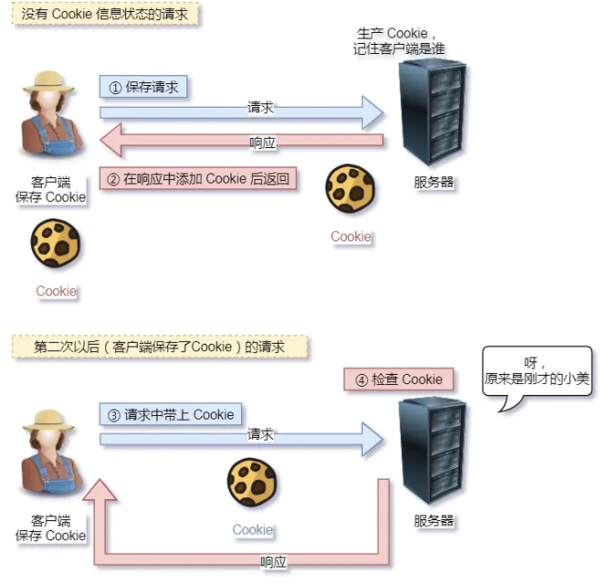
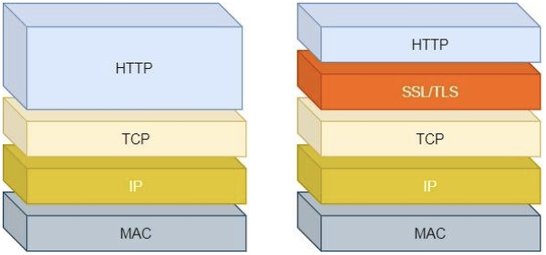
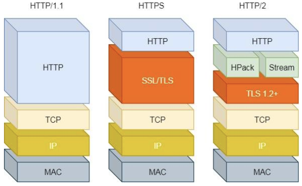
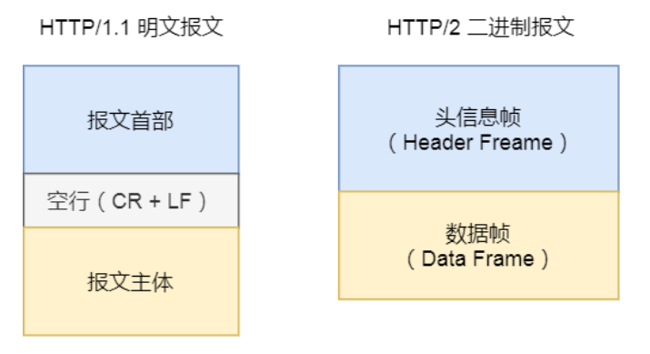
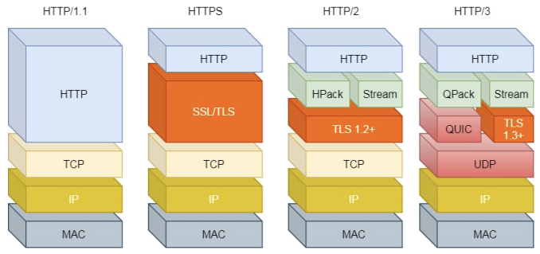

### 最最开始的
一种能让两地研究者们共享知识的设想，最初设想是：借助多文档之间相互之间关联形成超文本，连成可相互参阅的万维网（world wide web）
### HTTP是什么？
HTTP（HyperText Transfer Protocol）超文本传输协议，我们可以将这个名词拆成三个部分：

1. 超文本
1. 传输：
1. 协议：

我们从下往上解释：

- 协议：协代表两者以上的参与者进行协商，代表两个参与者对行为的一种约定和规范，所以HTTP是一个在计算机里的协议，它使用计算机能够理解的语言确立了一种计算机之间交流通信的规范（**两个以上的参与者**），以及相关的各种控制和错误处理方式（行为约定和规范）
- 传输：表示的就是将东西从一点转移到另一点，我们并上上面协议的概念，那么HTTP就是在计算机世界中专门用来在两点之间传输数据的约定和规范
- 超文本：不仅仅是文本，是文本🪧、图片🖼️、视频🎞️、链接🔗等混合体，比如HTML就是超文本，那么我们结合上面两点，总结一下：**HTTP是一个在计算机世界里专门用来在【两点】之间【传输】文字、图片、音视频等【超文本】数据的【约定和规范】**

### HTTP的优缺点
以常用的HTTP1.1说明：
#### 优点
HTTP 最凸出的优点是**简单、灵活和易于扩展、应用广泛和跨平台**。

1. 简单

HTTP 基本的报文格式就是 header + body ，头部信息也是 key-value 简单文本的形式， 易于理解，降低了学习和使用的门槛。

2. 灵活和易于扩展

HTTP协议里的各类请求方法、 URI/URL、状态码、头字段等每个组成要求都没有被固定死，都允许开发人员自定义和扩充。同时HTTP由于是工作在应用层（ OSI 第七层），则它下层可以随意变化。HTTPS也就是在HTTP与TCP层之间增加了SSL/TLS安全传输层， HTTP/3甚⾄把TCP层换成了基于UDP的QUIC。

3.  应用广泛和跨平台

互联网发展至今， HTTP 的应⽤范围⾮常的⼴泛，从台式机的浏览器到⼿机上的各种 APP，从看新闻、刷贴吧到购物、理财、吃鸡， HTTP 的应⽤⽚地开花，**同时天然具有跨平台的优越性。**
#### 缺点
HTTP 协议里有两把双刃剑--**无状态、明文传输**，同时还有一大缺点**不安全**。

1. 无状态：
   - 好处是：因为服务器不会去记忆 HTTP 的状态，所以不需要额外的资源来记录状态信息，这能减轻服务器的负担，能够把更多的 CPU 和内存用来对外提供服务。
   - 坏处是：正是因为没有记录HTTP状态，在完成关联性操作时就会比较麻烦，比如如果一个用户想要买一个商品，选择商品需要登录，付款需要登录，查看订单害的再登录一次当然这个解决方案还是有的，最常用的技术是Cookie，Cookie 通过在请求和响应报文中写入Cookie 信息来控制客户端的状态。

2. 明文传输：

明文传输也是一把双刃剑，很明显

   - 好处是：方便调试，在浏览器控制台就可以直接看出数据
   - 坏处是：数据都明文展示了，没有什么隐私可言
3. **不安全**：**(重要)**
   - 通信使用明文（**不加密**），内容可能会被窃听。比如， 账号信息容易泄漏。
   - **不验证通信方的身份**，因此有可能遭遇伪装。比如， 访问假的淘宝、拼多多。
   - **无法证明报文的完整性**，所以有可能已遭篡改。比如， 网页上植入垃圾广告。
### HTTP常见状态码
|  | 具体含义 | 常见状态码 |
| --- | --- | --- |
| 1XX | 提示信息，表示目前是协议处理的中间状态，还需要后续的操作 |  |
| 2XX | 成功，报文已经收到并被正确处理 | **200：OK一切正常，正常响应头会有body数据**
204：NO Content和200基本类似，但是响应头没有body数据
206：Partial Content应用与HTTP分块下载或者断点续传，表示这个相应的body并不是资源的全部，只是一部分 |
| 3XX | 重定向，资源位置发生变动，需要客户端重新发送请求 | **301: Moved Permanently永久重定向，说明请求的资源已经不存在了，需要修改url重新访问**
302：Found临时重定向，表示资源还在，但是临时需要一个新的url进行访问
**304: Not Modified不具有跳转的含义，表示资源未修改，重定向已存在的缓冲文件，也称缓存重定向，用于缓存控制**
301 和 302 都会在响应头⾥使⽤字段 Location ，指明后续要跳转的 URL，浏览器会⾃动重定向新的 URL。 |
| 4XX | 客户端错误，请求报文有错，服务器无法处理 | 400: Bad Request表示客户端请求的报⽂有错误，但只是个笼统的错误。
**403: Forbidden 表示服务器禁止访问资源，并不是客户端的请求出错（没权限）**
**404: Not Found 表示请求的资源在服务器上不存在或者未找到，所以无法提供给客户端** |
| 5XX | 服务器错误，服务器在处理请求时内部发生了错误 | 500：Internal Server Error服务器内部错误，和400类似，是一个通用的错误码，不能知道具体是什么错误
501: Not Implemented 表示客户端请求的功能还不支持
**502: Bad Gateway 通常是服务器作为网关或者代理时返回的错误码，表示这个代理服务器自身工作正常，访问后台服务的服务器时发生了错误**
**503: Service Unavailable 表示服务器当前忙，暂时无法响应（类似网络服务忙，请稍后重试的意思）** |

### HTTP常见字段

1. **Host字段**：客户端发送请求时，⽤来指定服务器的域名
1. **Content-Length 字段**：服务器在返回数据时，会有 Content-Length 字段，表明本次回应的数据长度。
1. **User-Agent: **浏览器表明自己的身份（是哪种浏览器）。例如：User-Agent：Mozilla/5.0 (Windows; U; Windows NT 5.1; zh-CN; rv:1.8.1.14) Gecko/20080404 Firefox/2、0、0、14
1. **Connection 字段**：**非标准字段，最常⽤于客户端要求服务器使⽤ TCP 持久连接，以便其他请求复⽤**。HTTP/1.1 版本的默认连接都是持久连接（可以复用的 TCP 连接，直到客户端或服务器主动关闭连接），但为了兼容⽼版本的 HTTP，需要指定 Connection ⾸部字段的值为Keep-Alive----Connection: keep-alive。
1. **Content-Type 字段**：⽤于服务器回应时，告诉客户端，本次数据是什么格式。如：Content-Type: text/html; charset=utf-8
1. **Accept 字段**：客户端请求的时候，可以使用 Accept 字段声明自己可以接受哪些数据格式。例如：Accept: */*，表示客户端声明自己可以接受任何格式的数据。
1. **Content-Encoding 字段**：说明数据的压缩方法。表示服务器返回的数据使⽤了什么压缩格式，例如：Content-Encoding: gzip表示服务器返回的数据采⽤了 gzip ⽅式压缩，告知客户端需要⽤此⽅式解压。
1. **Accept-Encoding 字段**：客户端在请求时，⽤ Accept-Encoding 字段说明自己可以接受哪些压缩方法Accept-Encoding: gzip, deflate
### 从HTTP到HTTPS
#### HTTP和HTTPS的区别

1. HTTP是明文传输，有数据安全问题，HTTPS在HTTP和TCP之间加上了SSL/TLS安全协议
1. HTTP在三次握手后就可以进行数据传输，而HTTPS在HTTP和TCP之间添加了SSL/TLS协议，而HTTPS 在 TCP 三次握⼿之后，还需进行 SSL/TLS 的握⼿过程，才可进⼊加密报文传输。
1. HTTP默认端口是80，HTTPS默认端口是443
1. HTTPS 协议需要向 CA（证书权威机构）申请数字证书，来保证服务器的身份是可信的。

#### HTTPS如何解决HTTP的不安全
再说一下HTTP的不安全：1、容易被窃听，2、容易被篡改，3、容易被伪装来欺骗用户
HTTPS在HTTP和TCP之间可以加入SSL/TLS协议，可以很好解决

1. **信息加密**：使用对等加密和非对等加密的🔗[**混合加密**](https://www.yuque.com/go/doc/44429749)方式
1. 校验机制：使用**摘要算法**来保证数据的完整性
1. 数字证书：将服务器公钥放到**数字证书CA**，保证这个网站是正版的
#### SSL/TLS流程

1. 客户端向服务器索要并严重服务器公钥
1. 双方协商生产【会话秘钥】
1. 双方采用【会话秘钥】进行加密通信

前两步是SSL/TLS的建立过程，也就是握手阶段，具体过程见HTTPS握手章节
### 从HTTP1.0到HTTP3.0
具体历史可以参考：[https://coolshell.cn/articles/19840.html](https://coolshell.cn/articles/19840.html)
#### HTTP1.1优化了什么
> 早期HTTP1.0在性能上有一个很大的问题，就是每次发起一个请求，都需要建立一次TCP连接，而且是串行请求，做了无谓的TCP连接建立和断开，增加了通信开销（也就是短连接）

- **使用TCP 长连接**的方式改善了 HTTP/1.0 短连接造成的性能开销。
- **支持管道（pipeline）网络传输**，只要第⼀个请求发出去了，不必等其回来，就可以发第二个请求出去，**可以减少整体的响应时间。**

但 HTTP/1.1 还是有性能瓶颈：

- 请求 / 响应**头部未经压缩**就发送，首部信息越多延迟越大。只能压缩 Body 的部分；
- 发送冗长的首部。每次互相发送相同的首部造成的浪费较多；
- 请求-应答模式加剧了HTTP的性能问题，服务器是按请求的顺序响应的，如果服务器响应慢，会导致客户端⼀直请求不到数据，也就是**队头阻塞**；
- 没有请求优先级控制；
- 请求只能从客户端开始，**服务器只能被动响应，不支持服务器推送消息**。

#### HTTP2.0优化了什么
HTTP/2 协议是基于 HTTPS 的，所以 HTTP/2 的安全性也是有保障的。

- 会**压缩头部数据**，如果多个请求或者响应头文件一样或者大部分相似，那么2.0会将器重复部分消除（HPACK算法：在客户端和服务器同时维护一张头信息表，所有字段都会存入这个表，生成一个索引号，以后就不发送同样字段了，只发送索引号，这样就会提高速度了）
- HTTP/2 不再像 HTTP/1.1 里的纯文本形式的报文，而是**全面采用了二进制格式**，头信息和数据体都是二进制，并且统称为帧（frame）： 头信息帧和数据帧。这样虽然对人不友好，但是对计算机非常友好，因为计算机只懂二进制，那么收到报文后，无需再将明文的报文转成二进制，而是直接解析二进制报文，这**增加了数据传输的效率**。

- HTTP2.0中**数据包不按顺序发送**，同一个连接里面连续的数据包，可能属于不同的回应，因此，必须要对数据包做标记，指出它属于哪一个回应，每个请求或响应的所有数据包，成为一个数据流Stream，每个数据流都标记这一个独一无二的编号。（其中规定客户端发出的数据流编号为奇数，服务器发出的为偶数）。客户端还可以指定数据流的优先级，**服务器会先响应优先级高的请求**
- **多路复用**：**HTTP2.0可以在一个连接中并发多个请求或者响应，而不用按照顺序一一对应，**不会出现HTTP1.1中的队头阻塞问题，降低了延迟，大幅度提高连接利用率
- 服务器推送：在一定程度上改善了传统的【请求-应答】模式，服务不再是被动响应，也可以主动向客户端发送消息。
- HTTP2.0还存在的缺陷
   - **HTTP/2 主要的问题在于，多个 HTTP 请求在复用一个 TCP 连接，下层的 TCP 协议是不知道有多少个 HTTP 请求的。所以⼀旦发生了丢包现象，就会触发 TCP 的重传机制，这样在⼀个 TCP 连接中的所有的 HTTP 请求都必须等待这个丢了的包被重传回来。**
   - HTTP/1.1 中的管道（ pipeline）传输中如果有⼀个请求阻塞了，那么队列后请求也统统被阻塞住了
   - HTTP/2 多个请求复用⼀个TCP连接，⼀旦发生丢包， 就会阻塞住所有的HTTP请求

#### HTTP3.0优化了什么？？

**由于HTTP2.0存在阻塞的问题，是基于TCP的问题，所以HTTP3.0将下层的TCP协议转成了UDP**
UDP 发⽣是不管顺序，也不管丢包的，所以不会出现 HTTP/1.1 的队头阻塞 和 HTTP/2 的⼀个丢包全部重传问题。
⼤家都知道 UDP 是不可靠传输的，但基于 UDP 的 QUIC 协议 可以实现类似 TCP 的可靠性传输。

- QUIC 有⾃⼰的⼀套机制可以保证传输的可靠性的。当某个流发⽣丢包时，只会阻塞这个流， 其他流不会受到影响。
- TLS3 升级成了最新的 1.3 版本，头部压缩算法也升级成了 QPack 。
- HTTPS 要建⽴⼀个连接，要花费 6 次交互，先是建⽴三次握⼿，然后是 TLS/1.3 的三次握⼿。 QUIC 直接把以往的 TCP 和 TLS/1.3 的 6 次交互合并成了 3 次，减少了交互次数

