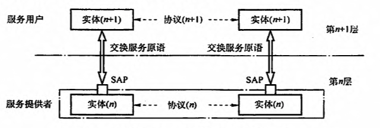
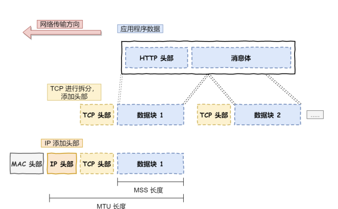
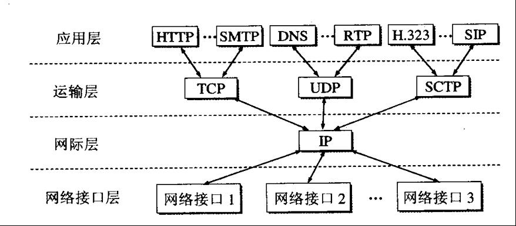

### 计算机网络是什么
一般认为计算机网络是一个将分散的、具有独立功能的计算机系统，通过通信设备与线路连接起来，由功能完善的软件实现资源共享和信息传递的系统。简而言之，**计算机网络就是一些互联的、自治的计算机系统的集合。**

**最主要的几个功能包括：数据通信、资源共享、分布式处理、负载均衡等等。**
​

### 计算机分层结构
了解分层之前，需要了解两个概念

1. 协议：为了保证网络中数据正常交换而指定的一些规则，可以控制两个或者多个对等实体间的数据交换。是水平。
1. 服务：下层为紧挨着的上层提供的功能调用，对等实体在协议控制下，使得本层可以为上一层提供服务，且可以使用下一层为本层提供的服务。是垂直的

> 为什么要分层？
> **协议**的实现是很复杂的，需要网络协议将人读得懂的数据，如网页、邮件等信息加工转换成可以在网络上传输的信号，需要进行的处理会非常多。
> 这样的话，两个对等实体之间通信是一个十分复杂的过程，为了减少协议设计和调试过程中的复杂度，网络协议通常按照结构化的层次进行组织，每一层完成一定的功能，且建立在它的下层之上，为其上层提供一定的**服务**。
> 简单来说：每一层都在下层基础上，为上层提供一定的服务，但是如何实现这种服务，细节和过程对上层透明。

### OSI和TCP/IP模型
分层结构有七层、五层、四层的模型，对应关系如下图所示:

OSI参考模型（开放系统互连参考模型)是由国际标准化组织ISO定义而来，低三层为通信子网，高三层为资源子网。

#### 物理层
当数据准备从设备发送到网络时，需要将数据包转换成电信号，让其可以在物理介质中传输，这一层就是物理层，**主要为数据链路层提供二进制转换服务，传输单位是比特。（基本不考，了解一下即可）**
#### 数据链路层
数据链路层的传输单位是帧，任务是将网络层的IP数据报组装成帧，功能有成帧、差错控制、流量控制和传输管理等等，主要协议有SDLC、**HDLC、PPP**、STP和帧中继等
> 实际场景中，网络并不是一个整体，数据不仅可以在同一个网络中的设备间传输，也可以跨网络传输
> 数据一旦需要跨网络传输，就需要有一个设备同时在两个网络里，一般来说这个设备是路由器，路由器主要任务就是通过路由表计算出数据下一跳地址，那么路由器怎么知道这个IP地址对应的具体设备呢？？？？

这时候，就需要有一个专门层来标识网络中的设备，让数据在一个链路中传输，这就是数据链路层**，主要为网络层提供链路级别传输的服务。**
每一个设备网卡都有一个MAC地址，出厂就有，这个可以唯一标识这个设备，路由器计算出了下一跳的IP地址，再通过ARP协议来找到该目的地的MAC地址，这样就知道这个IP地址是哪个设备的了
**不过ARP不是数据链路层协议，属于网络层协议，本层主要协议是PPP（点对点协议）和SLIP（**串行线路 IP**）**
#### 网络层
关心通信子网的运行控制，主要是将网络层的协议数据单元（分组）从源端传输到目的端，为分组交换网上的不同主机提供通信服务。主要实现路由选择、流量控制、拥塞控制、差错控制和网际互联等功能。
> 实际场景中，网络环节是错综复杂的，中间由各种各样的线路和分叉路口，如果一个设备的数据要传输到另一个设备，就需要在各种各样的路径和节点中进行选择，所以不适合在传输层实现

传输层设计理念是：简单、高效、专注，只要服务好应用层就好，实现应用到应用之间的通信，而实际的传输交给网络层
本层常用协议是IP协议，还有ICMP、ARP、RARP等等

- IP 协议会将传输层的报⽂作为数据部分，再加上 IP 包头组装成 IP 报⽂，如果 IP 报⽂⼤⼩超过 MTU（以太⽹中⼀般为 1500 字节）就会再次进⾏分⽚，得到⼀个即将发送到⽹络的 IP 报⽂。

> 网络层负责将数据从一个设备传输到另一个设备，如何找到这个设备呢？所以网络层需要有区分设备的编号。
> 一般来说是用IP地址给设备编号。以IPV4为例，地址共32位，分为4段，每段8位

对于IP地址来说，分为两个意义

- 一个是网络号，负责标识该IP是属于哪个子网的
- 一个是主机号，负责标识同一子网下的不同主机

具体IP地址怎么分，需要配合子网掩码来计算出网络号和主机号，在寻址的过程中先匹配到相同的网络号才去找对应的主机
除了**寻址**能力，IP协议还有一个重要能力就是**路由**，实际场景下，两台设备并不是用一条网线连接起来的，而是通过很多网关、路由器、交换机等众多网络设备连接起来的，那么就会形成很多条网络的路径，当数据包到达一个网络节点，就需要通过算法决定走哪一条路径
所以，IP协议的寻址作用是在告诉我们去往下一个目的地应该朝哪个方向走，路由则根据【下一个目的地】选择路径，**寻址像是导航，路由像是真正掌舵**
#### 传输层
传输层为应用层提供网络支持，负责主机两个进程之间的通信，功能是为端到端连接提供可靠的传输服务（流量控制，差错控制，服务质量，数据传输管理等服务），传输单位是报文段或用户数据报
**主要两个协议：TCP和UDP**

- TCP：传输层控制协议，大部分应用使用的时TCP协议，比如HTTP应用层协议，TCP比UDP多了很多特性，如**流量控制、超时重传、拥塞控制**等，为了保证数据包可以可靠传输到对方，因为需要传输的数据可能很大，直接传输难控制，所以要分块，每个块成为一个TCP段
- UDP：用户数据报协议，只关注发送数据包，不保证数据包可以抵达对方，但由于不用三次握手，所以实时性更好，传输效率更高。在HTTP3中，底层由TCP改为UDP，将原来TCP的特性放到应用层实现
#### 应用层
用户接触的最上层，应用软件等都在该层实现，当两个设备的应用需要通信时，应用层将数据传到下一层（传输层）
**应用层只关注为用户提供功能，不关心数据如何传输**
**而且应用层时工作在操作系统的用户态，传输层及以下则工作在内核态**
**主要协议有HTTP，DNS等等**
**【说明】：七层需要了解一下，会话层用来建立连接，利用传输层提供的端到端的服务，向表示层提供它的服务；表示层用来处理两个通信系统之间交换信息的表示方式，主要有数据压缩，加解密等功能。**
**​**

#### TCP/IP模型
由于得到广泛应用而成为事实上的国际标准。

### TCP/IP模型和OSI模型的比较
相同点：

1. 都采用了分层体系结构，将庞大复杂的问题划分成若干个比较容易处理的小问题
1. 都基于独立的协议栈的概念
1. 都可以解决异构网络的互联

不同点

1. OSI有三个主要概念：服务、协议和接口，TCP/IP没有这个明确区分
1. OSI产生在协议发明之前，不针对特定协议，通用性良好，但不知道将哪些功能放到哪一层更好，TCPIP正好相反，已有协议，再设计模型。
1. TCPIP模型在设计之处就考虑到了多种异构网的互联网，而OSI没考虑到
1. （重点）**OSI参考模型在网络层支持无连接和面向连接的通信，但在传输层仅有面向连接的通信。而TCPIP模型认为可靠性是端到端的问题，因此它在网际层仅有一种无连接的通信模式，但传输层支持无连接和面向连接的两种模式。**

**这两个模型都是不完美的，在学习是常常采取折中的方案，采用五层协议的体系结构**
**​**

**参考文档：**

- [https://ld246.com/article/1590226877769](https://ld246.com/article/1590226877769)
- 王道考研
- 小林coding

