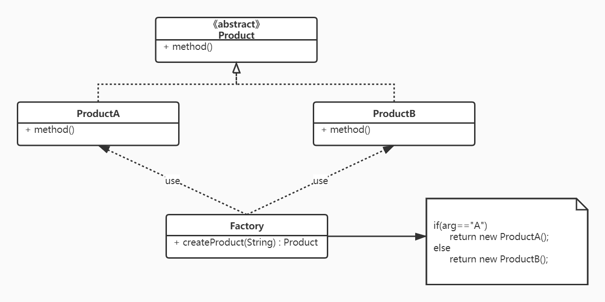

简单工厂模式（非GoF之一）：又称为静态工厂方法，属于类创建型模式，在简单工厂模式中，可以根据参数的不同返回不同类的实例【1】。简单工厂模式专门定义了一个类来负责创建其他类的实例，被创建的实例通常都有共同的父类【2】

1. 即工厂类知道每一个产品，它决定哪一个产品类应当被实例化
1. 即各种各样的产品类都是属于同一个大类


抽象产品类，表明了产品的父类，具体产品创建交给工厂，工厂有一个create方法，根据传入的参数可以决定生成什么类的实例
代码实现：

```java
public class SimpleFactory {
    //3. 工厂会有一个方法去创建这些类的实例
    public static Product createProduct(String type) {
        if("A".equals(type)){
            return new ProductA();
        }else {
            return new ProductB();
        }
    }
    //测试
    public static void main(String[] args) {
        Product product = SimpleFactory.createProduct("A");
        product.print();
    }
}
//1.先创建一个抽象的产品类
abstract class Product{
    public abstract void print();
}
//2.接着创建两个子类
//子类:A
class ProductA extends Product{

    @Override
    public void print() {
        System.out.println("A");
    }
}
//子类：B
class ProductB extends Product{

    @Override
    public void print() {
        System.out.println("B");
    }
}
```
优点：实现对象的创建和使用分离，创建完全交给专门的工厂类进行，客户端使用者只需要关心使用，而不需要关心怎么创建出来的
缺点：简单工厂类不够灵活，如果新增一个产品就要修改工厂类，就要修改它的判断逻辑
